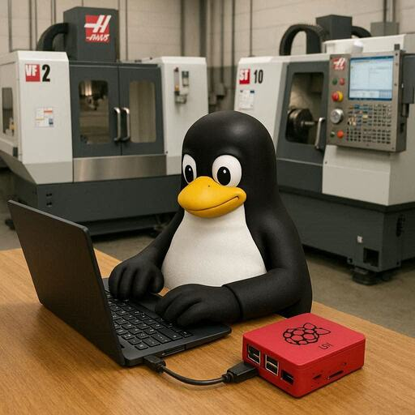

# Introduction to the Haas Data Collect Project



----------------------------------------------------------------

## Project Purpose

----------------------------------------------------------------

The project enables Haas CNC machines with NG controls and the `macro` option to output operational data using CNC `DPRNT` commands to a network server, which is then saved to disk by a Python script. Operations personnel can then copy the files off to their PCs and analyze the data. Multiple copies of the script can listen on different `TCP/IP` ports which allows multiple `Haas` machines to send data concurrently to one server.

----------------------------------------------------------------

**The project workflow:**

1. Copy the files from the GitHub repository.
2. Set Haas Options to output TCP/IP
      1. 261 - Set to `TCP Port`
      2. 262 - Set to `User Data/` to send to a server
      3. 263 - the `DPRNT Port` to use. Haas recommends using `TCP/IP` ports 5001 - 5999 to communicate with the server.
3. Python logger script connects to the machine’s IP/port.
4. Haas NG control sends DPRNT messages over the network.
5. Data is written into CSV files for later analysis.

----------------------------------------------------------------

The python script is cross platform and will run on Windows/Mac/Linux. The script is lightweight, using approximately 20KB of RAM and under 100MB of disk space for the repository.

The collected data is saved into text files with a `csv` extension. The `csv` in the extension stands for `Comma Separated Value` and is a common format for storing data. The `csv` format is lightweight and a typical file will be under 5KB in size.

**An example of a `csv` file:**

----------------------------------------------------------------

```text
Machine,Timestamp,Part_Number,Revision,Date_YYMMDD,Time_HHMMSS
Machine2,2025-12-04 10:58:15,“265-4183”,“X2”,251204,105815
Machine2,2025-12-04 10:58:20,“265-4183”,“X2”,251204,105820
Machine2,2025-12-04 10:58:23,“265-4183”,“X2”,251204,105823
Machine2,2025-12-04 11:27:07,“265-4183”,“X2”,251204,112707
```

`csv` files are typically opened in Microsoft Excel or LireOffice Calc.

----------------------------------------------------------------

The biggest hurdle to running the script in production is that the computer with the script has to be powered up and logged into. For testing, that isn't a big barrier but for 24/7/365 operations that is a problem. The next section of this guide shows how to [Build a Raspberry Pi 5 appliance](build_pi_5_appliance/why_pi_5_appliance.md) running Ubuntu 24.04.3 that creates a `service` to start the script on boot. No one has to be logged into the appliance for data to be collected. The total cost for an 8GB Raspberry Pi 5 with a 256GB NVME drive, PoE power supply and industrial case is around $200.00. The Raspberry Pi 5 draws around 25W of power so the OpEx cost is minimal.

The appliance is built from the ground up to be secure. Ubuntu can be configured to automatically download security updates, the firewall is enabled and configured during installation and only ports:

- 22 (SSH)
- 445 (Microsoft server)
- 9090 (Cockpit management)

are exposed to just the users that need access. In other words, the appliance is "Hardened".

**Can I use a repurposed PC?**

What about using an out of service Intel/AMD based PC? Yes, the code for the appliance will run on the Raspberry Pi 5 or any Intel/AMD x86 computer. The code would also run on an Intel based Mac that is running Ubuntu 24.04.

----------------------------------------------------------------

## Haas Videos on DPRNT

The Haas CNC control supports a command named DPRNT. It allows data such as date/time, cycle count, cycle time, inspection data, etc. to be sent to a file on a USB Flash drive or a computer. Haas has a YouTube channel and this [video](https://youtube.com/watch?v=g7hl2Lw4KdM&si=txrjMdDefbxXeBxp) clearly explains how to configure the control to send `DPRNT` statements to a USB flash drive or a server.

This page on the [Haas site](https://www.haascnc.com/video/Video-Bonus-Content.html) has links to all the Haas videos on YouTube.

Haas provides a copy of the [Inspection Plus software for Haas machining centres](https://www.haascnc.com/content/dam/haascnc/en/service/reference/probe/renishaw-inspection-plus-programming-manual---2008.pdf) manual. All of the variables used for probing can be output over `DPRNT`. You could write a `DPRNT` program that outputs dimensions that are out of spec and alert the operator before starting the next run,

----------------------------------------------------------------

!!! Info
      I wrote a manual for Fanuc Custom Macro way back in 1993! I was using `dprnt` to output Renishaw probe inspection data to a panel mounted serial printer. There is a section in the book on using `dprnt`, fully compatible with Haas, that you might find useful. Here is a link to the book - [Fanuc Custom Macro](./macromanual.pdf)

----------------------------------------------------------------

## Haas Connect

Haas provides a cloud-based monitoring system for all new Next Gen controls. Here is a video describing it:

[Haas Connect Intro](https://youtu.be/bvz6Fdciodo?si=HqzlgCH-FUSv_iA2)

----------------------------------------------------------------
