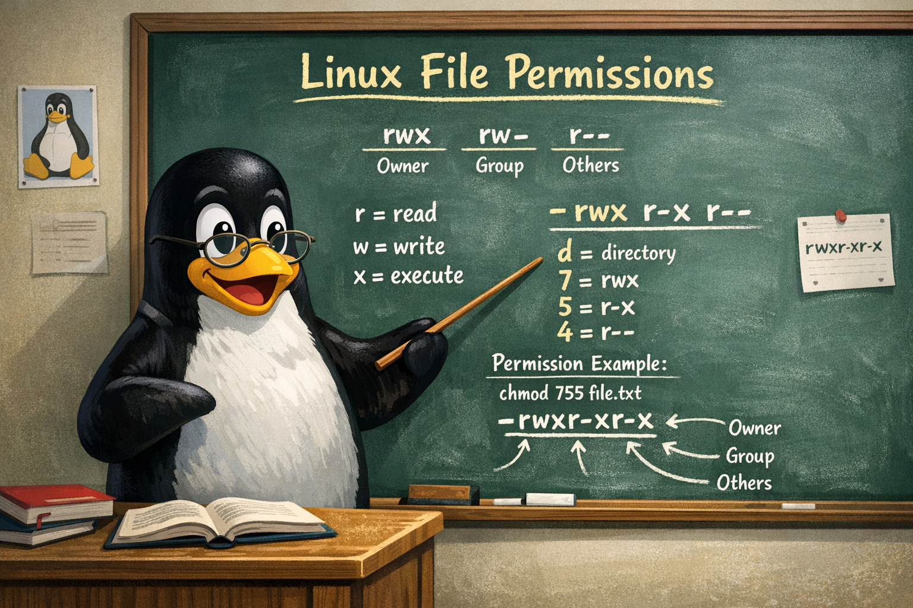

# File Permissions

----------------------------------------------------------------



----------------------------------------------------------------

**This appendix is optional reading!**

I included it in case you are coming from Windows and want to understand what the output of commands like `ls -la` mean. This was created 100% by Google Gemini. But I did read every line to make sure there were no **hallucinations** :smiley:

When I was at Cal Poly, the head of the department started a lecture with this:

- I'm going to tell you what I'm lecturing on today.
- Then I'm going to lecture to you.
- Then I'm going to summarize what I told you.

I was annoyed at first, but it was effective! This is done in a similar format, so if it seems repetitive, it is.

----------------------------------------------------------------

**Samba authenticates Windows users, but Linux decides what they can access.**

When a Windows user logs in, Samba maps them to a Linux user account that belongs to the `HaasGroup`. All folders under `Haas_Data_collect` are owned by `haas` and assigned to `HaasGroup`, so every user in that group gets the same read/write access. This keeps permissions simple and predictable without using Windows-style ACLs or effective permissions.

----------------------------------------------------------------

## 🎯 The key idea

Linux permissions are simple and strict compared to Windows.
Every file and folder has exactly one owner and one group, and Linux checks permissions in a fixed order.

Windows users are used to:

- Stacking multiple permissions from many groups
- Inheritance
- Deny rules
- “Effective Permissions” that calculate the final result

Linux does **none** of that.

## 🧱 The Linux Permission Model

Every file or folder has:

----------------------------------------------------------------

|    Concept   |              Meaning             |         Windows Analogy         |
|:------------:|:--------------------------------:|:-------------------------------:|
| User (Owner) | The person who owns the file     | Like the file’s “primary owner” |
|     Group    | A team of users who share access | Like a Windows security group   |
|     Other    | Everyone else on the system      | Like “Everyone” in Windows      |

----------------------------------------------------------------

And each of those three categories gets exactly three possible permissions:

- r → read
- w → write
- x → execute (or “enter” a folder)

That’s it. No inheritance. No merging. No deny rules.

----------------------------------------------------------------

🔍 **How Linux Decides Access (the part Windows users must understand).**

Linux checks permissions in this exact order:

1. Is the user the owner?
    → If yes, Linux uses the owner permissions and stops.

2. If not, is the user in the file’s group?
    → If yes, Linux uses the group permissions and stops.

3. Otherwise, use the “other” permissions.

There is no combining of permissions like Windows does.

### Example

If a file has:

- Owner: read/write
- Group: read only
- Other: no access

And a user is in the group but not the owner:

- They get read only, even if they belong to multiple groups.
- They cannot “inherit” write access from anywhere else.

**This is the biggest conceptual shift for Windows users.**

----------------------------------------------------------------

## 🧑‍🤝‍🧑 Why Groups Matter on a Raspberry Pi Appliance

If multiple users need access to the same shared folder (e.g., for Samba shares), Linux expects you to:

1. Create a group (in our case, `HaasGroup`)
1. Add users to that group
1. Set the folder’s group to HaasGroup
1. Give the group the needed permissions

----------------------------------------------------------------

### 🧠 A Simple Analogy

Linux doesn’t calculate permissions from multiple sources like Windows.
Instead, every file chooses one set of permissions to apply — either the owner’s, the group’s, or the other's — depending on who you are.

This analogy lands well with Windows admins

```text
|
├── Haas_Data_collect/
│   └── cnc_logs/
│
├── minimill/
├── st30/
├── st30l/
├── st40/
├── vf2ss/
└── vf5ss/
```

```text
                         ┌──────────────────────────────┐
                         │  Haas_Data_collect           │
                         │  Owner: haas                 │
                         │  Group: HaasGroup            │
                         └──────────────┬───────────────┘
                                        │
        ┌───────────────────────────────┼────────────────────────────────┐
        │                               │                                │
┌──────────────────┐       ┌──────────────────────┐        ┌──────────────────┐
│    minimill/     │       │      st30/           │        │      st30l/      │
│ Owner: haas      │       │ Owner: haas          │        │ Owner: haas      │
│ Group: HaasGroup │       │ Group: HaasGroup     │        │ Group: HaasGroup │
└──────────────────┘       └──────────────────────┘        └──────────────────┘
```

Additional sibling directories follow the same pattern:

`st40/, vf2ss/, vf5ss/`

This diagram makes the permission model visually obvious:

- One owner (`haas`)
- One shared group (`HaasGroup`)
- All users in `HaasGroup` get the same access
- No Windows‑style “effective permissions” — just owner → group → everyone else

All directories under `Haas_Data_collect` are owned by the user `haas` and assigned to the group `HaasGroup`, which contains all appliance users. This ensures consistent shared access without the complexity of Windows‑style effective permissions.

----------------------------------------------------------------

## How Windows users access the Pi

In this appliance, multiple Windows users will access shared folders on the Raspberry Pi.

To keep things simple and predictable, we use:

1. One owner for all files: `haas`
1. One shared group for all users: `HaasGroup`
1. A consistent permission model across all folders under `Haas_Data_collect`

You don’t need to become a Linux admin to understand this — just a few key ideas.

### 1. How Linux permissions work (in plain Windows terms)

On Linux, every file or folder has:

- One user (owner) → who “owns” it
- One group → a team that can also have access
- Other → everyone else on the system

Linux decides access in this strict order:

1. If you are the owner, Linux uses the owner permissions.
1. Else, if you are in the group, Linux uses the group permissions.
1. Else, Linux uses the other permissions.

It picks exactly one of those; it does not merge them like Windows “Effective Permissions.”

You can think of it like:

“Owner first, if not owner then group, if not group then everyone else.”

### 2. Who owns what (user and group)

To make permissions easy to reason about, everything under `Haas_Data_collect1 is set up like this:

- Owner (user): haas
- Group: HaasGroup
- Members of HaasGroup: all users who should have access to these folders

Conceptually, it looks like this:

```text
                         Haas_Data_collect/
                Owner: haas
                Group: HaasGroup
                         │
        ┌────────────────┼─────────────────────────────┐
        │                │                             │
    minimill/          st30/                         st30l/
Owner: haas          Owner: haas                    Owner: haas
Group: HaasGroup     Group: HaasGroup               Group: HaasGroup
        │
        └── cnc_logs/
            Owner: haas
            Group: HaasGroup
```

Additional sibling directories follow the same pattern:

`st40/, vf2ss/, vf5ss/`

So for every important directory:

- The  owner is always `haas`.
- The group is always `HaasGroup`.
- All real users connect as members of 'HaasGroup'.

### 3. What permissions users actually get

Let’s say the folders under 'Haas' are configured so that:

- The **owner** (haas) has full access.
- The **group** (HaasGroup) has full access.
- **Others** (everyone not in HaasGroup) have read only

In Linux shorthand, that would typically be something like:

- rwx for owner
- rwx for group
- r-- for others

You don’t need to remember the letters — what matters is the idea:

“Owner and HaasGroup can do everything here; everyone else is read only.”

So:

- if you’re a member of HaasGroup → you get the group permissions.
- If you’re not in HaasGroup → you get the other permissions (which are set to read only).

### 4. How this feels to a Windows user

From a Windows perspective, you can think of it like this:

- `haas` ≈ a built‑in “service account” that technically owns everything.
- `HaasGroup` ≈ a Windows security group that has Full Control on all the relevant folders.
- Other users on the system ≈ like “Everyone” being read only.

But unlike Windows:

- There are no deny rules.
- There is no inheritance that stacks or merges permissions.
- There is no “effective permissions” calculation.

Instead:

Each file chooses exactly one set of permissions to apply: the owner’s, the group’s, or everyone else’s — whichever matches the user first.

### 5. How this ties into the appliance usage

When a Windows user connects to the appliance via a network drive share:

- Their account is mapped to a Linux user that belongs to `HaasGroup`.
- That membership gives them the **group** permissions on everything under `Haas_Data_collect`.
- They don’t need to know anything about Linux users or groups; they just see folders like `Haas_Data_collect`, `cnc_logs`, `vf2ss`, etc., and can read/write according to the rules set for `HaasGroup`.

You, as the appliance creator, keep control simply by:

- Keeping `haas` as the owner.
- Ensuring all real users are in `HaasGroup`.
- Ensuring all critical directories under `Haas_Data_collect` are assigned to `HaasGroup`.

## 🧩 How Samba Fits Into This

When Windows users connect to the Raspberry Pi 5 appliance, they are not directly using Linux accounts. Instead, Samba acts as the “translator” between Windows authentication and Linux permissions.

Here’s what actually happens behind the scenes.

----------------------------------------------------------------

### 1. A Windows user connects to the network share

When someone on Windows enters the following into the `map network drive` dialog:

```unixconfig
\\your-appliance-ip\Haas
```

Windows prompts them for a username and password.
They enter the credentials you created for them (for example, `rgoodwin`).

----------------------------------------------------------------

### 2. Samba checks the username and password

Samba keeps its own password database, separate from Linux. To create the Samba user run the following command:

`sudo smbpasswd -a rgoodwin`

This will:

- Prompt you to enter and confirm a password for the Samba user `rgoodwin`.
- Add `rgoodwin` to the Samba user database (if not already present).
- Allow `rgoodwin` to authenticate when accessing Samba shares.

⚠️ Important: The user must already exist as a Linux system user (e.g., created via `sudo adduser rgoodwin`) before you can add them to Samba.

If the Samba password matches, the user is allowed in.

----------------------------------------------------------------

### 3. Samba maps the Windows user → Linux user

Once authenticated, Samba says:

This Windows user is the Linux user `rgoodwin`

From this point on, Linux file permissions apply, not Windows ACLs.
This is the key idea for your readers:

  Samba only handles the login.
  Linux decides what the user can do once they’re in.

----------------------------------------------------------------

### 4. Linux checks which groups the user belongs to

You added each user to the shared group:
`sudo usermod -aG HaasGroup rgoodwin`

So when Samba maps the Windows user to the Linux user, Linux sees:

- User: `rgoodwin`
- Groups: `rgoodwin`, **HaasGroup**

Because all your shared folders belong to `HaasGroup`, the user gets the group permissions.

----------------------------------------------------------------

### 5. The user gets access based on the folder’s owner/group

Every directory under `Haas_Data_collect` is set up like this:

- **Owner:** `haas`
- **Group:** `HaasGroup`
- **Permissions:** owner = full, group = full, others = read only

So when a Windows user connects:

- They are not the owner (haas)
- But they are in the group (HaasGroup)
- So they get the **group permissions**

This is why the setup works cleanly for all users.

----------------------------------------------------------------

### 6. What this means for your appliance users

From their perspective:

- They log in with a username and password
- They see the shared folders
- They can read/write files normally
- They never need to understand Linux permissions

From the appliance administrator's  perspective:

- You control access simply by adding/removing users from HaasGroup
- Samba handles authentication
- Linux handles authorization (permissions)
