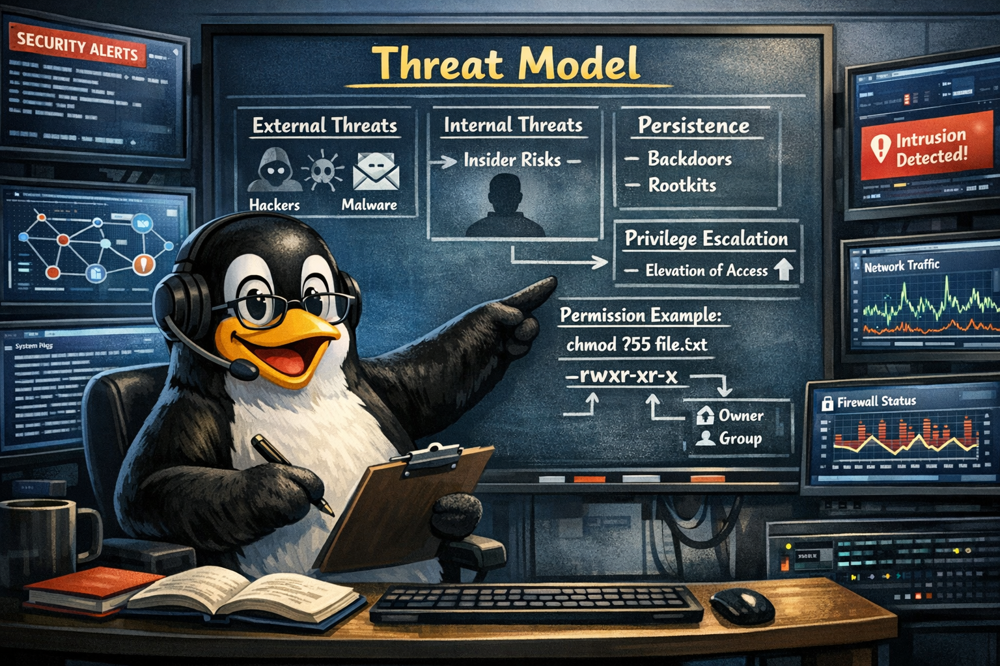

#

----------------------------------------------------------------



----------------------------------------------------------------

This threat model describes the security assumptions, expected adversaries, and defensive posture of the Haas Data Collection Appliance.
It is intended to support penetration testing, vendor risk assessments, and internal security reviews.

----------------------------------------------------------------

## 1. Security Objectives

The appliance is designed to:

- Safely collect CNC machine data via Telnet and share via SMBv2
- Provide local administrative access via SSH and Cockpit
- Remain stable, predictable, and low‑maintenance in industrial environments
- Minimize attack surface and eliminate unnecessary functionality
- Prevent unauthorized access, tampering, or lateral movement

The appliance is **not** intended to provide cloud connectivity, Internet remote management, or multi‑tenant operation.

----------------------------------------------------------------

## 2. In‑Scope Threat Actors

The following adversaries are considered within scope:

### 2.1. External Network Attackers

Attackers on the same LAN attempting:

- Port scanning
- Brute‑force authentication
- Exploitation of exposed services
- Lateral movement from compromised shop PCs

**Mitigations:**

- UFW default‑deny
- IP‑restricted access
- SMBv2‑only
- Cockpit restricted to authorized hosts.
- The appliance supports using SSH keys instead of username/password for ssh access.

----------------------------------------------------------------

### 2.2. Malicious or Compromised Internal Users

Users with physical or logical access to the shop network attempting:

- Unauthorized login
- Privilege escalation
- Tampering with configuration or logs
- Accessing machine data they should not see

**Mitigations:**

- Local authentication required
- no guest access
- root login disabled
- file permissions locked down
- Cockpit limited to authorized IPs.

----------------------------------------------------------------

### 2.3. Malware on Nearby Windows Systems

Common in machine shops where unmanaged PCs coexist with CNC equipment.

Potential threats:

- SMB worms
- Credential harvesting
- Lateral movement attempts

**Mitigations:**

- SMBv2/3‑only eliminates `eternal blue` type attacks
- no SMB1
- no guest access
- strict UFW rules
- no Windows‑compatible remote execution surfaces.

The appliance can be used with no Active Directory accounts. See [There are two trains of thoughts on usernames](../build_the_appliance/configuring_appliance.md/#there-are-two-trains-of-thoughts-on-usernames) for more detail.

----------------------------------------------------------------

### 2.4. Opportunistic Attackers on the Internet

These are out of scope because the appliance is **not Internet‑exposed**.
If misconfigured by an MSP, the threat becomes relevant.

**Mitigations:**

- Documented requirement: appliance ***must*** remain on an internal network,firewalled off from the Internet.

----------------------------------------------------------------

## 3. Out‑of‑Scope Threat Actors

These threats are explicitly out of scope for the appliance’s design:

- Nation‑state adversaries
- Advanced persistent threats (APT)
- Hardware supply‑chain attacks
- Physical attacks requiring disassembly or chip‑level access
- Compromise of the CNC machines themselves
- Attacks requiring cloud connectivity (none exists)

The appliance is not intended to withstand high‑budget, targeted attacks.

----------------------------------------------------------------

## 4. Attack Surface Summary

The appliance exposes only three network services, all restricted by IP:

| Service | Purpose | Hardening |
| ------- | -------- | ---------- |
| **SSH (22/tcp)** | Admin access | Key‑only auth (optional), root disabled, modern crypto only |
| **SMB (445/tcp)** | CNC data collection | SMBv2+, no guest, minimal share permissions |
| **Cockpit (9090/tcp)** | Local management UI | IP‑restricted by UFW, minimal modules installed, custom extension inputs reviewed for injection/traversal (see 6.7) |

**No other ports or services are exposed.**

----------------------------------------------------------------

## 5. Key Security Assumptions

The threat model assumes:

- The appliance is deployed on a **trusted internal network**
- Physical access is restricted to **authorized personnel**
- CNC machines are trusted to provide accurate data and are not adversarial
- MSPs follow the documented network requirements (**no WAN exposure**)
- Administrators maintain SSH keys securely
- The shop network is not intentionally hostile

If any of these assumptions are violated, the risk profile changes.

----------------------------------------------------------------

## 6. Identified Risks & Mitigations

### 6.1. Unauthorized Network Access

**Risk:** Attackers attempt to reach SSH, SMB, or Cockpit.

**Mitigation:**

- UFW default‑deny
- IP allowlists
- no guest access
- key‑only SSH optional to prevent `spray and pray`, `brute force` attacks.

----------------------------------------------------------------

### 6.2. Credential Compromise

**Risk:** Stolen passwords or weak credentials.

**Mitigation:**

- No password logins for SSH (optional)
- local accounts only
- Cockpit behind firewall.

----------------------------------------------------------------

### 6.3. Exploitation of Legacy Protocols

**Risk:** SMB1, DSA, CBC ciphers, or other deprecated crypto.

**Mitigation:**

- SMBv2+
- OpenSSH 9.9 modern‑only crypto
- legacy algorithms removed.

See [In Wireshark](../build_the_appliance/create-groups.md/#in-wireshark){target='_blank'} for details.

----------------------------------------------------------------

### 6.4. Lateral Movement

**Risk:** Malware on a Windows PC attempts to pivot into the appliance.

**Mitigation:**

- Strict firewalling
- minimal services
- no remote execution surfaces.

If only local Linux accounts are used there is no risk. See [There are two trains of thoughts on usernames](../build_the_appliance/configuring_appliance.md/#there-are-two-trains-of-thoughts-on-usernames)

----------------------------------------------------------------

### 6.5. Misconfiguration by MSPs

**Risk:** Appliance accidentally exposed to WAN or guest Wi‑Fi.

**Mitigation:**

- Documentation explicitly states internal‑only deployment
- SMB Shares, Cockpit and SSH reject unauthorized IPs

----------------------------------------------------------------

### 6.6. Ransomware

How Ransomware Impacts a Samba Server

If a Windows machine gets hit with ransomware and that user has write access to a Samba share (Haas, st30, etc.):

- The malware will happily encrypt files on the share
- Samba will treat the encryption as legitimate file writes
- Linux permissions and filesystem type (ext4, XFS, Btrfs, ZFS) do not protect you
- Samba does not “filter” or “inspect” file writes — it just writes what the client sends

This is identical to what happens on a Windows file server. Samba is protocol‑compatible, so it inherits the same exposure.

#### What cannot happen

- The ransomware cannot execute on Ubuntu
- It cannot infect Samba binaries
- It cannot spread “into” Linux
- It cannot compromise the OS or Samba daemon

The threat is strictly data‑level, not system‑level.

----------------------------------------------------------------

### 6.7. Custom Cockpit Extension Input Handling

**Risk:** An authenticated Cockpit user — or a penetration tester replaying/fuzzing the underlying WebSocket RPC traffic directly (e.g. with Burp Suite Intruder), bypassing the page's own JavaScript entirely — sends malformed or malicious input to one of the appliance's custom Cockpit extensions (Manage Samba, Updates ‑ Logs, Python Script Services, Firewall Control), attempting to crash a process, inject shell commands, or read/write files outside the intended location.

**Mitigation:**

- All three custom extensions call `cockpit.spawn()` with argument arrays rather than shell strings. Commands execute without a shell interpreter, so injection via `;`, backticks, or `$()` isn't possible no matter what a field contains.
- Where a value must be used inside a shell script, it's passed as a script argument (`$1`), never concatenated into the script's source text.
- Claude found a path‑traversal issue during the security review, in the CSV backup‑rollback script: an unvalidated filename field allowed `../` sequences to escape the intended backup directory. It has been fixed with a `realpath`‑based containment check. See [Securing the Custom Cockpit Extensions](../appendices/appendix-a.md/#securing-the-custom-cockpit-extensions) for the technical detail.
- Fields whose values are also user‑visible expectations (IP addresses, ports, machine names) are additionally restricted client‑side to their expected character set — a defense‑in‑depth/UX measure, not the actual security boundary, since client‑side JavaScript can't be relied on against a tool that talks to cockpit‑bridge directly.

----------------------------------------------------------------

## 7. Residual Risk

Residual risk is low for the intended environment, assuming:

- The appliance remains on an internal network
- Administrators follow documented deployment practices
- Physical access is controlled

Residual risk increases if:

- The appliance is Internet‑exposed
- SSH keys are mishandled
- The shop network is compromised by unmanaged devices

These risks are documented for MSP awareness. The script `smb_verify.sh` can be run from a remote Linux laptop/server to verify.

----------------------------------------------------------------

## 8. Software Supply Chain Attack

The Open Source community is facing more and more supply chain attacks. The appliance has a limited number of packages installed besides Ubuntu itself. You can list the packages installed by the installation script using:

```bash linenums='1' hl_lines='1'
grep -E '(apt|nala)[[:space:]]+install\b' haas-install.sh
grep -E '\-f[[:space:]]+fresh-editor\b' haas-install.sh
```

```bash title='Command Output'
if sudo apt install nala -y; then
if sudo nala install tree -y; then
if sudo nala install python3-pip -y; then
if sudo apt install micro -y; then
if sudo nala install inetutils-traceroute -y; then
if sudo apt install samba -y; then
if sudo apt install smbclient -y; then
if sudo nala install cockpit cockpit-pcp -y; then
rm -f fresh-editor.deb
```

The only packages that are necessary for appliance functionality are:

- samba
- smbclient
- cockpit

The other packages are for convenience. If you want the appliance locked down as much as possible you should remove the extra packages using:

```bash linenums='1' hl_lines='1'
sudo apt remove nala
sudo apt remove python3-pip
sudo apt remove micro
sudo apt remove inetutils-traceroute
sudo dpkg -r fresh
```

The risk from this packages is low since the appliance firewalls off all IP addresses that are authorized.

----------------------------------------------------------------

## 9.0 Verification

The `Haas_Data_collection` directory includes two scripts you can use to verify the appliances ports and SMB security:

- smb_verify.py - A Python script for Mac/Linux/WLS2
- SMB-SecurityScan.ps1 - A script for PowerShell on Windows

### Mac/Linux/WLS2

To use the `smb_verify.py` script you must have `nmap` installed. nmap is The industry standard `network mapper`.

- Linux/WSL - To install `sudo apt install nmap`. See [Linux Distributions](https://nmap.org/book/inst-linux.html)
- Macos - To install on Mac use brew or download the installer from [The nmap site](https://nmap.org/download.html#macosx)

----------------------------------------------------------------

The Python script performs the following:

- Uses nmap to scan for SMB versions
- Uses nmap to verify that the correct ports are open

----------------------------------------------------------------

### Usage

| Scenario                  | Command                                                                         |
| ------------------------- | ------------------------------------------------------------------------------- |
| Authorized host (default) | `python3 smb_verify.py` or `python3 smb_verify.py --expected-access=authorized` |
| Unauthorized host         | `python3 smb_verify.py --expected-access=unauthorized`                          |
| JSON output               | `python3 smb_verify.py --expected-access=unauthorized --json`                   |

----------------------------------------------------------------

### Results

| Case                                                  | Message                                                                  | Grade |
| ----------------------------------------------------- | ------------------------------------------------------------------------ | ----- |
| Unauthorized host blocked (good firewall)             | `[FIREWALL] Firewall blocking unauthorized access (expected)`                    | PASS  |
| Unauthorized host sees open ports (firewall disabled) | `[FIREWALL] Unauthorized access allowed! Open ports: 22,445,9090`   | WARN  |
| Authorized host can reach required ports              | `[FIREWALL] Firewall allowing access (expected)`                             | PASS  |
| Authorized host blocked (misconfigured)               | `Authorized host cannot reach required services check Firewall rules`    | FAIL  |

----------------------------------------------------------------

### Examples

Here is a listing of the firewall rules.

```bash
sudo ufw status numbered | sort -k5
```

```unixconfig title='Command Output'
     --                         ------      ----
     To                         Action      From
Status: active
[ 6] 9090                       ALLOW IN    192.168.10.113             # msp_admin-admin-cockpit
[ 5] 445                        ALLOW IN    192.168.10.113             # msp_admin-admin-smb
[ 4] 22                         ALLOW IN    192.168.10.113             # msp_admin-admin-ssh
[ 3] 9090                       ALLOW IN    192.168.10.143             # haas-admin-cockpit
[ 2] 445                        ALLOW IN    192.168.10.143             # haas-admin-smb
[ 1] 22                         ALLOW IN    192.168.10.143             # haas-admin-ssh
[ 9] 445                        ALLOW IN    192.168.10.141             # st40-user-smb
[ 7] 445                        ALLOW IN    192.168.10.144             # st30-user-smb
[ 8] 445                        ALLOW IN    192.168.10.145             # st30l-user-smb
```

----------------------------------------------------------------

The following IP addresses have the admin roll so they have ports 22, 445 and 9090 open.:

- 192.168.10.113
- 192.168.10.143

#### Run script from an admin ip machine

If we run the script from one of the admin machines with the `--expected-access=authorized` flag we will see these outputs:

```unixconfig
./smb_verify.py --target=192.168.10.127 --expected-access=authorized
```

```bash hl_lines='1-2 8-9 12' title='Command Output'
PASS: [SMB] Modern SMB protocols detected
PASS: [FIREWALL] Firewall allowing access (expected)

==============================================
  SECURITY SUMMARY
==============================================
Target: 192.168.10.127
Expected Access: authorized
Access Result: PASS
Overall: SECURE
Failures: 0, Warnings: 0
SMB Grade: PASS
==============================================
```

That is perfect. All ports are open and the Samba Server offered only SMBv2 or SMBv3.

----------------------------------------------------------------

If we run it with the `--expected-access=unauthorized` flag we will see these outputs:

```bash linenums='1' hl_lines='1'
./smb_verify.py --target=192.168.10.127 --expected-access=unauthorized
```

```bash hl_lines='1-2 8-9 12' title='Command Output'
WARN: [SMB] SMB reachable from unauthorized host! Firewall issue
WARN: [FIREWALL] Unauthorized access allowed! Open ports: 22,445,9090

==============================================
  SECURITY SUMMARY
==============================================
Target: 192.168.10.127
Expected Access: unauthorized
Access Result: FAIL
Overall: NOT_SECURE
Failures: 0, Warnings: 2
SMB Grade: WARN
==============================================
```

----------------------------------------------------------------

That is expected since we ran it from an admin ip address. If you run it from a device on the network that isn't authorized as admin and get the first output there is a problem. **Most likely the firewall is disabled** and needs to be re-enabled and possibly reconfigured.

----------------------------------------------------------------

#### Run script from ip not listed

In this example we run the script from `192.168.10.142` which isn't authorized to access the appliance as an admin.

----------------------------------------------------------------

Run with the `--expected-access=authorized` flag:

```unixconfig
./smb_verify.py --target=192.168.10.127 --expected-access=authorized
```

```bash hl_lines='1-2 8-9 12' title='Command Output'
FAIL: [SMB] No modern SMB protocols detected
FAIL: [FIREWALL] Authorized host cannot reach ports: 22,445,9090

==============================================
  SECURITY SUMMARY
==============================================
Target: 192.168.10.127
Expected Access: authorized
Access Result: FAIL
Overall: NOT_SECURE
Failures: 2, Warnings: 0
SMB Grade: FAIL
==============================================
```

----------------------------------------------------------------

That is exactly what we want to see. Lines 1-2 show that SMB isn't exposed and the firewall blocked the ports.

----------------------------------------------------------------

Now let's run it with the `--expected-access=unauthorized` flag.

```bash linenums='1' hl_lines='1'
./smb_verify.py --target=192.168.10.127 --expected-access=unauthorized
```

```bash hl_lines='1-2 8-9 12' title='Command Output'
PASS: [SMB] Unauthorized host cannot reach SMB (expected)
PASS: [FIREWALL] Firewall blocking unauthorized access

==============================================
  SECURITY SUMMARY
==============================================
Target: 192.168.10.127
Expected Access: unauthorized
Access Result: PASS
Overall: SECURE
Failures: 0, Warnings: 0
SMB Grade: PASS
==============================================
```

----------------------------------------------------------------

That is exactly what we want. Lines 1-2 show all ports were blocked and SMB wasn't available. You should run the script from an unauthorized workstation right after deployment and then as often as your security policy requires.

----------------------------------------------------------------

## 10. Conclusion

The appliance’s threat model is intentionally simple:
**minimize attack surface, restrict access, use modern cryptography, and avoid unnecessary complexity.**

This design aligns with best practices for industrial environments and supports successful penetration testing outcomes.
