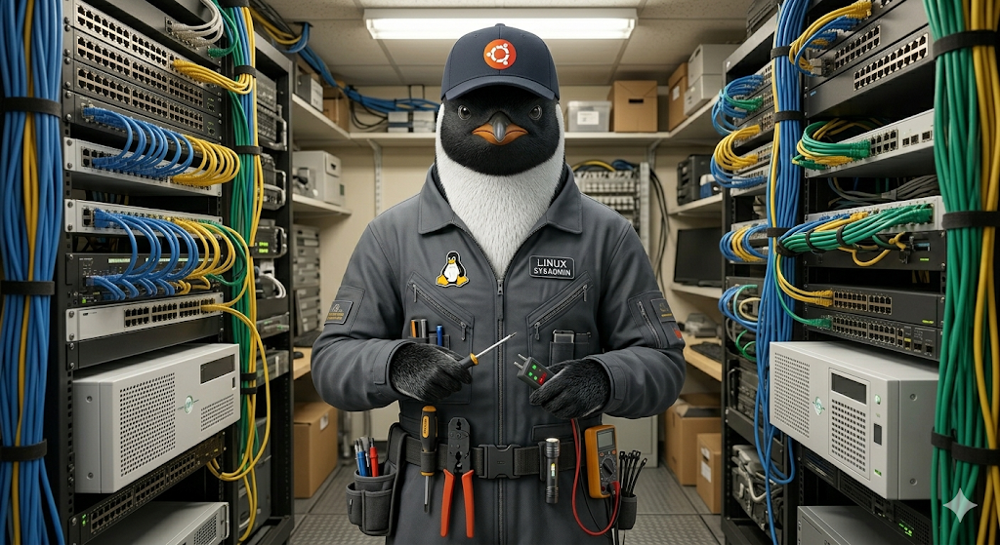
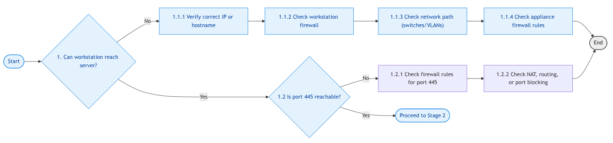
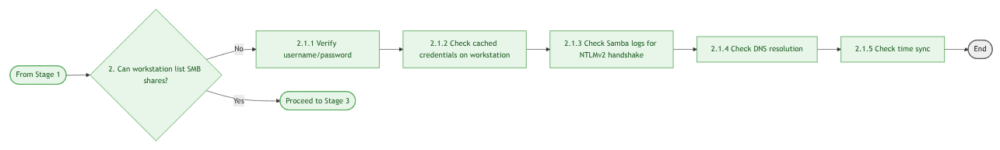
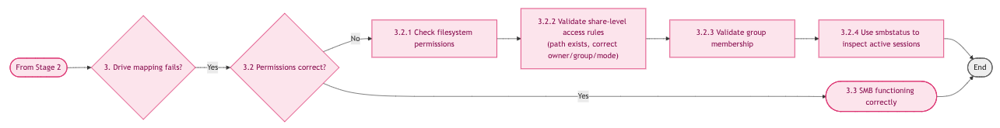

# Appliance Troubleshooting flowchart

----------------------------------------------------------------



----------------------------------------------------------------

The following flowchart will assist you in troubleshooting:

- You can't ping the device
- You can't map a drive to the appliance
- You can't save a CNC program to the appliance

The flowchart has the following three stages:

----------------------------------------------------------------


----------------------------------------------------------------

## ⭐ Stage 1 Port Reachability and Firewall Checks



----------------------------------------------------------------

- **Confirm correct IP** - Make sure you are using the correct IP address for the appliance. Port 445 is only open from authorized ip addresses.
- **Verify VLANS/Switches** - Use `ping <appliance_ip>` to verify network connectivity to the appliance
- **Is port 445 reachable**
    1. Use `nmap -Pn -p 445 <appliance_ip>` to verify
    2. Use `Test-NetConnection <appliance_ip> -Port 445` on Windows
- **Check Appliance firewall** - SSH to the appliance, run `sudo ufw status numbered | sort -k5` to list the appliance firewall rules
    1. Use `Cockpit` to manage the firewall from a browser `https://<appliance_ip>:9090`
    2. Use the `configure_ufw_from_csv.sh` script from the terminal - `sudo /usr/local/sbin/configure_ufw_from_csv.sh --show-rules`
    3. See [The script options](../build_the_appliance/firewall_configuration.md/#the-script-options){target="_blank"} for more information
- **Check W/S Firewall** - This is a low probability. By default Windows, Mac, Linux allow outbound traffic

----------------------------------------------------------------

### Reachability Commands

??? info "troubleshooting outputs"

    ```text hl_lines='1 7 17'
    ping 192.168.10.127
    PING 192.168.10.127 (192.168.10.127) from 192.168.10.143 wlp61s0: 56(84) bytes of data.
    64 bytes from 192.168.10.127: icmp_seq=1 ttl=64 time=86.9 ms
    64 bytes from 192.168.10.127: icmp_seq=2 ttl=64 time=7.80 ms
    64 bytes from 192.168.10.127: icmp_seq=3 ttl=64 time=6.28 ms
    ---
    nmap -Pn -p 22,445,9090 192.168.10.127
    Starting Nmap 7.95 ( https://nmap.org ) at 2026-04-02 12:27 PDT
    Nmap scan report for haas.pu.pri (192.168.10.127)
    Host is up (0.0061s latency).

    PORT     STATE SERVICE
    22/tcp   open  ssh
    445/tcp  open  microsoft-ds
    9090/tcp open  zeus-admin
    ---
    Test-NetConnection 192.168.10.127 -Port 445
    ComputerName     : 192.168.10.127
    RemoteAddress    : 192.168.10.127
    RemotePort       : 445
    InterfaceAlias   : Wi-Fi
    SourceAddress    : 192.168.10.104
    TcpTestSucceeded : True
    ```

----------------------------------------------------------------

## ⭐ Stage 2 SMB Share Listing and Authentication



----------------------------------------------------------------

- **List SMB Shares**
     1. On the appliance, cd to `Haas_Data_collect` and run `./lshares.sh`
     2. Lists the Haas share and the <share_name> share.
- **Check Credentials**
     1. Run `manager_users.sh <username> --set-password` to reset the password
- **Domain name** - The domain name is `WORKGROUP` by default, all caps
- **Check DNS** - If you are using a FQDN instead of an ip use `dig` or `nslookup` to verify the appliance is registered in DNS
- **Check Time Sync** - SSH to the appliance and run `date` to see the current date/time on the appliance
- **Check Samba logs on the appliance** - SSH to the appliance, run `sudo tail -f /var/log/samba/log.smbd`. This keeps the logger running. Use `ctrl+c` to cancel it.

----------------------------------------------------------------

### List Share Commands

??? info "troubleshooting outputs"

    ```text linenums='1' hl_lines='1 3 11 14-17 21-24 28-29 33 36 38 40 42-43 48 53'
    cd Haas_Data_collect
    ┌─[haas@haas] - [~/Haas_Data_collect] - [2358]
    └─[$] ./lshares.sh
    Haas         /home/haas/Haas_Data_collect
    minimill     /home/haas/Haas_Data_collect/machines/minimill
    st40         /home/haas/Haas_Data_collect/machines/st40
    st30         /home/haas/Haas_Data_collect/machines/st30
    st30l        /home/haas/Haas_Data_collect/machines/st30l

            -------------------------------

    sudo ./manage_users.sh mspadmin
    ==== Thu Apr  2 12:44:43 PDT 2026 ====
    Log file: /var/log/user_mgmt_20260402_124443.log
    Processing user: mspadmin
    User exists
    Update passwords? (y/N): y
    Updating system password
    New password:
    Retype new password:
    passwd: password updated successfully
    Samba user exists
    Updating Samba password
    New SMB password:
    Retype new SMB password:Forcing Primary Group to 'Domain Users' for mspadmin
    Forcing Primary Group to 'Domain Users' for mspadmin
    Forcing Primary Group to 'Domain Users' for mspadmin
    Enabled user mspadmin.
    Final user info:
    uid=1007(mspadmin) gid=1011(mspadmin) groups=1011(mspadmin),27(sudo),1004(HaasGroup)
    Done.

            -------------------------------

    On the appliance
    ┌─[haas@haas] - [~/Haas_Data_collect] - [2361]
    └─[$] date
    Thu Apr  2 12:47:58 PDT 2026

            -------------------------------

    On your Laptop
    ┌─[mhubbard@1S1K-G5] - [~/Insync/GD/04_Tools/Haas/Haas_Data_collect] - [9005]
    └─[$] date
    Thu Apr  2 12:48:43 PM PDT 2026

    ```

----------------------------------------------------------------

## ⭐ Stage 3 User Authentication and Permissions

----------------------------------------------------------------



----------------------------------------------------------------

!!! Note
    All stage 3 troubleshooting requires being logged into the appliance over ssh as an admin

- **List file permissions**
    1. `cd Haas_Data_collect\machines`, `ls -l`, should see `drwxrwsr--` and `haas HaasGroup` for each folder
    2. Run `tree -d` to list the machine directory structure
- **Validate Share level access rules**
    1. Verify that the directory for the machine tool exists under `machines`
    2. Run `testparm -s` and verify that the share is defined correctly
- **Verify firewall rules**
    1. Run `sudo ufw status numbered | sort -k5`
    2. Verify that the ip address of the workstation is listed.
- **Verify that the Samba Service is active** - SSH to the appliance, run `sudo systemctl status smbd.service` and look for Active: active (running)
- **List Samba Shares that are active** - SSH to the appliance, run `sudo smbstatus` (Only lists shares with devices that are connected). If any shares are listed, Samba is working.

### Permission Commands

??? info "troubleshooting outputs"

    ```text linenums='1' hl_lines='2 4 7-11 16 18 20-27 32 70 94 97 102 104 110 120 121 131 133 134-137 139'
    ┌─[haas@haas] - [~] - [2503]
    └─[$] cd Haas_Data_collect
    ┌─[haas@haas] - [~/Haas_Data_collect] - [2504]
    └─[$] ls -l --group-directories-first

    total 8460
    drwxrwsr-- 2 haas    HaasGroup   12288 Apr 17 00:00  backups
    drwxrwsr-- 2 haas    HaasGroup    4096 Mar 22 18:36  cockpit
    drwxrwsr-- 5 haas    HaasGroup    4096 Mar 22 18:36  docs
    drwxrwsr-- 6 haas    HaasGroup    4096 Mar 16 19:43  machines
    drwxrwsr-x 2 haas    HaasGroup    4096 Apr 16 14:26  releases

            -------------------------------

    ┌─[haas@haas] - [~/Haas_Data_collect] - [2505]
    └─[$] cd machines
    ┌─[haas@haas] - [~/Haas_Data_collect/machines] - [2506]
    └─[$] tree -d
    .
    ├── minimill
    │   └── cnc_logs
    ├── st30
    │   └── cnc_logs
    ├── st30l
    │   └── cnc_logs
    └── st40
        └── cnc_logs

            -------------------------------

    ┌─[haas@haas] - [~/Haas_Data_collect/machines] - [2507]
    └─[$] testparm -s
    Load smb config files from /etc/samba/smb.conf
    Loaded services file OK.
    Weak crypto is allowed by GnuTLS (e.g. NTLM as a compatibility fallback)
    Server role: ROLE_STANDALONE

    --- Global section truncated for brevity ---

    [Haas]
        comment = Haas Data Collection Share
        create mask = 0664
        directory mask = 0775
        force create mode = 0664
        force directory mode = 0775
        force group = HaasGroup
        force user = haas
        path = /home/haas/Haas_Data_collect
        read only = No
        valid users = @HaasGroup haas


    [minimill]
        comment = Logger for minimill
        create mask = 0664
        directory mask = 0775
        force create mode = 0664
        force directory mode = 0775
        force group = HaasGroup
        force user = haas
        path = /home/haas/Haas_Data_collect/machines/minimill
        read only = No
        valid users = @HaasGroup haas # Ensure the user is valid

    --- output truncated for brevity ---

            -------------------------------

    ┌─[haas@haas] - [~/Haas_Data_collect/machines] - [2508]
    └─[$] sudo ufw status numbered | sort -k5

         --                         ------      ----
         To                         Action      From
    Status: active
    [13] 445                        ALLOW IN    192.168.10.141             # st40-user-smb
    [12] 9090                       ALLOW IN    192.168.10.143             # haas-admin-cockpit
    [11] 445                        ALLOW IN    192.168.10.143             # haas-admin-smb
    [10] 22                         ALLOW IN    192.168.10.143             # haas-admin-ssh
    [15] 445                        ALLOW IN    192.168.10.145             # st30l-user-smb
    [14] 445                        ALLOW IN    192.168.10.147             # st30-user-smb
    [ 3] 9090                       ALLOW IN    192.168.1.100              # test-admin-cockpit
    [ 2] 445                        ALLOW IN    192.168.1.100              # test-admin-smb
    [ 1] 22                         ALLOW IN    192.168.1.100              # test-admin-ssh
    [ 6] 9090                       ALLOW IN    192.168.10.104             # vf2ss-admin-cockpit
    [ 5] 445                        ALLOW IN    192.168.10.104             # vf2ss-admin-smb
    [ 4] 22                         ALLOW IN    192.168.10.104             # vf2ss-admin-ssh
    [ 9] 9090                       ALLOW IN    192.168.10.113             # msp_admin-admin-cockpit
    [ 8] 445                        ALLOW IN    192.168.10.113             # msp_admin-admin-smb
    [ 7] 22                         ALLOW IN    192.168.10.113             # msp_admin-admin-ssh

            -------------------------------

    ┌─[haas@haas] - [~/Haas_Data_collect/machines] - [2509]
    └─[$] sudo systemctl status smbd.service
    ● smbd.service - Samba SMB Daemon
         Loaded: loaded (/usr/lib/systemd/system/smbd.service; enabled; preset: enabled)
         Active: active (running) since Wed 2026-04-08 19:20:41 PDT; 1 week 1 day ago
           Docs: man:smbd(8)
                 man:samba(7)
                 man:smb.conf(5)
       Main PID: 65773 (smbd)
         Status: "smbd: ready to serve connections..."
          Tasks: 4 (limit: 9063)
         Memory: 13.3M (peak: 15.3M)
            CPU: 22.882s
         CGroup: /system.slice/smbd.service
                 ├─65773 /usr/sbin/smbd --foreground --no-process-group
                 ├─65814 "smbd: notifyd" .
                 ├─65817 "smbd: cleanupd "
                 └─67376 "smbd: client [192.168.10.113]"

    Apr 08 19:20:40 haas systemd[1]: Starting smbd.service - Samba SMB Daemon...
    Apr 08 19:20:41 haas (smbd)[65773]: smbd.service: Referenced but unset environment variable evaluates to an empty string: SMBDOPTIONS
    Apr 08 19:20:41 haas systemd[1]: Started smbd.service - Samba SMB Daemon.
    Apr 09 00:00:17 haas systemd[1]: Reloading smbd.service - Samba SMB Daemon...
    Apr 09 00:00:17 haas systemd[1]: Reloaded smbd.service - Samba SMB Daemon.
    ```

----------------------------------------------------------------

### SMB Commands

??? info "Common share commands"

    ```unixconfig linenums='1' hl_lines='2 7 12 14-17 22 35-37 41 52 66 86 94'
    ┌─[haas@haas] - [~] - [2409]
    └─[$] cd Haas_Data_collect/

    ---

    ┌─[haas@haas] - [~/Haas_Data_collect] - [2410]
    └─[$] cd machines

    ---

    ┌─[haas@haas] - [~/Haas_Data_collect/machines] - [2411]
    └─[$] ls -l
    total 16
    drwxrwsr-- 2 haas HaasGroup 4096 Mar 15 20:18 minimill
    drwxrwsr-- 3 haas HaasGroup 4096 Mar 25 13:22 st30
    drwxrwsr-- 3 haas HaasGroup 4096 Mar 18 17:49 st30l
    drwxrwsr-- 3 haas HaasGroup 4096 Mar 25 13:22 st40

    ---

    ┌─[haas@haas] - [~/Haas_Data_collect/machines] - [2422]
    └─[$] tree -d
    .
    ├── minimill
    │   └── cnc_logs
    ├── st30
    │   └── cnc_logs
    ├── st30l
    │   └── cnc_logs
    └── st40
        └── cnc_logs

    ---

    testparm -s
    Load smb config files from /etc/samba/smb.conf
    Loaded services file OK.
    Weak crypto is allowed by GnuTLS (e.g. NTLM as a compatibility fallback)
    Server role: ROLE_STANDALONE
    ([Global] output not shown)
    [Haas]
      comment = Haas Data Collection Share
      create mask = 0664
      directory mask = 0775
      force create mode = 0664
      force directory mode = 0775
      force group = HaasGroup
      force user = haas
      path = /home/haas/Haas_Data_collect
      read only = No
      valid users = @HaasGroup haas
    [minimill]
      comment = Logger for minimill
      create mask = 0664
      directory mask = 0775
      force create mode = 0664
      force directory mode = 0775
      force group = HaasGroup
      force user = haas
      path = /home/haas/Haas_Data_collect/machines/minimill
      read only = No
      valid users = @HaasGroup haas # Ensure the user is valid

    ---

    sudo ufw status numbered | sort -k5
       --                         ------      ----
       To                         Action      From
    Status: active
    [10] 445                        ALLOW IN    192.168.10.141             # st40-user-smb
    [12] 445                        ALLOW IN    192.168.10.145             # st30l-user-smb
    [11] 445                        ALLOW IN    192.168.10.147             # st30-user-smb
    [ 3] 9090                       ALLOW IN    192.168.10.104             # vf2ss-admin-cockpit
    [ 2] 445                        ALLOW IN    192.168.10.104             # vf2ss-admin-smb
    [ 1] 22                         ALLOW IN    192.168.10.104             # vf2ss-admin-ssh
    [ 6] 9090                       ALLOW IN    192.168.10.113             # msp_admin-admin-cockpit
    [ 5] 445                        ALLOW IN    192.168.10.113             # msp_admin-admin-smb
    [ 4] 22                         ALLOW IN    192.168.10.113             # msp_admin-admin-ssh
    [ 9] 9090                       ALLOW IN    192.168.10.143             # haas-admin-cockpit
    [ 8] 445                        ALLOW IN    192.168.10.143             # haas-admin-smb
    [ 7] 22                         ALLOW IN    192.168.10.143             # haas-admin-ssh

    ---

    ┌─[haas@haas] - [~/Haas_Data_collect/machines] - [2416]
    └─[$] sudo systemctl status smbd.service
    ● smbd.service - Samba SMB Daemon
         Loaded: loaded (/usr/lib/systemd/system/smbd.service; enabled; preset: enabled)
         Active: active (running) since Tue 2026-04-07 15:37:55 PDT; 15min ago

    ---

    ┌─[haas@haas] - [~/Haas_Data_collect/machines] - [2415]
    └─[$] sudo smbstatus

    Samba version 4.19.5-Ubuntu
    PID     Username     Group        Machine                                   Protocol Version  Encryption           Signing
    ----------------------------------------------------------------------------------------------------------------------------------------
    3749    mspadmin     mspadmin     192.168.10.113 (ipv4:192.168.10.113:63186) SMB3_11           -                    partial(AES-128-GMAC)

    Service      pid     Machine       Connected at                     Encryption   Signing
    ---------------------------------------------------------------------------------------------
    st40         3749    192.168.10.113 Tue Apr  7 15:43:20 2026 PDT     -            -
    ```

----------------------------------------------------------------

## 🖥️ Common Workstation Issues

----------------------------------------------------------------

!!! info "Common Workstation Issues"
    SMB failures often originate on the workstation rather than the appliance.
    The following issues are frequently encountered during testing and real-world deployments:

    **1. Cached Credentials**
    - Workstations (Ubuntu, macOS, Windows) may silently reuse old credentials.
    - Symptoms: drive mapping fails, NTLM handshake errors, wrong user shown in `smbstatus`.
    - Fix: clear credential cache or reboot the workstation.

    **2. GVFS / Nautilus SMB Caching (Ubuntu)**
    - GNOME’s GVFS layer caches SMB sessions aggressively.
    - Symptoms: incorrect permissions, stale directory listings, “permission denied” after config changes.
    - Fix: kill GVFS processes or reboot; avoid mixing Nautilus and `mount.cifs`.

    **3. Multiple SMB Clients on the Same System**
    - Linux systems may mix:
        - `gio mount`
        - `nautilus`
        - `mount.cifs`
        - `smbclient`
    - Each uses different credential paths and caching behavior.
    - Fix: use one method consistently during troubleshooting.

    **4. Time Skew**
    - Even small time differences break NTLMv2 authentication.
    - Symptoms: authentication failures despite correct credentials.
    - Fix: ensure workstation and appliance sync to the same NTP source.

    **5. DNS Resolution Issues**
    - Workstations may resolve the appliance hostname incorrectly.
    - Symptoms: intermittent failures, wrong IP in logs, slow connections.
    - Fix: verify `/etc/resolv.conf`, DNS search domains, and `dig` results.

    **6. SMB Client Minimum Protocol Settings**
    - The appliance only supports SMB2/3.
    - Symptoms: connection refused if the workstation doesn't support SMB2/3.
    - Fix: ensure the workstation supports SMB2/3 (default on modern systems).

    **7. Firewall or Local Security Policies**
    - Local workstation firewalls may block outbound SMB.
    - Symptoms: cannot reach port 445 despite correct server configuration.
    - Fix: check UFW, firewalld, Windows Defender Firewall, or corporate policies. This is low probability unless on a highly locked down network. In such an environment, AD policies will block port 445 to unauthorized ip addresses.

    **8. Credential Manager / Keychain Conflicts**
    - Windows Credential Manager, macOS/Linux Keychain may store stale SMB passwords.
    - Symptoms: repeated authentication failures with correct credentials.
    - Fix: remove stored SMB entries and reconnect.

----------------------------------------------------------------

🧩 Troubleshooting Quick‑Reference Table

| Symptom / Observation | Likely Cause | Quick Checks / Next Steps |
|----------------------|--------------|----------------------------|
| <span style="color:#1e88e5;">🛜 Cannot reach server on port 445</span> | <span style="color:#1e88e5;">Stage 1 — Firewall or network path issue</span> | [1.1.1 Confirm correct IP](../appendices/appendix-g.md/#stage-1-port-reachability-and-firewall-checks) • [1.1.2 Verify VLANs/switches](../appendices/appendix-g.md/#stage-1-port-reachability-and-firewall-checks) • [1.1.3 Appliance firewall](../appendices/appendix-g.md/#stage-1-port-reachability-and-firewall-checks) |
| <span style="color:#43a047;">📁 Shares not listed</span> | <span style="color:#43a047;">Stage 2 — Authentication or DNS issue</span> | [2.1.1 Check credentials](../appendices/appendix-g.md/#stage-2-smb-share-listing-and-authentication) • [2.1.3 DNS resolution](../appendices/appendix-g.md/#stage-2-smb-share-listing-and-authentication) • [2.1.4 Time sync](../appendices/appendix-g.md/#stage-2-smb-share-listing-and-authentication) |
| <span style="color:#43a047;">👤 Wrong username appears in logs</span> | <span style="color:#43a047;">Stage 2 — Cached credentials</span> | [2.1.1 Verify credentials](../appendices/appendix-g.md/#stage-2-smb-share-listing-and-authentication) • [Clear credential cache](../appendices/appendix-g.md/#stage-2-smb-share-listing-and-authentication) • [Reboot workstation](../appendices/appendix-g.md/#stage-2-smb-share-listing-and-authentication) |
| <span style="color:#d81b60;">🔐 Drive mapping fails</span> | <span style="color:#d81b60;">Stage 3 — Authentication failure</span> | [3.1.1 Verify username/password](../appendices/appendix-g.md/#stage-3-user-authentication-and-permissions) • [3.1.2 Clear cached credentials](../appendices/appendix-g.md/#stage-3-user-authentication-and-permissions) • [3.1.3 Check NTLMv2 handshake](../appendices/appendix-g.md/#stage-3-user-authentication-and-permissions) |
| <span style="color:#d81b60;">🚫 Access denied after mapping</span> | <span style="color:#d81b60;">Stage 3 — Permissions issue</span> | [3.2.1 Filesystem permissions](../appendices/appendix-g.md/#stage-3-user-authentication-and-permissions) • [3.2.2 Samba share ACLs](../appendices/appendix-g.md/#stage-3-user-authentication-and-permissions) • [3.2.3 Group membership](../appendices/appendix-g.md/#stage-3-user-authentication-and-permissions) |
| <span style="color:#43a047;">⏱️ Intermittent failures</span> | <span style="color:#43a047;">Stage 2 — DNS or time skew</span> | [2.1.3 DNS resolution](../appendices/appendix-g.md/#stage-2-smb-share-listing-and-authentication) • [2.1.4 Time sync](../appendices/appendix-g.md/#stage-2-smb-share-listing-and-authentication) |
| <span style="color:#d81b60;">🔄 Behavior inconsistent across attempts</span> | <span style="color:#d81b60;">Stage 3 — Stale Samba session</span> | [3.2.4 Use smbstatus](../appendices/appendix-g.md/#stage-3-user-authentication-and-permissions) • [Kill stale session - reconnect](../appendices/appendix-g.md/#stage-3-user-authentication-and-permissions) |
| <span style="color:#43a047;">🧩 Works on one device but not another</span> | <span style="color:#43a047;">Stage 2 — Local firewall or endpoint policy</span> | [Check UFW/Windows Firewall](../appendices/appendix-g.md/#stage-2-smb-share-listing-and-authentication) • [Corporate endpoint policies](../appendices/appendix-g.md/#stage-2-smb-share-listing-and-authentication) |
| <span style="color:#43a047;">🐌 Slow browsing or delayed auth</span> | <span style="color:#43a047;">Stage 2 — DNS search domain issues</span> | [Verify `/etc/resolv.conf`](../appendices/appendix-g.md/#stage-2-smb-share-listing-and-authentication) • [Ensure correct search domain](../appendices/appendix-g.md/#stage-2-smb-share-listing-and-authentication) |
| <span style="color:#d81b60;">📂 User appears logged in but cannot access files</span> | <span style="color:#d81b60;">Stage 3 — Stale or conflicting session</span> | [3.2.4 smbstatus](../appendices/appendix-g.md/#stage-3-user-authentication-and-permissions) • [Kill session - Reconnect](../appendices/appendix-g.md/#stage-3-user-authentication-and-permissions) |

----------------------------------------------------------------

## End of the troubleshooting guide
