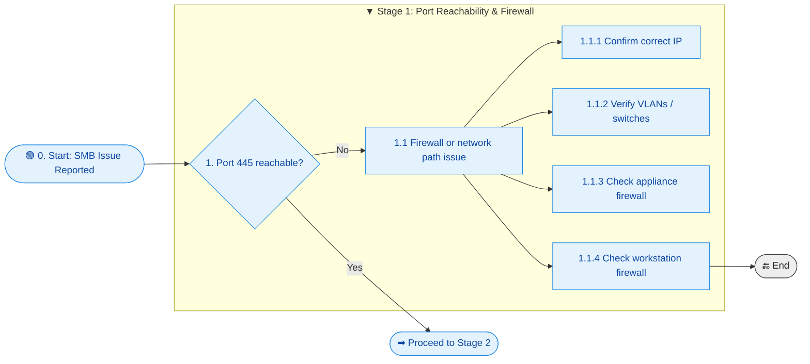
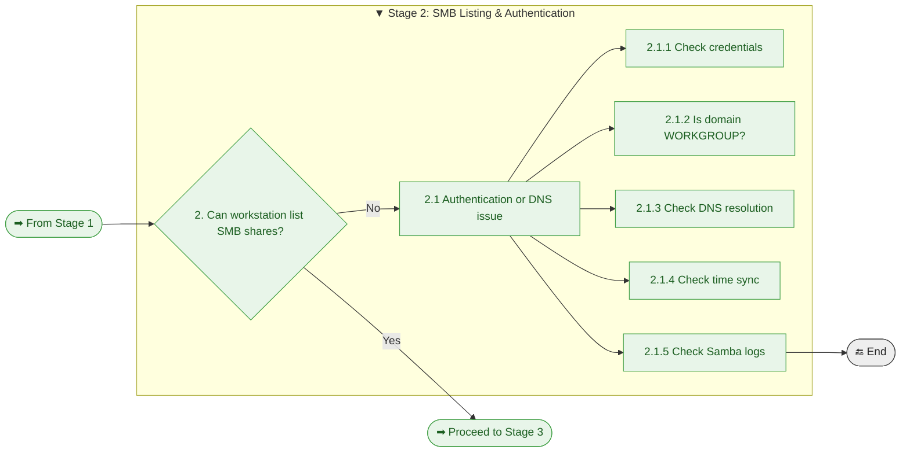
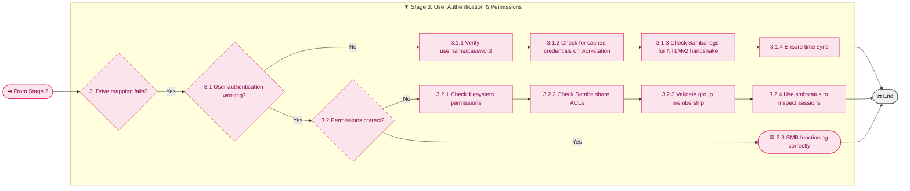

# Troubleshooting flowchart

The following flowchart will assist you in troubleshooting:

- You can't ping the device
- You can't map a drive to the appliance
- The machine tools can't connect

It's broken down into the following three stages:

----------------------------------------------------------------

----------------------------------------------------------------

## ⭐ Stage 1 — Port Reachability & Firewall Checks

----------------------------------------------------------------

- Port 445 reachable - use `nmap -p 22,445,9090 <appliance_ip>` to verify
- Confirm correct IP - Make sure you are using the correct IP address for the appliance.
- Verify VLANS/Switches - Use `ping <appliance_ip> to verify network connectivity to the appliance
- Check Appliance firewall - Use `sudo ufw status numbered | sort -k5` to list the appliance firewall rules
- Check W/S Firewall - This is a low probability. By default Windows, Mac, Linux allow outbound traffic

----------------------------------------------------------------

## ⭐ Stage 2 — SMB Share Listing & Authentication

----------------------------------------------------------------

- List SMB Shares - On the appliance, cd to `Haas_Data_collect` and run `./lshares.sh`
- Check Credentials - Run `manager_users.sh <username> --set-password` to reset the password
- Domain name - The domain name is `WORKGROUP` by default
- Check DNS - I you are using a FQDN instead of an ip use `dig` or `nslookup` to verify the appliance is registered in DNS
- Check Time Sync - On the appliance run `date` to see the current date/time on the appliance
- Check Samba logs on the appliance - Use `sudo tail -f /var/log/samba/log.smbd`. This keeps the logger running. Use `ctrl+c` to cancel it.

----------------------------------------------------------------

## ⭐ Stage 3 — User Authentication & Permissions

----------------------------------------------------------------

🖥️ Common Workstation Issues

!!! info "Common Workstation Issues"
    SMB failures often originate on the workstation rather than the appliance.
    The following issues are frequently encountered during testing and real-world deployments:

    **1. Cached Credentials**
    - Workstations (Ubuntu, macOS, Windows) may silently reuse old credentials.
    - Symptoms: drive mapping fails, NTLM handshake errors, wrong user shown in `smbstatus`.
    - Fix: clear credential cache or reboot the workstation.

    **2. GVFS / Nautilus SMB Caching (Ubuntu)**
    - GNOME’s GVFS layer caches SMB sessions aggressively.
    - Symptoms: incorrect permissions, stale directory listings, “permission denied” after config changes.
    - Fix: kill GVFS processes or reboot; avoid mixing Nautilus and `mount.cifs`.

    **3. Multiple SMB Clients on the Same System**
    - Linux systems may mix:
        - `gio mount`
        - `nautilus`
        - `mount.cifs`
        - `smbclient`
    - Each uses different credential paths and caching behavior.
    - Fix: use one method consistently during troubleshooting.

    **4. Time Skew**
    - Even small time differences break NTLMv2 authentication.
    - Symptoms: authentication failures despite correct credentials.
    - Fix: ensure workstation and appliance sync to the same NTP source.

    **5. DNS Resolution Issues**
    - Workstations may resolve the appliance hostname incorrectly.
    - Symptoms: intermittent failures, wrong IP in logs, slow connections.
    - Fix: verify `/etc/resolv.conf`, DNS search domains, and `dig` results.

    **6. SMB Client Minimum Protocol Settings**
    - The appliance only supports SMB2/3.
    - Symptoms: connection refused if the workstation doesn't support SMB2/3.
    - Fix: ensure the workstation supports SMB2/3 (default on modern systems).

    **7. Firewall or Local Security Policies**
    - Local workstation firewalls may block outbound SMB.
    - Symptoms: cannot reach port 445 despite correct server configuration.
    - Fix: check UFW, firewalld, Windows Defender Firewall, or corporate policies. This is low probability unless on a highly locked down network. In such an environment, AD policies will block port 445 to unauthorized ip addresses.

    **8. Credential Manager / Keychain Conflicts**
    - Windows Credential Manager, macOS/Linux Keychain may store stale SMB passwords.
    - Symptoms: repeated authentication failures with correct credentials.
    - Fix: remove stored SMB entries and reconnect.

----------------------------------------------------------------

🧩 Troubleshooting Quick‑Reference Table

| Symptom / Observation | Likely Cause | Quick Checks / Next Steps |
|----------------------|--------------|----------------------------|
| 🛜 Cannot reach server on port 445 | Stage 1 — Firewall or network path issue | [1.1.1 Confirm correct IP](#-stage-1--port-reachability--firewall-checks) • [1.1.2 Verify VLANs/switches](#stage-1-port-reachability--firewall) • [1.1.3 Appliance firewall](#stage-1-port-reachability--firewall) |
| 📁 Shares not listed | Stage 2 — Authentication or DNS issue | [2.1.1 Check credentials](#stage-2-smb-listing--authentication) • [2.1.3 DNS resolution](#stage-2-smb-listing--authentication) • [2.1.4 Time sync](#stage-2-smb-listing--authentication) |
| 👤 Wrong username appears in logs | Stage 2 — Cached credentials | [2.1.1 Verify credentials](#stage-2-smb-listing--authentication) • Clear credential cache • Reboot workstation |
| 🔐 Drive mapping fails | Stage 3 — Authentication failure | [3.1.1 Verify username/password](#stage-3-user-authentication--permissions) • [3.1.2 Clear cached credentials](#stage-3-user-authentication--permissions) • [3.1.3 Check NTLMv2 handshake](#stage-3-user-authentication--permissions) |
| 🚫 Access denied after mapping | Stage 3 — Permissions issue | [3.2.1 Filesystem permissions](#stage-3-user-authentication--permissions) • [3.2.2 Samba share ACLs](#stage-3-user-authentication--permissions) • [3.2.3 Group membership](#stage-3-user-authentication--permissions) |
| ⏱️ Intermittent failures | Stage 2 — DNS or time skew | [2.1.3 DNS resolution](#stage-2-smb-listing--authentication) • [2.1.4 Time sync](#stage-2-smb-listing--authentication) |
| 🔄 Behavior inconsistent across attempts | Stage 3 — Stale Samba session | [3.2.4 Use smbstatus](#stage-3-user-authentication--permissions) • Kill stale session • Reconnect |
| 🧩 Works on one device but not another | Stage 2 — Local firewall or endpoint policy | Check UFW/Windows Firewall • Corporate endpoint policies |
| 🐌 Slow browsing or delayed auth | Stage 2 — DNS search domain issues | Verify `/etc/resolv.conf` • Ensure correct search domain |
| 📂 User appears logged in but cannot access files | Stage 3 — Stale or conflicting session | [3.2.4 smbstatus](#stage-3-user-authentication--permissions) • Kill session • Reconnect |

----------------------------------------------------------------

## End of the troubleshooting guide

[test](../appendices/appendix-g.md/#-stage-1--port-reachability--firewall-checks)

[test](../appendices/appendix-g.md/#-stage-1--port-reachability--firewall-checks)
