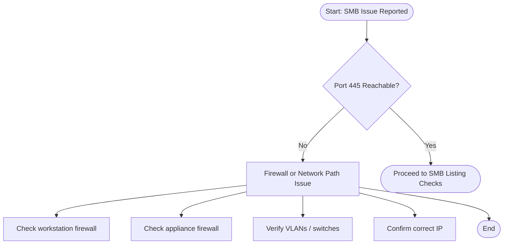
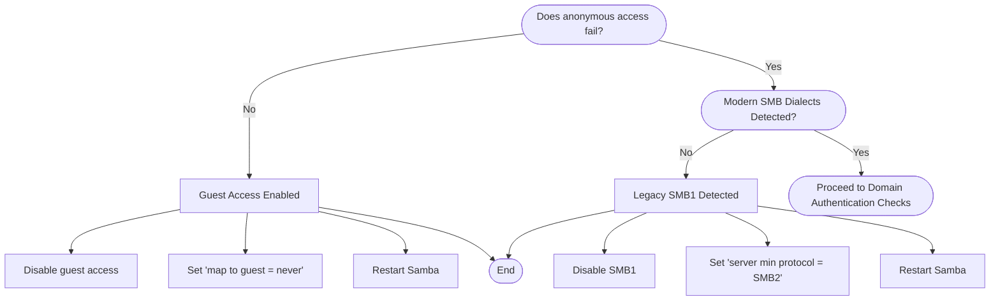

# Troubleshooting flowchart

## Stage 1 - Port Reachability & Firewall Checks



----------------------------------------------------------------

## Stage 2 — SMB Share Listing & Authentication

```mermaid
flowchart TD

START([SMB Listing Checks]) --> C([Can workstation list SMB shares?])

C -->|Yes| D([Proceed to Anonymous Access Checks])

C -->|No| C1[Authentication or DNS Issue]

C1 --> C1a[Verify username/password]
C1a --> C1b[Verify domain]
C1b --> C1c[Check DNS resolution]
C1c --> C1d[Check time sync (AD)]
C1d --> C1e[Review Samba logs]
C1e --> Z([End])
```

----------------------------------------------------------------

## Stage 3 — Anonymous Access & SMB Dialects



----------------------------------------------------------------

## Stage 4 — Domain Authentication & Permissions


----------------------------------------------------------------

## End of the troubleshooting guide
