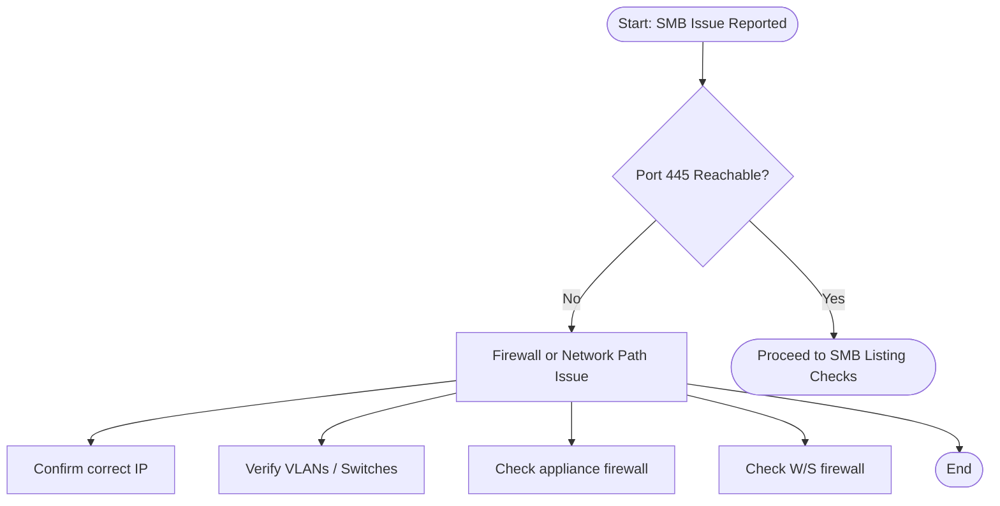
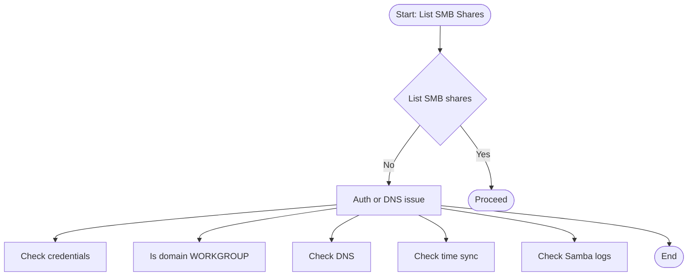
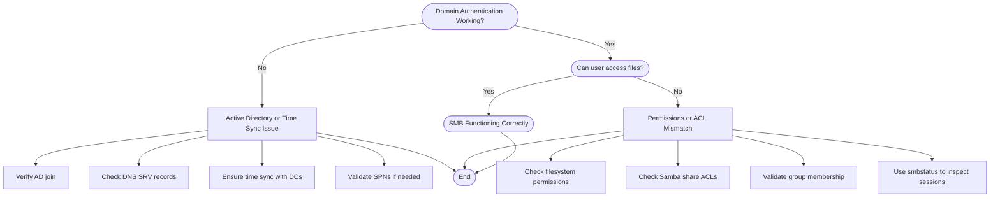

# Troubleshooting flowchart

## Stage 1 - Port Reachability & Firewall Checks

----------------------------------------------------------------

- Port 445 reachable - use `nmap -p 22,445,9090 <appliance_ip>` to verify
- Confirm correct IP - Make sure you are using the correct IP address for the appliance.
- Verify VLANS/Switches - Use `ping <appliance_ip> to verify network connectivity to the appliance
- Check Appliance firewall - Use `sudo ufw status numbered | sort -k5` to list the appliance firewall rules
- Check W/S Firewall - This is a low probability. By default Windows, Mac, Linux allow outbound traffic

----------------------------------------------------------------

## Stage 2 — SMB Share Listing & Authentication

----------------------------------------------------------------

- List SMB Shares - On the appliance, cd to `Haas_Data_collect` and run `./lshares.sh`
- Check Credentials - Run `manager_users.sh <username> --set-password` to reset the password
- Domain name - The domain name is `WORKGROUP` by default
- Check DNS - I you are using a FQDN instead of an ip use `dig` or `nslookup` to verify the appliance is registered in DNS
- Check Time Sync - On the appliance run `date` to see the current date/time on the appliance
- Check Samba logs on the appliance - Use `sudo tail -f /var/log/samba/log.smbd`. This keeps the logger running. Use `ctrl+c` to cancel it.

----------------------------------------------------------------

## Stage 3 — Anonymous Access & SMB Dialects

----------------------------------------------------------------

## Stage 4 — Domain Authentication & Permissions

----------------------------------------------------------------

## End of the troubleshooting guide
