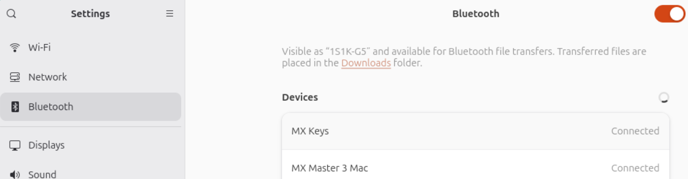

# Pair Bluetooth keyboard

----------------------------------------------------------------

If you used a Raspberry Pi 5 for your appliance, it has bluetooth built in. If you used physical PC it might have Bluetooth built in or you can use a [USB Bluetooth dongle](https://www.amazon.com/gp/aw/d/B09DMP6T22/) available on Amazon for about $15.

## Desktop version

The Desktop version of Ubuntu has bluetooth support built in so you don't need to install anything. Press `super + s` to open the quick settings menu. Then click the gear icon, click `bluetooth`. Move the slider to the right to enable bluetooth. Devices actively advertising bluetooth will appear.

----------------------------------------------------------------



----------------------------------------------------------------

## Server Version

Follow these instructions to connect a bluetooth keyboard to Ubuntu server. Connecting a bluetooth mouse is the same process except you won't type in the 6 digit code.

----------------------------------------------------------------

## Install Bluetooth support

```bash
sudo apt update
sudo apt install bluetooth bluez bluez-tools rfkill -y
```

----------------------------------------------------------------

## Verify the dongle is detected

If you used a PC and needed to use a Bluetooth dongle, follow these steps. If not, continue from [Start and enable the Bluetooth service](../appendices/appendix-h.md/#start-and-enable-the-bluetooth-service) below.

Check whether the system sees the adapter using the `list usb devices` command:

```bash
lsusb
```

```bash title='Command Output'
lsusb
Bus 001 Device 003: ID 04b4:f901 Cypress Semiconductor Corp. CYW20704A2
```

Bluetooth is usually not in the output. You will have to do a Google search. In this example, `Cypress Semiconductor Corp. CYW20704A2` is my bluetooth dongle.

Linux provides a tool called `hciconfig` for bluetooth devices. You can see all the options it supports by running `man hciconfig`. In this case `-a` to show all output.

```bash
hciconfig -a
```

```bash title='Command Output'
hciconfig -a
hci0:    Type: Primary  Bus: USB
    BD Address: DA:60:92:F7:CA:9A  ACL MTU: 1021:8  SCO MTU: 64:1
    UP RUNNING
    RX bytes:12236 acl:450 sco:0 events:729 errors:0
    TX bytes:7171 acl:85 sco:0 commands:141 errors:0
    ...Output removed for brevity
    Manufacturer: Cypress Semiconductor (305)
```

If nothing appears:

- Reseat the bluetooth dongle
- load the USB Bluetooth driver using `modprobe`

Modprobe is the tool to add or remove modules from the Linux kernel.:

```bash
sudo modprobe btusb
```

----------------------------------------------------------------

To verify that the module loaded use the `list modules` command:

```bash linenums='1' hl_lines='1'
lsmod | grep -i blue
```

```bash title='Command Output'
bluetooth            1019904  48 btrtl,btmtk,btintel,btbcm,bnep,btusb,rfcomm
```

----------------------------------------------------------------

## Start and enable the Bluetooth service

```bash
sudo systemctl start bluetooth
sudo systemctl enable bluetooth
```

----------------------------------------------------------------

## Enter the Bluetooth control shell

```bash
sudo bluetoothctl
```

```bash title='Command Output'
Waiting to connect to bluetoothd...
[bluetooth]# hci0 new_settings: powered bondable ssp br/edr le secure-conn
[bluetooth]# Agent registered
```

Inside the shell:

```hash
[bluetooth]# power on
[bluetooth]# Changing power on succeeded
[bluetooth]# agent on
Agent is already registered
default-agentdefault-agent
[bluetooth]# Default agent request successful
[bluetooth]# pairable on
[bluetooth]# Changing pairable on succeeded
[bluetooth]# scan on
[bluetooth]# SetDiscoveryFilter success
[bluetooth]# hci0 type 7 discovering on
[bluetooth]# Discovery started
```

You can copy the commands below and paste them in rather than pasting one at a time:

```bash
# copy and paste these in
power on
agent on
default-agent
pairable on
scan on
```

----------------------------------------------------------------

## Put your keyboard into pairing mode

In this example I am using a logitech MX Keys Mini keyboard. To put it into pairing mode:

**Hold Easy‑Switch key 1, 2, or 3 for 3 seconds until it blinks rapidly.**

Your server should now detect it.

----------------------------------------------------------------

## Pair the keyboard

Once you see something like:

```bash
[NEW] Device DA:60:92:F7:CA:9A MX Keys Mini
```

Run:

```bash
pair DA:60:92:F7:CA:9A
```

Ubuntu will display a PIN code. Type that PIN on the keyboard and press Enter.

This is required for keyboards, not for mice.

Then:
[bluetooth]# trust DA:60:92:F7:CA:9A
[bluetooth]# connect DA:60:92:F7:CA:9A

!!! Note
    Use the MAC of your keyboard, not the one in the example: DA:60:92:F7:CA:9

----------------------------------------------------------------

## ⚠️ Common Issues & Fixes

1. Keyboard not detected
    1. Make sure it’s not still connected to another device — keyboards often stop advertising when already paired.

2. Ubuntu finds no devices
    1. Check /etc/bluetooth/main.conf:
       ControllerMode = dual

If it’s set to bredr, change it to dual or comment it out.

Restart Bluetooth:
sudo systemctl restart bluetooth
