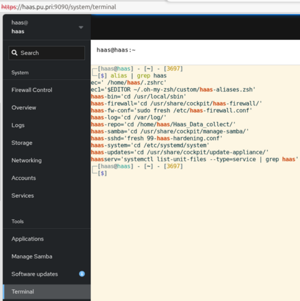
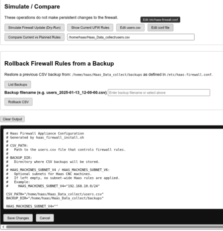
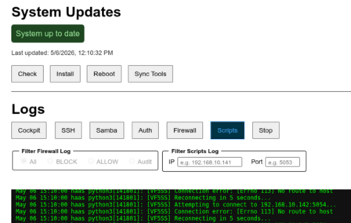

# Directories and aliases

The Linux shell allows a mix of `aliases` and `functions` to simplify common tasks. The zsh shell (terminal) on the appliance has several custom `aliases` and `functions` in the file `/home/haas/.oh-my-zsh/custom/haas-aliases.zsh`. These `aliases` and `functions` allow you to:

- Jump to important directories without having to remember the full path
- List the custom `haas` service files in the `/etc/systemd/system/` directory
- View the status of the custom `haas` services.
- Edit the firewall configuration file in `/etc/haas-firewall.conf`
- View the files in the cockpit extension directories
- output the complete path, one elemenet per line
- make a directory and switch to it.

I wrote a book on using Ubuntu for network engineering this chapter dives deeper on setting up a great terminal. Here is a link to it: [Build a Great Terminal](https://rikosintie.github.io/Ubuntu4NetworkEngineers/terminal/#install-oh-my-zsh)

You don't have to be logged in over ssh to use the terminal. The Cockpit management webpage has a terminal built in. You access the cockpit page at `https://<appliance_ip>:9090` or `http://dns_name:9090` if your appliance is registered in DNS (recommended). To edit the `haas-aliases.zsh` file, enter `ec1` at the terminal prompt. There is an alias defined that opens it in the `fresh` editor.

----------------------------------------------------------------



----------------------------------------------------------------

## List Aliases

You can type "haas' and tap the `tab' key to get a list of all the haas aliases that are built in.

```bash
haas [tab]
```

----------------------------------------------------------------

```bash title='Command Output'
haas-bin
haas-firewall
haas-log
haas-repo
haas-samba
haas-updates
haas-fw-conf
haas-sshd
haas-system
haasserv
```

----------------------------------------------------------------

Here are the aliases for directories:

```bash
alias haas-bin='cd /usr/local/sbin'
alias haas-firewall='cd /usr/share/cockpit/haas-firewall/'
alias haas-fw-conf='sudo fresh /etc/haas-firewall.conf'
alias haas-log='cd /var/log/'
alias haas-repo='cd /home/haas/Haas_Data_collect/'
alias haas-firewall='cd /usr/share/cockpit/haas_firewall'
alias haas-samba='cd /usr/share/cockpit/manage-samba/'
alias haas-systemd='cd /etc/systemd/system'
alias haas-updates='cd /usr/share/cockpit/update-appliance/'
```

----------------------------------------------------------------

## Additional Aliases - Functions

The following aliases and functions help you:

- List the state of the haas services
- List the haas services files found in /etc/systemd/system
- Edit the haas-firewall.conf file located in /etc/haas-firewall.conf
- Edit the ssh custom config file located in /etc/systemd/
- Output logs from the data collection scripts

### haas service state

The appliance uses several `systemd services` to accomplish its mission. The `haasserv` alias lists the status of all services that start with `haas`. It's important that you preface all CNC service files with `haas` or they will not be listed.

Below is the alias:

`alias haasserv='systemctl list-unit-files --type=service | grep haas'`

```bash hl_lines='2'
┌─[haas@haas] - [/usr/share/cockpit] - [3659]
└─[$] haasserv
```

```bash title='Command Output'
haas-firewall.service                        enabled         enabled
haas-minimill.service                        enabled         enabled
haas-st30.service                            enabled         enabled
haas-st30l.service                           enabled         enabled
haas-st40.service                            enabled         enabled
haas-vf2ss.service                           enabled         enabled
haas-vf5ss.service                           enabled         enabled
```

----------------------------------------------------------------

### List the haas system files

`haas-systemd` is a function. It changes to the `/etc/systemd/system/` directory and then lists the custom `haas` service files. This is very useful if you have more than 5-6 CNC machines. It's very easy to forget what you named the service file.

```bash
haas-systemd() {
    cd /etc/systemd/system/
    ls -l haas-*
    }
```

Here is the output of running the function:

```unixconfig title='Command Output'
-rw-r--r-- 1 root root 1159 Apr 17 21:00 haas-firewall.service
-rw-r--r-- 1 root root  730 Apr 17 21:00 haas-firewall.timer
-rw-r--r-- 1 root root  327 May  2 08:48 haas-minimill.service
-rw-r--r-- 1 root root  302 Mar 18 18:11 haas-st30.service
-rw-r--r-- 1 root root  305 Mar 18 18:08 haas-st30l.service
-rw-r--r-- 1 root root  302 Mar 18 19:33 haas-st40.service
-rw-r--r-- 1 root root  303 May  2 08:48 haas-vf2ss.service
-rw-r--r-- 1 root root  303 May  2 08:48 haas-vf5ss.service
```

----------------------------------------------------------------

### Edit haas-firewall.conf

The `haas-fw-conf` alias opens the configuration file in the `fresh` editor.

Below is the alias:

```bash
alias haas-fw-conf='sudo fresh /etc/haas-firewall.conf'
```

----------------------------------------------------------------

You can also edit the file using the Cockpit Firewall extension from a browser.



----------------------------------------------------------------

### Edit the ssh config file

The command `haas-sshd` alias opens /etc/ssh/sshd_config.d/99-haas-hardening.conf file in the fresh editor. Make sure you use `ctrl+s` to save the file if you make edits. You must restart the ssh daemon using `sudo systemctl restart ssh` or the changes will not be active.

```bash
alias haas-sshd='fresh /etc/systemd/system/99-haas-hardening.conf'
```

----------------------------------------------------------------

### Show the script logs

The scripts run constantly after they are installed with a service file. The `t-python3` alias opens the Linux journal and limits the output to `python3`. Machines that are working correctly don't generate logs. Machines that don't accept the script's connection request will create a log similar to this:

```bash
May 06 15:06:49 haas python3[141790]: [VF2SS] Connection refused. Machine may be offline or not accepting connections.
May 06 15:06:49 haas python3[141790]: [VF2SS] Reconnecting in 5 seconds...
May 06 15:06:49 haas python3[141790]: [VF2SS] Attempting to connect to 192.168.10.141:5053...
```

Here is the alias:

```bash
alias t-python3='journalctl -f --no-pager | grep -E 'python3' | tspin'
```

!!! Note
    It can take up to 2 minutes for the log to be displayed.

You an also see the logs in the Cockpit `Updates-Logs` extension. One advantage of the cockpit extension is that there is a filter for `ip address` and `port` so you can look at just one machine.

----------------------------------------------------------------



----------------------------------------------------------------

### Path function

This is an incredibly useful function! Sometimes a command just wont run or isn't found. You can use teh `which` command to see where the executable is, then `path to see if the executable is in the path.

```bash
# "path" shows current path, one element per line.
# If an argument is supplied, grep for it.
path() {
    test -n "$1" && {
        echo $PATH | perl -p -e "s/:/\n/g;" | grep -i "$1"
    } || {
        echo $PATH | perl -p -e "s/:/\n/g;"
    }
}
```

```bash hl_lines='1'
┌─[haas@haas] - [/usr/share/samba] - [3704]
└─[$] path
```

```bash title='Command Output'
/usr/local/bin
/usr/sbin
/usr/bin
/sbin
/bin
/usr/games
/usr/local/games
/snap/bin
```

----------------------------------------------------------------

### Make a directory and switch to it

This script uses `mkdir -p` to create a directory, and if necessary, the parent path, then switches to the directory. THe function saves several steps when creating the CNC machine folders under the `machines` directory.

You can switch to the `machines` folder, then use `mkd` as shown in teh example below.

```bash
mkd() {
    mkdir -p "$@"
    cd "$@" || exit
}
```

#### Example

```bash linenums='1' hl_lines='1'
┌─[haas@haas] - [~/Haas_Data_collect/machines] - [3715]
└─[$] pwd
/home/haas/Haas_Data_collect/machines
```

```bash hl_lines='2 5' title='Command Output'
┌─[haas@haas] - [~/Haas_Data_collect/machines] - [3717]
└─[$] mkd 01_test/cnc_logs
┌─[haas@haas] - [~/Haas_Data_collect/machines/01_test/cnc_logs] - [3718]
└─[$]
```

----------------------------------------------------------------

## Important Directories

----------------------------------------------------------------

### CNC Machine directories are located under

```bash
/home/haas/Haas_Data_collect/machines
```

----------------------------------------------------------------

### Custom SSH config file is located here

```hash
/etc/ssh/sshd_config.d/99-haas-hardening.conf
```

----------------------------------------------------------------

### Cockpit Extensions are located here

```bash
/usr/share/cockpit/haas-firewall
```

```bash
/usr/share/cockpit/update-appliance
```

```bash
/usr/share/cockpit/manage-samba
```

----------------------------------------------------------------

### Prelogin banner is located here

```bash
/etc/issue.net
```

----------------------------------------------------------------

### Samba files

Configuration file location

```bash
/etc/samba/smb.conf
```

Log files for each machine that connected

```bash
/var/log/samba/
```

----------------------------------------------------------------

### Systemd services

The service files for each CNC machine and the firewall are located here:

```bash
/etc/systemd/system/
```

----------------------------------------------------------------

### System Scripts

All system scripts for the appliance are located here:

```bash
/usr/local/sbin
```

----------------------------------------------------------------

## Scripts

- build-nmap.sh
- configure_ufw_from_csv.sh
- gh-updater.lib.sh
- haas_firewall_install.sh
- haas_firewall_uninstall.sh
- install-tools.sh
- lshares.sh
- manage_users.sh
- rollback_csv.sh
- smb_verify.sh
- ssh_port.sh
- ssh_validate.sh
- update-check.sh
- update-system.sh
- validate_users_csv.sh
