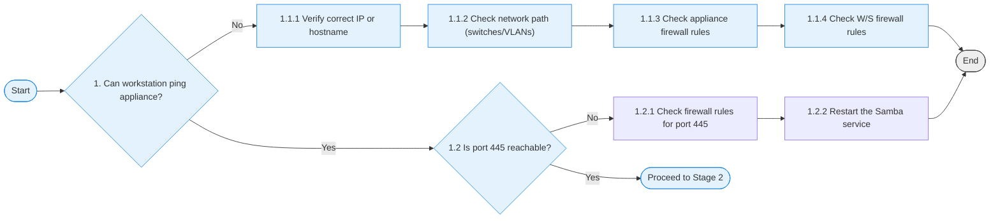
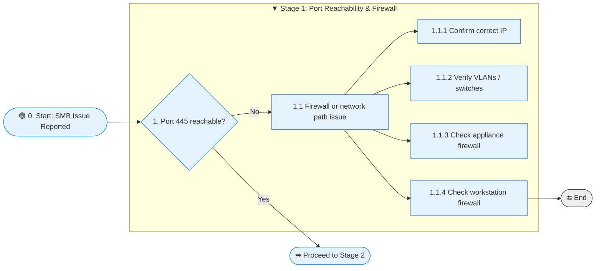

```mermaid
%%{init: {"themeCSS": ".stage1 .nodeLabel{color:#0d47a1 !important} .terminal .nodeLabel{color:#212121 !important}"}}%%
flowchart LR

    classDef stage1 fill:#e3f2fd,stroke:#1e88e5,stroke-width:1px,color:#0d47a1 !important;
    classDef terminal fill:#eeeeee,stroke:#424242,color:#212121 !important;

    A([Start]) --> B{1. Can workstation ping appliance?}
    class A,B stage1

    %% Cannot reach server
    B -->|No| C["1.1.1 Verify correct IP or hostname"]
    C --> D["1.1.2 Check network path (switches/VLANs)"]
    D --> E["1.1.3 Check appliance firewall rules"]
    E --> F["1.1.4 Check W/S firewall rules"]
    F --> Z([End])
    class C,D,E,F stage1
    class Z terminal

    %% Can reach server
    B -->|Yes| G{1.2 Is port 445 reachable?}
    class G stage1

    G -->|No| H["1.2.1 Check firewall rules for port 445"]
    H --> I["1.2.2 Restart the Samba service"]
    I --> Z

    G -->|Yes| J([Proceed to Stage 2])
    class J stage1
```

```mermaid
%%{init: {"themeCSS": ".stage1 .nodeLabel{color:#0d47a1 !important} .terminal .nodeLabel{color:#212121 !important}"}}%%
flowchart LR

    %% Styles
    classDef stage1 fill:#e3f2fd,stroke:#1e88e5,stroke-width:1px,color:#0d47a1 !important;
    classDef terminal fill:#eeeeee,stroke:#424242,color:#212121,stroke-width:1px !important;

    %% Stage 1 Entry
    A([🟢 0. Start: SMB Issue Reported]) --> B{1. Port 445 reachable?}
    class A,B stage1

    %% Stage 1
    subgraph Stage1 [▼ Stage 1: Port Reachability & Firewall]
        direction LR

        %% No path → firewall troubleshooting
        B -->|No| B1[1.1 Firewall or network path issue]
        B1 --> B1a[1.1.1 Confirm correct IP]
        B1 --> B1b[1.1.2 Verify VLANs / switches]
        B1 --> B1c[1.1.3 Check appliance firewall]
        B1 --> B1d[1.1.4 Check workstation firewall]
    end

    class B1,B1a,B1b,B1c,B1d stage1

    %% End if unreachable
    B1d --> Z([🔚 End])
    class Z terminal

    %% Yes path → Stage 2
    B -->|Yes| NextStage2([➡ Proceed to Stage 2])
    class NextStage2 stage1
```
