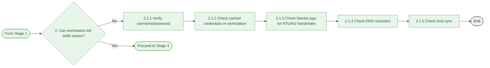
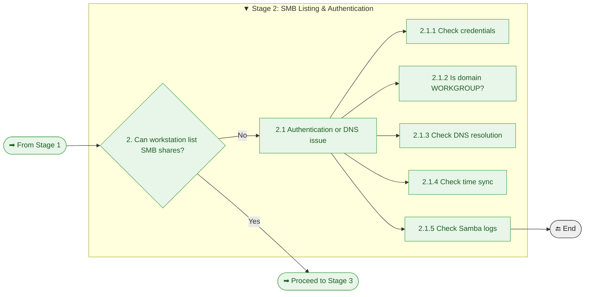

```mermaid

flowchart LR

    classDef stage2 fill:#e8f5e9,stroke:#43a047,stroke-width:1px,color:#1b5e20;
    classDef terminal fill:#eeeeee,stroke:#424242,color:#212121;

    A([From Stage 1]) --> B{2. Can workstation list SMB shares?}
    class A,B stage2

    %% Listing fails
    B -->|No| C["2.1.1 Verify username/password"]
    C --> D["2.1.2 Check cached credentials on workstation"]
    D --> E["2.1.3 Check Samba logs for NTLMv2 handshake"]
    E --> F["2.1.4 Check DNS resolution"]
    F --> G["2.1.5 Check time sync"]
    G --> Z([End])
    class C,D,E,F,G stage2
    class Z terminal

    %% Listing succeeds
    B -->|Yes| H([Proceed to Stage 3])
    class H stage2
```

```mermaid
flowchart LR

    %% Styles
    classDef stage2 fill:#e8f5e9,stroke:#43a047,stroke-width:1px,color:#1b5e20;
    classDef terminal fill:#eeeeee,stroke:#424242,color:#212121,stroke-width:1px;

    %% Stage 2 Entry
    A([➡ From Stage 1]) --> C{2. Can workstation list SMB shares?}
    class A,C stage2

    %% Stage 2
    subgraph Stage2 [▼ Stage 2: SMB Listing & Authentication]
        direction LR

        C -->|No| C1[2.1 Authentication or DNS issue]

        C1 --> C1a[2.1.1 Check credentials]
        C1 --> C1b[2.1.2 Is domain WORKGROUP?]
        C1 --> C1c[2.1.3 Check DNS resolution]
        C1 --> C1d[2.1.4 Check time sync]
        C1 --> C1e[2.1.5 Check Samba logs]
    end

    class C1,C1a,C1b,C1c,C1d,C1e stage2

    %% End if listing fails
    C1e --> Z([🔚 End])
    class Z terminal

    %% Success path → Stage 3
    C -->|Yes| NextStage3([➡ Proceed to Stage 3])
    class NextStage3 stage2
```
