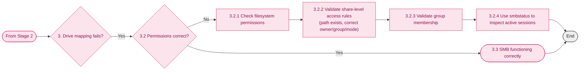
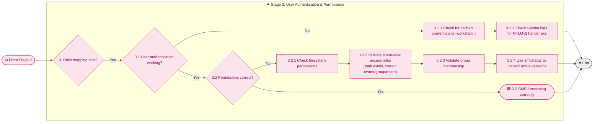

```mermaid

flowchart LR

    classDef stage3 fill:#fce4ec,stroke:#d81b60,stroke-width:1px,color:#880e4f;
    classDef terminal fill:#eeeeee,stroke:#424242,color:#212121;

    A([From Stage 2]) --> B{3. Drive mapping fails?}
    class A,B stage3

    %% Permissions branch
    B -->|Yes| C{3.2 Permissions correct?}
    class C stage3

    C -->|No| D["3.2.1 Check filesystem permissions"]
    D --> E["3.2.2 Validate share-level access rules\n(path exists, correct owner/group/mode)"]
    E --> F["3.2.3 Validate group membership"]
    F --> G["3.2.4 Use smbstatus to inspect active sessions"]
    G --> Z([End])
    class D,E,F,G stage3
    class Z terminal

    %% Success
    C -->|Yes| H([3.3 SMB functioning correctly])
    H --> Z
    class H stage3
```

```mermaid

flowchart LR

    %% Styles
    classDef stage3 fill:#fce4ec,stroke:#d81b60,stroke-width:1px,color:#880e4f;
    classDef terminal fill:#eeeeee,stroke:#424242,color:#212121,stroke-width:1px;

    %% Stage 3 Entry
    A([➡ From Stage 2]) --> D{3. Drive mapping fails?}
    class A,D stage3

    %% Stage 3
    subgraph Stage3 [▼ Stage 3: User Authentication & Permissions]
        direction LR

        %% Tier 1 — Authentication
        D -->|Yes| E{3.1 User authentication working?}

        %% Only meaningful workstation-side checks remain
        E -->|No| E1[3.1.1 Check for cached credentials on workstation]
        E1 --> E2[3.1.2 Check Samba logs for NTLMv2 handshake]

        %% Tier 2 — Permissions
        E -->|Yes| F{3.2 Permissions correct?}

        F -->|No| F1[3.2.1 Check filesystem permissions]
        F1 --> F2["3.2.2 Validate share-level access rules\n(path exists, correct owner/group/mode)"]
        F2 --> F3[3.2.3 Validate group membership]
        F3 --> F4[3.2.4 Use smbstatus to inspect active sessions]

        %% Success
        F -->|Yes| G([🟦 3.3 SMB functioning correctly])
    end

    class E,E1,E2,F,F1,F2,F3,F4,G stage3

    %% Endpoints
    E2 --> Z([🔚 End])
    F4 --> Z
    G --> Z
    class Z terminal
```
