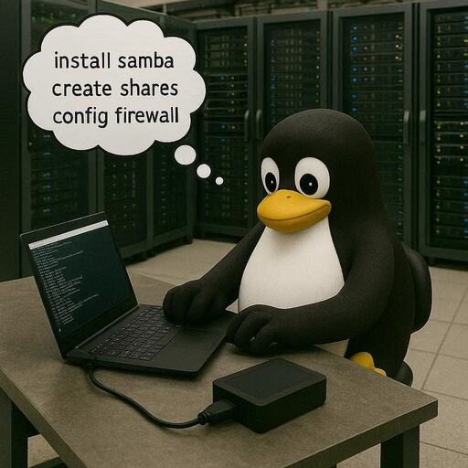

# Install Samba for Windows integration

----------------------------------------------------------------



----------------------------------------------------------------

**What is a Samba Server?**

A [Samba server](https://www.samba.org/) is an open-source software suite that enables seamless file and printer sharing between Linux/Unix systems and Windows systems. It implements the Server Message Block (SMB) and Common Internet File System (CIFS) protocols, which are standard for Windows-based file sharing. Samba also supports integration with Active Directory (AD) environments, making it a versatile tool for mixed-OS networks.

- Active Directory Integration: It can act as an Active Directory Domain Controller or a member server, supporting protocols like LDAP and Kerberos.

----------------------------------------------------------------

For my project I chose not to use Active Directory integration because 99% of MSPs will freak out if you say you need a Linux server connected to Active Directory. We are only dealing with:

- One account for the machines
- A handful of accounts for the CNC Programmers
- A handful of accounts for Operations personnel that will use the spreadsheets created by the scripts

Creating local accounts on the Raspberry Pi 5 is straight forward and we can script it if needed. If you want use Active Directory integration there are plenty of blogs/YouTube Videos available.

----------------------------------------------------------------

## Install Samba Server

Open a terminal on the Raspberry Pi 5 and enter

```bash
sudo apt update && sudo apt install -y samba
```

This will install the Samba Server packages. The `-y` means "Don't prompt for yes". If you want to be in control during the installation don't include the `-y`.

----------------------------------------------------------------

Configure the Samba Server to start on boot and start the Samba Server

```bash
sudo systemctl enable --now smbd
sudo systemctl start smbd
```

----------------------------------------------------------------

Anytime you need to restart the Samba Server, use the following:

```bash
sudo systemctl restart smbd
```

----------------------------------------------------------------

### Verify the installation

Run the following to verify the Samba Server installation and location:

```bash
whereis samba
```

```bash title='Command Output'
samba: /usr/sbin/samba /usr/lib/x86_64-linux-gnu/samba /etc/samba /usr/libexec/samba /usr/share/samba /usr/share/man/man8/samba.8.gz /usr/share/man/man7/samba.7.gz
```

----------------------------------------------------------------

Run this to view the Samba Server version:

```bash
samba --version
```

```bash title='Command Output'
Version 4.19.5-Ubuntu
```

As you can see, on January 4th, 2025 the current version is 4.19.5.

----------------------------------------------------------------

Run the this to see the smb.conf file and service status

```bash
testparm -s
```

```bash title='Command Output'
Load smb config files from /etc/samba/smb.conf
Loaded services file OK.
Weak crypto is allowed by GnuTLS (e.g. NTLM as a compatibility fallback)

Server role: ROLE_STANDALONE
```

This is just the top of the file. The entire smb.conf file will be displayed

----------------------------------------------------------------

Run the following to display the Samba Server service status:

```bash
sudo systemctl status smbd
```

```bash title='Command Output'
● smbd.service - Samba SMB Daemon
     Loaded: loaded (/usr/lib/systemd/system/smbd.service; enabled; preset: enabled)
     Active: active (running) since Fri 2025-12-26 21:59:34 PST; 1 week 1 day ago
       Docs: man:smbd(8)
             man:samba(7)
             man:smb.conf(5)
   Main PID: 10736 (smbd)
     Status: "smbd: ready to serve connections..."
      Tasks: 4 (limit: 4601)
     Memory: 24.9M (peak: 48.2M swap: 1.4M swap peak: 1.4M)
        CPU: 23.914s
     CGroup: /system.slice/smbd.service
             ├─10736 /usr/sbin/smbd --foreground --no-process-group
             ├─10739 "smbd: notifyd" .
             ├─10740 "smbd: cleanupd "
             └─75813 "smbd: client [192.168.10.143]"

Dec 27 19:07:06 ubuntu-server smbd[20940]: pam_unix(samba:session): session opened for user haas(uid=1000) by (uid=0)
```

----------------------------------------------------------------

## The directory structure

We will need the table we created earlier for reference. The concept is to create a share on the `Haas_Data_collect` directory named `Haas`. This top level share will will be able so see the entire directory structure when it's mapped to a Windows network drive.

Then create a directory/share for each Haas machine tool. The Haas machine tool share will be used for the CNC programmer to drop programs into and the machine operator to load from. This share is used when setting up the Ethernet on the CNC control.

The Haas data collection scripts create the spreadsheets in the `cnc_logs` directory.

The final structure will look like this:

```bash
├── haas
    ├── Haas_Data_collect
       ├── cnc_logs
       ├── minimill
       ├── st30
       ├── st30l
       ├── st40
       ├── vf2ss
       └── vf5ss
```

----------------------------------------------------------------

### Create the shares

First we need to create the directories. We can refer to our table for the names:

----------------------------------------------------------------

| Machine  | Port# |   IP Address   |
|----------|-------|:--------------:|
| ST40     | 5052  | 192.168.10.141 |
| VF2SS    | 5053  | 192.168.10.142 |
| VF5SS    | 5054  | 192.168.10.143 |
| MINIMILL | 5055  | 192.168.10.143 |
| ST30     | 5056  | 192.168.10.144 |
| ST30L    | 5057  | 192.168.10.145 |

----------------------------------------------------------------

If you are only doing a handful of machines use:

```bash
mkdir /home/haas/Haas_Data_collect/st40
```

And repeat for each machine. If you used the Python script under [Scaling up](configuring_appliance.md/#scaling-up) with the `systemd-template.txt` it creates the 'mkdir' command along with the aliases.

**Open the `smb.conf` file**

```bash
sudo nano /etc/samba/smb.conf
```

Go to the bottom of the file and paste this code in:

```bash
# Share for Haas CNC Programs

[Haas]
    comment = Haas
    path = /home/haas/Haas_Data_collect
    read only = no
    browsable = yes
    writable = yes
    browsable = yes
    public = no
    valid users = @HaasGroup, haas # Ensure the user is valid
    force user = haas
    force group = HaasGroup
    create mask = 0664
    force create mode = 0664
    directory mask = 0775
    force directory mode = 0775
```

This is the root directory. All other paths will be appended to the end of `/home/haas/Haas_Data_collect`. For example:

```bash linenums='1' hl_lines='1'
[ST40]
    comment = st40
    path = /home/haas/Haas_Data_collect/st40
    read only = no
    browsable = yes
    writable = yes
    browsable = yes
    public = no
    valid users = @HaasGroup, haas # Ensure the user is valid
    force user = haas
    force group = HaasGroup
    create mask = 0664
    force create mode = 0664
    directory mask = 0775
    force directory mode = 0775
```

----------------------------------------------------------------

If you used the Python script with the `systemd-template.txt`, it creates all of the smb.conf share commands. Open each file and copy the code after `Create the share configuration`.

```bash linenums='1' hl_lines='13-17'
sudo cp st1.service /etc/systemd/system/st1.service
sudo systemctl daemon-reload
sudo systemctl enable st1.service
sudo systemctl start st1.service
sudo systemctl status st1.service

# Create the directory for the share

mkdir /home/haas/Haas_Data_collect/st1

Create the share configuration

[st1]
    comment =
    path = /home/haas/Haas_Data_collect/st1
    read only = no
    browsable = yes
    writable = yes
    browsable = yes
    public = no
    valid users = @HaasGroup, haas # Ensure the user is valid
    force user = haas
    force group = HaasGroup
    create mask = 0664
    force create mode = 0664
    directory mask = 0775
    force directory mode = 0775
```

----------------------------------------------------------------

The following options are needed so that files created from Windows, Mac, Linux with mapped drives get the correct permissions:

1. **force user = haas:** Ensures that all operations on this share are performed as the user haas, making them the owner of all new files.
1. **force group = HaasGroup:** Ensures that all new files and directories are assigned to the group HaasGroup.
1. **create mask = 0664 and force create mode = 0664:** These lines work together to ensure that the resulting file permissions are exactly rw-rw-r-- (664 octal).
1. **directory mask = 0775 and force directory mode = 0775:** These lines ensure that new directories are created with rwxrwxr-x permissions (775 octal), which includes the necessary execute bit for directory traversal.

Ensure the underlying Linux directory permissions are correct:
On the server's filesystem, make sure the shared directory (/home/haas/Haas_Data_collect) in this example is owned by `haas:HaasGroup`.

After you add all the share configurations, save `/etc/samba/smb.conf` and exit nano.

----------------------------------------------------------------

Based on the [table](Install_Samba.md/#create-the-shares) above this is what the share section will look like:

```bash linenums='1'
# Share for Haas CNC Programs

[Haas]
    comment = Haas Directory Share
    path = /home/haas/Haas
    browseable = yes
    writable = yes
    guest ok = no
    valid users = @HaasGroup, haas # Ensure the user is valid
    force user = haas
    force group = HaasGroup
    create mask = 0664
    force create mode = 0664
    directory mask = 0775
    force directory mode = 0775
[ST40]
    comment = ST40
    path = /home/haas/Haas_Data_collect/st40
    read only = no
    browsable = yes
    public = no
    valid users = @HaasGroup, haas # Ensure the user is valid
    force user = haas
    force group = HaasGroup
    create mask = 0664
    force create mode = 0664
    directory mask = 0775
    force directory mode = 0775
[minimill]
    comment = minimill
    path = /home/haas/Haas_Data_collect/minimill
    read only = no
    browsable = yes
    public = no
    valid users = @HaasGroup, haas # Ensure the user is valid
    force user = haas
    force group = HaasGroup
    create mask = 0664
    force create mode = 0664
    directory mask = 0775
    force directory mode = 0775
[VF2SS]
    comment = vf2ss
    path = /home/haas/Haas_Data_collect/vf2ss
    valid users = @HaasGroup
    read only = no
    public = no
    valid users = @HaasGroup, haas # Ensure the user is valid
    force user = haas
    force group = HaasGroup
    create mask = 0664
    force create mode = 0664
    directory mask = 0775
    force directory mode = 0775
  [VF5SS]
    comment = vf5ss
    path = /home/haas/Haas_Data_collect/vf5ss
    read only = no
    browsable = yes
    public = no
    valid users = @HaasGroup, haas # Ensure the user is valid
    force user = haas
    force group = HaasGroup
    create mask = 0664
    force create mode = 0664
    directory mask = 0775
    force directory mode = 0775
[ST30]
    comment = st30
    path = /home/haas/Haas_Data_collect/st30
    read only = no
    browsable = yes
    public = no
    valid users = @HaasGroup, haas # Ensure the user is valid
    force user = haas
    force group = HaasGroup
    create mask = 0664
    force create mode = 0664
    directory mask = 0775
    force directory mode = 0775
[ST30L]
    comment = st30l
    path = /home/haas/Haas_Data_collect/st30l
    read only = no
    browsable = yes
    public = no
    valid users = @HaasGroup, haas # Ensure the user is valid
    force user = haas
    force group = HaasGroup
    create mask = 0664
    force create mode = 0664
    directory mask = 0775
   force directory mode = 0775

```

----------------------------------------------------------------

## Restart the Samba Server

Now that the /etc/samba/smb.conf file has been updated you need to restart the Samba Server service.

This command restarts the samba service.

```bash
sudo systemctl restart smbd
```

There is no output from this command.

----------------------------------------------------------------

## View the status of the shares

This command outputs a lot of information.

```bash
sudo smbstatus shares
```

```bash title='Command Output'
Samba version 4.19.5-Ubuntu
PID     Username     Group        Machine                                   Protocol Version  Encryption           Signing
----------------------------------------------------------------------------------------------------------------------------------------
127044  haas     haas     192.168.10.143 (ipv4:192.168.10.143:51376) SMB3_11           -                    partial(AES-128-GMAC)
117495  mchavez      mchavez      192.168.10.120 (ipv4:192.168.10.120:55586) SMB3_11           -                    partial(AES-128-GMAC)
127455  rgoodwin     rgoodwin     192.168.10.104 (ipv4:192.168.10.104:52578) SMB3_11           -                    partial(AES-128-GMAC)
127051  haas     haas     192.168.10.143 (ipv4:192.168.10.143:48096) SMB3_11           -                    partial(AES-128-GMAC)

Service      pid     Machine       Connected at                     Encryption   Signing
---------------------------------------------------------------------------------------------
minimill     127455  192.168.10.104 Fri Jan  9 07:41:53 PM 2026 PST  -            -
Haas         127051  192.168.10.143 Fri Jan  9 06:27:16 PM 2026 PST  -            -
ST40         127044  192.168.10.143 Fri Jan  9 06:26:33 PM 2026 PST  -            -
ST30         117495  192.168.10.120 Thu Jan  8 11:45:23 AM 2026 PST  -            -


Locked files:
Pid          User(ID)   DenyMode   Access      R/W        Oplock           SharePath   Name   Time
--------------------------------------------------------------------------------------------------
127455       1002       DENY_NONE  0x100081    RDONLY     NONE             /home/haas/Haas_Data_collect/minimill   .   Fri Jan  9 19:49:03 2026
127455       1002       DENY_NONE  0x100081    RDONLY     NONE             /home/haas/Haas_Data_collect/minimill   .   Fri Jan  9 19:49:03 2026
127455       1002       DENY_NONE  0x100081    RDONLY     NONE             /home/haas/Haas_Data_collect/minimill   .   Fri Jan  9 19:49:03 2026
127455       1002       DENY_NONE  0x120089    RDONLY     LEASE(RWH)       /home/haas/Haas_Data_collect/minimill   O1000.txt   Fri Jan  9 19:57:32 2026
117495       1003       DENY_NONE  0x100081    RDONLY     NONE             /home/haas/Haas_Data_collect/st30   .   Thu Jan  8 11:45:51 2026
117495       1003       DENY_NONE  0x100081    RDONLY     NONE             /home/haas/Haas_Data_collect/st30   .   Thu Jan  8 11:45:51 2026

```

### What the output means

The first section list the username, group, IP address of the machine that mapped the drive. Then you can see that SMB3 is being used. Yes, no SMBv1 vulnerabilities on the appliance!

----------------------------------------------------------------

The second section lists the `systemd service file` that was used for each device, the IP address and the `pid`. In this case, there are the following devices connected:

- 192.168.10.104 - A Windows 11 laptop with a mapping to the `minimill` share
- 192.168.10.143 - An Ubuntu laptop with a mapping to the `Haas` share
- 192.168.10.143 - An Ubuntu laptop with a mapping to the `ST40` share
- 192.168.10.120 - An Apple Silicon MacBook with a mapping to the `ST30` share

----------------------------------------------------------------

The third section lists files that are locked. This can useful information if a user closed a


----------------------------------------------------------------


----------------------------------------------------------------

To force all new files and directories created via Samba to have a specific owner and permissions, you need to modify the share's configuration in your smb.conf file.

This configuration requires two main changes:
Enforce the desired user and group ownership for all connections to that share.
Set the default file and directory creation masks to match the desired permissions.
Configuration Steps
Edit your Samba configuration file:
Use a text editor like nano to edit the smb.conf file. The path is typically /etc/samba/smb.conf.

```bash
sudo nano /etc/samba/smb.conf
```

Locate the relevant share definition (e.g., [myshare]) and add or modify the following lines within that specific share section:
ini
[myshare]
  comment = Shared Directory
  path = /srv/samba/myshare
  writable = yes
  browsable = yes
  public = no
  valid users = @HaasGroup, haas # Ensure the user is valid
  force user = haas
  force group = HaasGroup
  create mask = 0664
  force create mode = 0664
  directory mask = 0775
  force directory mode = 0775

1. force user = haas: Ensures that all operations on this share are performed as the user haas, making them the owner of all new files.
1. force group = HaasGroup: Ensures that all new files and directories are assigned to the group HaasGroup.
1. create mask = 0664 and force create mode = 0664: These lines work together to ensure that the resulting file permissions are exactly rw-rw-r-- (664 octal).
1. directory mask = 0775 and force directory mode = 0775: These lines ensure that new directories are created with rwxrwxr-x permissions (775 octal), which includes the necessary execute bit for directory traversal.

Ensure the underlying Linux directory permissions are correct:
On the server's filesystem, make sure the shared directory (/home/haas/Haas_Data_collect) in this example) is owned by haas:HaasGroup.

sudo chown -R haas:HaasGroup /home/haas/Haas_Data_collect
sudo chmod -R 2775 /home/haas/Haas_Data_collect

The 2 in 2775 sets the setgid bit, which ensures that all locally created files also inherit the HaasGroup.
