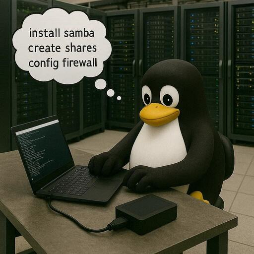

# Install Samba for Windows integration

----------------------------------------------------------------



----------------------------------------------------------------

**What is a Samba Server?**

A [Samba server](https://www.samba.org/) is an open-source software suite that enables seamless file and printer sharing between Linux/Unix systems and Windows systems. It implements the Server Message Block (SMB) and Common Internet File System (CIFS) protocols, which are standard for Windows-based file sharing. Samba also supports integration with Active Directory (AD) environments, making it a versatile tool for mixed-OS networks.

- Active Directory Integration: Samba can act as an Active Directory Domain Controller or a member server, supporting protocols like LDAP and Kerberos.

!!! Note
    If the appliance isn't added to Active Directory as a member server it will only offer `NTLMv2` authentication to Windows. If your company's security policy doesn't allow NTLMV2, then you must join the appliance to the domain. Microsoft plans to disable `NTLMv2` in 2028 so you will have to Active Directory integrate it then or re-enable NTLMv2 on the desktops connecting to it!

----------------------------------------------------------------

For my project I chose not to use Active Directory integration because most small/medium manufacturing companies use Managed Service Providers (MSP) to support their IT operations. MSP don't normally run Linux servers and push back if you say you need a Linux server connected to Active Directory. We are only dealing with:

- One account for the machines (haassvc)
- A handful of accounts for the CNC Programmers
- A handful of accounts for Operations personnel that will use the spreadsheets created by the scripts

Creating local Linux accounts on the appliance is straight forward and the project includes a script to create users. See the section [There are two trains of thoughts on usernames](../build_pi_5_appliance/configuring_appliance.md/#there-are-two-trains-of-thoughts-on-usernames) before deciding what accounts to use.

If you want use Active Directory integration there are plenty of blogs/YouTube Videos available.

----------------------------------------------------------------

## Install Samba Server

The installation script, `haas_firewall_install.sh`, completes all of the steps needed to install Samba Server on the appliance. These instructions are provided for reference if you want to understand what installation script does.

If you plan to use the installation script and don't want to read the details of installing Samba Server jump to [The Directory Structure](../build_pi_5_appliance/Install_Samba.md/#the-directory-structure) to learn about the directory structure that is needed.

----------------------------------------------------------------

Open a terminal on the appliance and enter

```bash
sudo apt update && sudo apt install -y samba
```

This will install the Samba Server packages. The `-y` means "Don't prompt for yes". If you want to be in control during the installation don't include the `-y`.

----------------------------------------------------------------

Configure the Samba Server to start on boot and start the Samba Server

```bash
sudo systemctl enable --now smbd
sudo systemctl start smbd
```

----------------------------------------------------------------

Anytime you need to restart the Samba Server, use the following:

```bash
sudo systemctl restart smbd
```

----------------------------------------------------------------

### Verify the installation

Run the following to verify the Samba Server installation and location:

```bash
whereis samba
```

```bash title='Command Output'
samba: /usr/sbin/samba /usr/lib/x86_64-linux-gnu/samba /etc/samba /usr/libexec/samba /usr/share/samba /usr/share/man/man8/samba.8.gz /usr/share/man/man7/samba.7.gz
```

----------------------------------------------------------------

Run this to view the Samba Server version:

```bash
samba --version
```

```bash title='Command Output'
Version 4.19.5-Ubuntu
```

As you can see, on January 4th, 2026 the current version is 4.19.5. Samba removed SMBv1 at version 4.16 so there is no chance of it getting enabled by mistake.

----------------------------------------------------------------

Run this to verify that there are no errors in smb.conf file.

```bash
testparm -s
```

```bash title='Command Output'
Load smb config files from /etc/samba/smb.conf
Loaded services file OK.
Weak crypto is allowed by GnuTLS (e.g. NTLM as a compatibility fallback)

Server role: ROLE_STANDALONE
```

This is just the top of the file. The entire smb.conf file will be displayed. You will need to scroll up to see any error messages since the conf file is longer than one screen.

----------------------------------------------------------------

Run the following to display the Samba Server service status:

```bash
sudo systemctl status smbd
```

```bash title='Command Output'
● smbd.service - Samba SMB Daemon
     Loaded: loaded (/usr/lib/systemd/system/smbd.service; enabled; preset: enabled)
     Active: active (running) since Fri 2025-12-26 21:59:34 PST; 1 week 1 day ago
       Docs: man:smbd(8)
             man:samba(7)
             man:smb.conf(5)
   Main PID: 10736 (smbd)
     Status: "smbd: ready to serve connections..."
      Tasks: 4 (limit: 4601)
     Memory: 24.9M (peak: 48.2M swap: 1.4M swap peak: 1.4M)
        CPU: 23.914s
     CGroup: /system.slice/smbd.service
             ├─10736 /usr/sbin/smbd --foreground --no-process-group
             ├─10739 "smbd: notifyd" .
             ├─10740 "smbd: cleanupd "
             └─75813 "smbd: client [192.168.10.143]"

Dec 27 19:07:06 ubuntu-server smbd[20940]: pam_unix(samba:session): session opened for user haas(uid=1000) by (uid=0)
```

----------------------------------------------------------------
