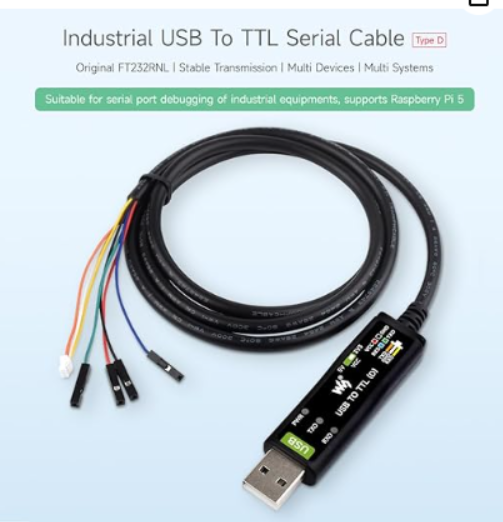

# Raspberry Pi 5 Appliance

----------------------------------------------------------------

Why would you want to build a Raspberry Pi 5 appliance when the Python scripts will run on Windows? A couple of reasons jump out:

- The scripts need to be running anytime the shop is working.
- You will need to have shares available for the files to be copied

The first reason means that a Windows computer would have to be up and running 24/7 with a user logged in. I don't think that many IT security teams would find that acceptable. A cyber attack is most likely when a PC is powered on, a user is logged in and the user has gone home. If the scripts are on a user's Windows desktop and they shut down in the evening or over weekends/holidays, data won't be collected.

The workaround to a user being logged in is to use a tool like `NSSM (Non-Sucking Service Manager)` to install the script as a service. I researched `NSSM` and it appears to be abandoned, so no security updates will be produced. My Haas scripts use standard Python libraries that will get updated anytime you update Python. There are a few other ways to run Python as a service on Windows, but you would still have to have a machine running 24/7, so the Pi is a less expensive method. The attack surface of a hardened Linux appliance is smaller than a Windows 11 desktop.

The second reason means creating file shares on the Windows computer that the scripts are running on. I have had a lot of wasted time in small shops making their MSP understand what is needed (a user account, the shares, security groups, etc.) and getting it done while I'm onsite. Plus, creating shares on a personal workstation may violate IT security policy.

**A Raspberry Pi 5 appliance solves both of these problems:**

- It can run 24/7 in the shop or in the server closet with no one logged in.
- It uses less than 27 watts of power; electricity cost isn't an issue.
- Creating a service that starts during boot is easy to do with Ubuntu.
- Ubuntu has a long track record of security in the enterprise.

You will still need to discuss the appliance with the IT security team, but it resolves most security issues. The appliance uses the Ubuntu UFW firewall and has SMB V1 disabled. [Red Hat Cockpit](https://www.redhat.com/en/blog/intro-cockpit) is used to manage the appliance, so applying security updates and verifying firewall status is accomplished in a GUI.

----------------------------------------------------------------

## Ubuntu Pro coverage

If you are building the appliance for personal use, Ubuntu has a service that is free for up to five devices called `Ubuntu Pro`. Think of it as Microsoft support but for Ubuntu. The details are on the [Ubuntu Pro Pricing](https://ubuntu.com/pricing/pro) page. For business use, the desktop version is $25/yr and the server version is $300/yr.

**Ubuntu Pro includes:**

- Security updates
- Kernel Livepatch
- Advanced Active Directory policies for Ubuntu Desktop
- And much more

----------------------------------------------------------------

## Why use an RPi instead of a SFF Intel machine

Raspberry Pis have become popular for industrial applications. They are inexpensive, reliable, and have a massive community of blogs, YouTube videos, and magazine articles supporting them. Here is a link to [Raspberry Pi for Industry](https://www.raspberrypi.com/for-industry/) on the official Raspberry Pi site.

A Small Form Factor (SFF) Intel PC will still cost more than the Raspberry Pi 5 and won't run on PoE power!

----------------------------------------------------------------

If you have never seen Raspberry Pi 5s in the industrial and manufacturing spaces, here are couple of example companies:

- [Revolution Pi](https://revolutionpi.com/en/products/revolution-pi-series) - Revolution Pi is your open-source Linux platform for future-oriented industrial solutions:
    1. Powered by the Raspberry Pi Compute Module
    1. Raspberry Pi OS-based, industry-optimized operating system
- [Strato Pi](https://sferalabs.cc/strato-pi/) - Industrial Raspberry Pi for Maximum Reliability
    1. Edge Computing
    1. Industrial Automation
    1. Building & Energy Management
    1. Data Acquisition
    1. Marine
    1. Fleet Management

**It's worth a few minutes to look at the homepages of those two companies.**

----------------------------------------------------------------

### The Raspberry Pi community

There is also a vibrant ecosystem of add-on "Hardware Attached on Top" boards, usually called `Hats`.

Sites like:

- [Adafruit](https://www.adafruit.com/)
- [Waveshre](https://www.waveshare.com/)
- [Ameridroid](https://ameridroid.com/)

Sell a large array of add ons, cases, etc. for the Raspberry Pi 5.

Some examples:

- [Waveshare PoE Hat](https://www.waveshare.com/poe-hat-h.htm) makes a $30 PoE hat that will power the RPI 5 from the Ethernet cable. Very convenient on the manufacturing floor.
- [Waveshare 4 port 2.5Gbps Ethernet](https://www.cnx-software.com/2025/12/30/add-four-gigabit-or-2-5gbps-ethernet-ports-to-the-raspberry-pi-5-with-this-expansion-board/) - Support APs with 2.5 Gbps Ethernet.
- [Raspberry Pi AI Hat](https://www.adafruit.com/product/5979) - No article is complete until AI is used! The AI HAT+ is available in 13 and 26 tera-operations per second (TOPS) variants, built around the Hailo-8L and Hailo-8 neural network inference accelerators.
- [Hi Resolution Camera](https://ameridroid.com/products/8mp-noir-raspberry-pi-camera-module) - The Raspberry Pi Camera V2 is IR sensitive for low-light situations and features an upgraded 8MP Sony image sensor capable of taking 3280 x 2464 pixel images and capturing video at 1080p30, 720p60 and 640x480p90 resolutions. Like all Raspberry Pi camera modules, it works flawlessly with Raspberry Pi models using the latest Raspbian operating system.

#### e-paper displays

 Waveshare makes great [e-paper displays](https://www.waveshare.com/product/displays/e-paper/3.97inch-e-paper-hat-plus.htm) for the Pi. I built a serial console server using a Pi Zero W and a Waveshare display. On startup:

- Shows me the IP addresses it got
- Displays the MFG-S/N of the USB serial adapters that are connected.
- If it gets internet access, it emails the address to my `Gmail` account.

The email is handy if the console is in a rack up high and you can't see the display. Waveshare provides a Python library to talk to the display, and there are tons of YouTube videos and blogs on coding it..

Here is a photo of my Pi Zero 2 W serial console. It has a PoE hat; I can plug it into a PoE switch, and it's ready to go. In the photo, one FTDI serial cable is connected. The P 2003 means that I telnet to port 2003 to connect to the device it's connected to.

----------------------------------------------------------------

----------------------------------------------------------------

In the future I might add one to the Haas Data Collection appliance and display what machines are online. Here is the link to the Waveshare site: [3.97inch E-Paper Display](https://www.waveshare.com/product/displays/e-paper/epaper-2/3.97inch-e-paper-hat-plus.htm)

----------------------------------------------------------------

## The RPi 5 is available 4 models

The difference is the amount of RAM. To build a dedicated RPi 5 for this project, I recommend the 8GB RAM model. That is overkill for just the scripts, but the difference in cost is negligible compared to the 4GB model, and I find that it's always better to have more RAM for future-proofing.

**On 12/29/2025, Amazon's site offered this cost:**

- Raspberry Pi 5 8GB: $93.99
- Raspberry Pi 5 4GB: $76.95

----------------------------------------------------------------

To build a high-performance appliance for a manufacturing plant, I used:

- [Raspberry Pi 5 8GB - $104.48](https://www.amazon.com/dp/B0CK2FCG1K?ref=fed_asin_title)
- [Waveshare case - $33.99](https://www.amazon.com/dp/B0D97VK1VW?ref=fed_asin_title)
- [Waveshare PoE Hat - $28.49](https://www.amazon.com/dp/B0CR1JGP1Z?ref=fed_asin_title)
- [RTC battery case - $5.49](https://www.amazon.com/dp/B0CRKQ2MG1?ref=fed_asin_title)
- [Samsung 256GB NVME - $78.00](https://www.amazon.com/Samsung-SSD-PM9A1-NVMe-256GB/dp/B0BVKYN245)

----------------------------------------------------------------

The Waveshare [case](https://www.amazon.com/dp/B0D97VK1VW?ref=fed_asin_title) is industrial quality with ears to mount it to a back board. It has the following capabilities:

- ✅ Supports PCIe Extending To M.2 Interface
- ✅ Larger internal space, supports connecting to various HATs such as PoE HAT, Etc. Also, with space left for cable management
- ✅ Adapting Type-C, dual full-size HDMI female ports, and a screw terminal for easier connection with peripherals, supports two power supply connection methods from the front side or the back side
- ✅ Tabs on both sides for mounting to a backboard.
- ❤️ [Official Wiki Resources](https://www.amazon.com/stores/page/46D67D8E-DEF3-4032-A289-5C72C3DC78BE)

The installation instructions are on the Amazon link but they are hard to find. You can click the [link here](https://github.com/rikosintie/Haas_Data_collect/blob/main/docs/img/Waveshare-case-instruction.png) to view them.

----------------------------------------------------------------

## USB Serial cable for the Raspberry Pi 5

I recommend purchasing the [Waveshare Industrial USB to TTL (D) Serial Cable, compatible with the Raspberry Pi 5](https://www.amazon.com/Waveshare-Industrial-Compatible-Raspberry-Protection/dp/B0CX5C5KR4?crid=UOYE4ZQGD85P&dib=eyJ2IjoiMSJ9.BPFSkDQQOB_j9pTthVxIH4j29kCE7yNqMgc9hB24bXyZhFqiigw3R8GFKkNfReHcXnOziFKmQqQT18804nToT-uEjdtmRbNvjT7EAReShBp_-x8drPgFSEOiVlVJefzxlg92li3IySROS7fhPIbUUCjNmzzSXwEktDIOugk-NjlgFu55M4KYy8D7fpKQ_cFomwpIjZmp9w28W1e2MFkhYuAF2tf9ULMQeNLm8Mz8SIs.7Cn4aq4suv6rP_fKHjW11v9K2c4YlYELTGYOSVdyyDw&dib_tag=se&keywords=raspberry+pi+5+serial+cable&qid=1768278124&sprefix=raspberry+pi+5+serial%2Caps%2C193&sr=8-1) Serial to USB cable, for $13.99. The cable allows you to connect to the Raspberry Pi 5 if you lock yourself out over SSH. And that can happen when configuring the firewall. :smiley:

This cable is nice because in addition to the individual 4 connects it includes the `3 pin UART` connector that the Raspberry Pi 5 has. I have used that cable to console into Aruba 315 APs that have 4 pins instead of the typical RJ45 console connector.

----------------------------------------------------------------

