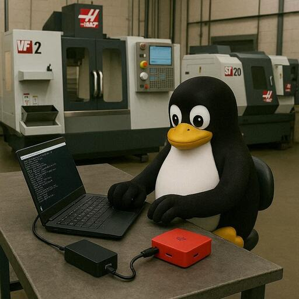

# Raspberry Pi 5 Appliance

----------------------------------------------------------------

Why would you want to build a Raspberry Pi 5 appliance when the Python scripts will run on Windows? A couple of reasons jump out:

- The scripts need to be running anytime the shop is working.
- You will need to have shares available for the files to be copied

The first reason means that a Windows computer would have to be up and running 24/7 with a user logged in. I don't think that many IT security teams would find that acceptable. A cyber attack is most likely when a PC is powered on and a user is logged in. If the scripts are on a user's Windows desktop and they shut down in the evening or over weekends/holidays, data won't be collected.

The workaround to a user being logged in is to use a tool like `NSSM (Non-Sucking Service Manager)` to install the script as a service. I researched `NSSM` and it appears to be abandoned so no security updates will be produced. My Haas scripts use standard Python libraries that will get updated anytime you update Python. There are a few other ways to run Python as a service on Windows, but you would still have to have a machine running 24/7, so the Pi is a less expensive method. The attack surface of a hardened Linux appliance is smaller than a Windows 11 desktop.

!!! Note
    Python doesn't get updated when you run Windows Update. Use `winget upgrade --id Python.Python.3` from a PowerShell terminal if you installed using winget or Update via Microsoft Store (If installed from there).

The second reason means creating file shares on the Windows computer that the scripts are running on. I have had a lot of wasted time in small shops making their MSP understand what is needed (a user account, the shares, security groups, etc.) and getting it done while I'm onsite. Plus, creating shares on a personal workstation may violate IT security policy.

A Raspberry Pi 5 appliance solves both of these problems. It can run 24/7 in the shop or in the server closet. It uses less than 20W of power so no one will be upset at the cost. It's simple to create a service that starts during boot using the systemd init system that Ubuntu is built on. You will still need to discuss the appliance with the IT security team. In the Samba section I will cover enabling the firewall and proving that SMB V1 is disabled.

## Ubuntu Pro coverage

If you are building the appliance for personal use, Ubuntu has a service that is free for up to five devices called `Ubuntu Pro`. Think of it as Microsoft support but for Ubuntu. The details are on the [Ubuntu Pro Pricing](https://ubuntu.com/pricing/pro) page. For business use, the desktop version is $25/yr and the server version is $300/yr.

**Ubuntu Pro includes:**

- Security updates
- Kernel Livepatch
- Advanced Active Directory policies for Ubuntu Desktop
- And much more

----------------------------------------------------------------

## Why use a Raspberry Pi instead of a cheap SFF Intel machine

Raspberry Pis have become popular for industrial applications. They are inexpensive, reliable and have a massive community of blogs, YouTube videos, and magazine articles supporting them.

If you have never seen Raspberry Pi 5s in the Industrial and Manufacturing spaces here are couple of example companies:

- [Revolution Pi](https://revolutionpi.com/en/products/revolution-pi-series) - Revolution Pi is your open-source Linux platform for future-oriented industrial solutions:
    1. Powered by the Raspberry Pi Compute Module
    1. Raspberry Pi OS-based, industry-optimized operating system
- [Strato Pi](https://sferalabs.cc/strato-pi/) - Industrial Raspberry Pi for Maximum Reliability
    1. Edge Computing
    1. Industrial Automation
    1. Building & Energy Management
    1. Data Acquisition
    1. Marine
    1. Fleet Management

It's worth a few minutes to look that homepages of those two companies.

There is also a vibrant ecosystem of add-on hardware boards, sometimes called `Hats`. For example, Waveshare makes a $30 PoE hat that will power the RPI 5 from the Ethernet cable. Very convenient on the manufacturing floor. Here is a link to it - [PoE hat](https://www.waveshare.com/poe-hat-h.htm). Waveshare also produces a board with four 2.5Gbs Ethernet ports - [Waveshare 4 port Ethernet](https://www.cnx-software.com/2025/12/30/add-four-gigabit-or-2-5gbps-ethernet-ports-to-the-raspberry-pi-5-with-this-expansion-board/)

Finally, Waveshare makes great [e-paper displays](https://www.waveshare.com/product/displays/e-paper/3.97inch-e-paper-hat-plus.htm) for the Pi. I built a serial console server using a Pi Zero W and a Waveshare display. On startup:

- Shows me the ip addresses it got
- Shows the MFG-S/N of the USB serial adapters that are connected.
- If it gets internet access, it emails my `gmail` account it the address.

The email is handy if the console is in a rack up high and you can't see the display. Waveshare provides a Python library to talk to the display and there are tons of YouTube videos and blogs on coding it..

Here is a photo of my Pi Zero 2 W serial console. It has a PoE hat so that I can just plug it into a switch, and it's ready to go. It has one FTDI serial cable connected. The `P 2003` means that I telnet to port 2003 to console to the device it's connected to.

----------------------------------------------------------------

In the future I might add one and display what machines are online. Here is the link to the Waveshare site - [3.97inch E-Paper Display](https://www.waveshare.com/product/displays/e-paper/epaper-2/3.97inch-e-paper-hat-plus.htm)

----------------------------------------------------------------

## The Raspberry Pi 5 is available in several models

The difference is the amount of RAM. To build a dedicated RPi 5 for this project I recommend the 8GB RAM model. That is overkill for just the scripts, but the difference in cost is negligible compared to the 4GB model, and I find that it's always better to have more RAM for future proofing.

**On 12/29/2025, Amazon's site offered this cost:**

- Raspberry Pi 5 8GB - $93.99
- Raspberry Pi 5 4GB - $76.95

You will need:

- Raspberry 5 8GB
- A certified power adapter
- An SD card of at least 32GB
- A case

!!! Note
    After I ordered my Raspberry Pi 5, case and PoE hat I found out that the Pi 5 supports a `Real Time Clock` (RTC) battery. I recommend purchasing one to keep the clock sync'd when powered off. Amazon sells an [RTC rechargeable battery](https://www.amazon.com/XYGStudy-Raspberry-Recharging-Connector-RTC-Battery-B/dp/B0CR76SM52) with a 64mAh rating for $8.69.

Amazon sells an aluminum case named the [Argon NEO 5](https://www.amazon.com/dp/B0CRH8V95R?ref=fed_asin_title) that accepts an NVME drive and includes the following:

- a fan
- a heat sink

I purchased the Waveshare PoE hat instead of a power supply. Most environments have PoE switches now, but finding a power outlet, not so much! I had a Samsung Evo 970 500MB NVME drive that I had taken out of a laptop so I reused it.

To build a high performance appliance for a manufacturing plant, I think the Argon NEO 5, at $41.00 is worth the cost. The heat sink and fan will keep temperatures down and an SD card used for heavy writing will have a shorter life than a Samsung EVO NVME drive.
