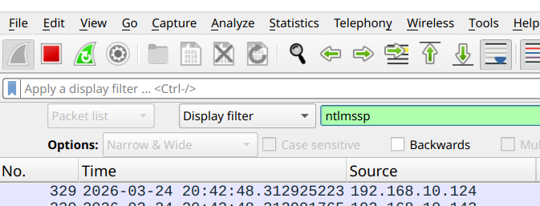
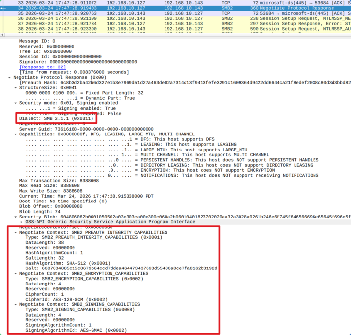

# Create the HaasGroup and users

----------------------------------------------------------------


----------------------------------------------------------------

The Installation script creates the `HaasGroup` and users that are in the `users.csv` and `initial_users.csv` files. The instructions are included here to clarify how the installation script works.

----------------------------------------------------------------

!!! tip "Day-to-day user management: use Cockpit instead of the terminal"
    Everything in [Manage users by script](#manage-users-by-script) below —
    creating a user, deleting one, and changing a password — can now be
    done directly from Cockpit's **Manage Samba** page (**Create User** /
    **Delete User** / **Change Password** buttons), without SSH access or
    needing to remember `manage_users.sh`'s flags. See
    [Create User](../manage_the_appliance/samba.md#create-user) for the
    how-to. This page is still worth reading if you want to understand
    what those buttons actually do under the hood — or you're doing the
    one-time `HaasGroup`/permissions setup below, which isn't exposed
    through Cockpit.

----------------------------------------------------------------

Linux uses groups to manage permissions for users. For this project, all users will be in the same group. That isn't a security best practice since a disgruntled employee could delete everything. If you have compliance requirements or other concerns, just repeat this process to create multiple groups. For example, create a user and group for each machine. Then add the user to the machine's share and use it as the username when setting up the account on the machine.

Does this seem like a lot of extra work? Yes, but I actually had a disgruntled employee delete the configuration for the DNC system for a neighboring cell one time. Of course, he was a night shift employee, and did it at midnight on Friday. I got called on Saturday morning and had to drive an hour to the plant and restore it. So it depends on your determination of the risk in your shop.

----------------------------------------------------------------

## Create the HaasGroup group

```bash
sudo groupadd HaasGroup
```

**There is no output from this command.**

### Set permissions on the folders

You need to be in the root of your home director to review the current permissions. Use the following to verify that you are in the correct location:

```bash
cd ~
pwd
ls -l
```

```bash title='Command Output'
/home/haas
drw-rw-r-- 9 haas haas  4096 Jan  4 20:26 Haas_Data_collect
```

We can see the `Haas_Data_collect` folder, so we are in the correct location. Note that the `Haas_Data_collect` directory has `haas haas` listed. We need to change that to `haas HaasGroup`

Now run:

```bash hl_lines='2 5 8'
# Allow traversal into /home/haas (needed to reach Haas subdirectory)
sudo chmod 774 /home/haas

# Set ownership for everything under Haas
sudo chown -R haas:HaasGroup /home/haas/Haas_Data_Collect

# View the changes
ls -l
```

```bash title='Command Output'
drwxrwxr-x 9 haas HaasGroup  4096 Jan  4 20:26 Haas_Data_collect
```

Note the `Haas_Data_collect` directory had changed from `haas haas` to `haas HaasGroup`. That means haas is the owner and HaasGroup is the group that will be applied.

----------------------------------------------------------------

## Set the file permissions

Run the following:

```bash
# Set permissions: directories get execute, files don't
sudo find /home/haas/Haas_Data_Collect -type d -exec chmod 2775 {} +
sudo find /home/haas/Haas_Data_Collect -type f -exec chmod 664 {} +
chmod +x /home/$USER/Haas_Data_collect/lshare.sh
chmod +x /home/$USER/Haas_Data_collect/smb_verify.sh
chmod +x /home/$USER/Haas_Data_collect/manage_users.sh
chmod +x /home/$USER/Haas_Data_collect/tspin_setup.sh
chmod +x /home/$USER/Haas_Data_collect/tspin_alias.sh
chmod +x /home/$USER/Haas_Data_collect/rollback_csv.sh
chmod +x /home/$USER/Haas_Data_collect/ssh_port.sh
chmod +x /home/$USER/Haas_Data_collect/ssh_validate.sh
chmod +x /home/$USER/Haas_Data_collect/haas-install.sh
```

There is no output from these commands.

!!! Note
    The 2 in 2775 sets the `setgid` bit, basically set group ID, which ensures that all locally created files also inherit the HaasGroup. Without this bit set, files created locally on the appliance would get owner and group IDs of the user that created the file. The `setgid` bit is located in the fourth character of the permissions string (the execute position of the group permissions).

Run a directory listing to see the results:

```bash
cd ~
ls -l
```

```unixconfig title='Command Output'
ls -l
total 4
drwxrwsr-- 9 haas HaasGroup 4096 Mar 24 15:30 Haas_Data_collect

```

Now the account `haas` has `rwx` (read/write/execute) and the group `HaasGroup` has `rws` (read\write\setgid) to directories. The `other` group has `r--` (read only). Files will have rw-, read/write.

The bash scripts in Haas_Data_collect:

```bash
~/Haas_Data_collect ‹main●›
╰─$ ls -l *.sh
-rwxrwsr-- 1 haas HaasGroup 45830 Mar 24 15:19 haas-install.sh
-rwxrwsr-- 1 haas HaasGroup  2679 Feb 15 20:50 haas_firewall_uninstall.sh
-rwxrwsr-- 1 haas HaasGroup   582 Feb 15 20:50 lshares.sh
-rwxrwsr-- 1 haas HaasGroup  4366 Mar 22 18:36 manage_users.sh
-rwxrwsr-- 1 haas HaasGroup  1897 Feb 15 20:50 rollback_csv.sh
-rwxrwsr-- 1 haas HaasGroup  2732 Mar 17 18:19 setup_user.sh
-rwxrwsr-- 1 haas HaasGroup  2620 Feb 15 20:50 smb_verify.sh
-rwxrwsr-- 1 haas HaasGroup  3467 Feb 21 21:19 ssh_port.sh
-rwxrwsr-- 1 haas HaasGroup   860 Mar 22 18:36 ssh_validate.sh
-rwxrwsr-- 1 haas HaasGroup  1000 Feb 21 21:19 tspin_alias.sh
-rwxrwsr-- 1 haas HaasGroup  1863 Feb 21 21:19 tspin_setup.sh
-rwxrwsr-- 1 haas HaasGroup  4540 Feb 15 20:50 validate_users_csv.sh
```

Have eXecute so that you can run them.

----------------------------------------------------------------

## Create the users

All users, whether they are a machine tool, a CNC programmer, or the Operations personnel, need a Linux and a Samba account. The installation script reads the file `initial_users.csv` and creates both the Linux and Samba users during the installation.

!!! Note
    You cannot create users that can log in over ssh using the `initial_users.csv` file. Use the `manage_users.sh` script - [Manage users by script](../build_the_appliance/create-groups.md/#manage-users-by-script) to create users with ssh capability.

To add users later you can follow these instructions or run the `manage_users.sh` script that is in the `Haas_Data_collect` directory. See [Manage users by script](../build_the_appliance/create-groups.md/#manage-users-by-script) for instructions for the Manager Users script.

In this example I have:

```text
|     Username    | Role and Responsibility                                                                                     |
|:---------------:|-------------------------------------------------------------------------------------------------------------|
|     haassvc     | The limited permission account used on the Haas CNC control                                                 |
|     mspadmin    | An account for an MSP to manage the appliance                                                               |
|     haas        | The administrator for the appliance                                                                         |
|  Manuel Chavez  | CNC Setup technician. Needs to review the CNC Programs from his Windows desktop and review the spreadsheets |
| Robert Goodwin  | Operations. Needs access to the `cnc_logs` directory to move files                                          |
```

----------------------------------------------------------------

**Run for each user:**

```bash linenums='1' hl_lines='2 5 8'
# Create user without shell access
sudo useradd -M -s /usr/sbin/nologin haassvc

# Add to Samba
sudo smbpasswd -a haassvc

# Enable the Samba user
sudo smbpasswd -e haassvc
```

----------------------------------------------------------------

The first command creates the user `haassvc`.

- The `-M` skips creating a user `home` directory..
- The `-s /usr/sbin/nologin` disables shell login (good for service accounts that only need SMB access)

The second command creates the Samba Server user. You will be prompted to enter and confirm a password. Here is the output for the `haassvc` user:

```bash hl_lines='1'
sudo smbpasswd -a haassvc
```

```bash title='Command Output
New SMB password:
Retype new SMB password:
Added user haassvc.
```

Finally,

```bash
`sudo smbpasswd -e haassvc` enables the smb username.
```

```bash title='Command Output'
Enabled user haassvc.
```

----------------------------------------------------------------

**Add the haassvc User account to the `HaasGroup` group:**

```bash
sudo usermod -aG HaasGroup haassvc
```

**There is no output from this command.**

----------------------------------------------------------------

### List all users in the HaasGroup

```bash hl_lines='1'
cat /etc/group | grep Haas
```

```bash title='Command Output'
HaasGroup:x:1002:haassvc,haas
```

----------------------------------------------------------------

### Verify the `haassvc` user settings

```bash linenums='1' hl_lines='1'
id haassvc
```

```bash title='Command Output'
uid=1001(haassvc) gid=1001(haassvc) groups=1001(haassvc),1002(HaasGroup)
```

----------------------------------------------------------------

### Manage users by script

All users, whether they are a machine tool, a CNC programmer, or the Operations personnel, need a Linux and a Samba account. The installation script reads the file `initial_users.csv` and creates both the Linux and Samba users during the installation.

If you need to add or remove users after the initial installation use the `manage_users.sh` script that is located in the `Haas_Data_collect` directory. The script creates users that can map drives. The script DOES NOT add a user to the `sudoers` file so they cannot run Linux commands or log in over SSH.

It's fairly simple to create a user manually from the instructions above, but it's a lot of individual commands which leaves room for errors. If you need to add or remove users after the initial installation, use the `manage_users.sh` script that is located in the `Haas_Data_collect` directory instead. The script creates users that can map drives. The script **DOES NOT** add a user to the `sudoers` file so they cannot run Linux commands or log in over SSH.

!!! note "This exact script is behind Cockpit's Create/Delete/Change Password User buttons"
    `--set-password`, `--delete-user --force`, and creating a new user —
    including `--admin-user` (Cockpit's "Administrator" role) — are
    exactly what Manage Samba's **Create User**, **Delete User**, and
    **Change Password** buttons run for you — see
    [Create User](../manage_the_appliance/samba.md#create-user). Running
    the script by hand from here is still useful for `--ssh-key` (adding
    a specific SSH public key to a new admin account), which isn't
    exposed in Cockpit.

The script has the following optional arguments:

```unixconfig
| Argument                   | Description                                     |
|----------------------------|-------------------------------------------------|
|   Username                 | The user to add, no -- in front of it           |
| --set-password             | Update password for an existing user            |
| --delete-user              | Delete an existing user with prompting          |
| --delete-user --force      | Delete an existing user without prompting       |
| --dry-run                  | Show what would happen, no changes              |
| --admin-user               | Create a user with `sudo` and `ssh` permissions |
| --ssh-key="ssh-ed25519..." | for an admin-user, add a public ssh key         |
```

----------------------------------------------------------------

To use the script, first run the following commands to make it executable:

```bash linenums='1'
cd /home/haas/Haas_Data_Collect
chmod +x manage_users.sh
sudo chmod 2775 manage_users.sh
```

**There is no output from these commands.**

Verify the script permissions:

```bash hl_lines='1'
ls -l manage_users.sh
```

```bash title='Command Output'
-rwxrwsr-- 1 haas HaasGroup 4183 Mar 18 14:13 manage_users.sh
```

----------------------------------------------------------------

#### How the script works

- You will be asked for your password to activate `sudo` (the haas user password).
- You will be asked for the password to use for the new Linux username.
- You will be asked for the smbuser password. It MUST be the same as the Linux user!
- It will then create and enable the smb user, add it to the `HaasGroup` and display the result.

----------------------------------------------------------------

#### Examples

```bash hl_lines='2 5 8 11 14 17 20 23'
# To add a user
sudo ./manage_users.sh bob

# Reset passwords
sudo ./manage_users.sh bob --set-password

# Delete user (with prompt)
sudo ./manage_users.sh bob --delete-user

# Combine for safe automation testing
sudo ./manage_users.sh bob --delete-user --dry-run

# Delete user silently (automation safe)
sudo ./manage_users.sh bob --delete-user --force

# Show what would happen (no changes made)
sudo ./manage_users.sh bob --dry-run

# To Add an admin user
sudo ./manage_users.sh mspadmin --admin-user

#To add an admin user and an SSH public key
sudo ./manage_users.sh mspadmin --admin-user --ssh-key="ssh-ed25519 AAAAC3Nza...)
```

----------------------------------------------------------------

#### Script outputs

Before adding a new user, list the existing users in case it already exists:

#### Linux users

```bash hl_lines='1'
awk -F: '$3 >= 1000 {print $1}' /etc/passwd
```

```bash title='Command Output'
nobody
haas
mhubbard
haassvc
mchavez
thubbard
test
```

----------------------------------------------------------------

#### Display the Samba users

```bash hl_lines='1'
sudo pdbedit -L
```

```bash title='Command Output'
mhubbard:1001:
mchavez:1003:
haassvc:1002:
thubbard:1004:
test:1005:
haas:1000:
```

----------------------------------------------------------------

#### Add a user

```bash hl_lines='1 3 5 6 7 10 11 12 13 15'
sudo ./manage_users.sh bob
==== Wed Mar 18 14:19:45 PDT 2026 ====
Log file: /var/log/user_mgmt_20260318_141945.log
Processing user: bob
Creating system user
New password:
Retype new password:
passwd: password updated successfully
Creating Samba user
New SMB password:
Retype new SMB password:
Added user bob.
Enabled user bob.
Final user info:
uid=1006(bob) gid=1010(bob) groups=1010(bob),1004(HaasGroup)
Done.
```

----------------------------------------------------------------

#### Update user's password on Linux and Samba

```bash hl_lines='1 3 7 8 12 13 19'
sudo ./manage_users.sh bob --set-password
==== Wed Mar 18 14:29:20 PDT 2026 ====
Log file: /var/log/user_mgmt_20260318_142920.log
Processing user: bob
User bob already exists.
Updating system password
New password:
Retype new password:
passwd: password updated successfully
Samba user exists
Updating Samba password
New SMB password:
Retype new SMB password:
Enabled user bob.
Final user info:
uid=1006(bob) gid=1010(bob) groups=1010(bob),1004(HaasGroup)
Done.

```

----------------------------------------------------------------

#### Delete a User with prompts

```bash hl_lines='1 3 5'
sudo ./manage_users.sh bob --delete-user --dry-run
==== Wed Mar 18 14:25:53 PDT 2026 ====
Log file: /var/log/user_mgmt_20260318_142553.log
Processing user: bob
DELETE MODE ENABLED for bob
Are you sure you want to delete user 'bob'? (y/N): N
Aborting.
```

----------------------------------------------------------------

#### Silently delete a user

Use the `--force` in a script to delete users without being prompted

```bash hl_lines='1 3 6 7-10'
sudo ./manage_users.sh bob --delete-user --force
==== Wed Mar 18 14:42:23 PDT 2026 ====
Log file: /var/log/user_mgmt_20260318_144223.log
Processing user: bob
DELETE MODE ENABLED for bob
[FORCE] Skipping confirmation
Deleting Samba user bob
Deleted user bob.
Deleting Linux user bob
Deletion complete for bob
```

----------------------------------------------------------------

#### Add a user with dry run

These arguments don't create the user, they show you what commands would be used.

```bash linenums='1' hl_lines='1'
sudo ./manage_users.sh bob --dry-run
==== Wed Mar 18 14:44:50 PDT 2026 ====
Log file: /var/log/user_mgmt_20260318_144450.log
Processing user: bob
Creating system user
[DRY-RUN] sudo [DRY-RUN] useradd [DRY-RUN] -M [DRY-RUN] -s [DRY-RUN] /usr/sbin/nologin [DRY-RUN] bob
[DRY-RUN] sudo [DRY-RUN] passwd [DRY-RUN] bob
Creating Samba user
[DRY-RUN] sudo [DRY-RUN] smbpasswd [DRY-RUN] -a [DRY-RUN] bob
[DRY-RUN] sudo [DRY-RUN] smbpasswd [DRY-RUN] -e [DRY-RUN] bob
[DRY-RUN] sudo [DRY-RUN] usermod [DRY-RUN] -aG [DRY-RUN] HaasGroup [DRY-RUN] bob
Final user info:
[DRY-RUN] id [DRY-RUN] bob
Done.
```

----------------------------------------------------------------

#### Add an admin user

```unixconfig linenums='1' hl_lines='1 4-5 7-9 10-12 14 17-19'
sudo ./manage_users.sh mspadmin --admin-user
[sudo] password for haas:
==== Wed Mar 25 15:06:06 PDT 2026 ====
Log file: /var/log/user_mgmt_20260325_150606.log
Processing user: mspadmin
Creating ADMIN user
New password:
Retype new password:
passwd: password updated successfully
Creating Samba user
New SMB password:
Retype new SMB password:Forcing Primary Group to 'Domain Users' for mspadmin
Forcing Primary Group to 'Domain Users' for mspadmin
Added user mspadmin.
Forcing Primary Group to 'Domain Users' for mspadmin
Forcing Primary Group to 'Domain Users' for mspadmin
Enabled user mspadmin.
Final user info:
uid=1008(mspadmin) gid=1012(mspadmin) groups=1012(mspadmin),27(sudo),1004(HaasGroup)
Done.
```

----------------------------------------------------------------

#### Add an admin user with ssh key

```unixconfig linenums='1' hl_lines='1 3-4 6-11 14-15 16-17'
sudo ./manage_users.sh mspadmin --admin-user --ssh-key="ssh-ed25519 AAAAC3..."
==== Wed Mar 25 12:49:48 PDT 2026 ====
Log file: /var/log/user_mgmt_20260325_124948.log
Processing user: mspadmin
Creating ADMIN user
New password:
Retype new password:
passwd: password updated successfully
Creating Samba user
New SMB password:
Retype new SMB password
Forcing Primary Group to 'Domain Users' for mspadmin
Forcing Primary Group to 'Domain Users' for mspadmin
Enabled user mspadmin.
Configuring SSH key
Final user info:
uid=1007(mspadmin) gid=1011(mspadmin) groups=1011(mspadmin),27(sudo),1004(HaasGroup)
Done.
```

----------------------------------------------------------------

To view the code in the manage_users.sh script:

```bash hl_lines='1'
cd ~/Haas_Data_collect
cat manage_users.sh
```

----------------------------------------------------------------

## Troubleshooting

Samba includes a utility called `testparm` that reads the `/etc/samba/smb.conf` file. The `-s` argument reads the file and reports any errors at the top of the output. It displays the entire smb/conf file so you will have to scroll up to see any errors.

```bash hl_lines='1'
testparm -s
```

```bash title='Command Output'
Load smb config files from /etc/samba/smb.conf
Loaded services file OK.
Weak crypto is allowed by GnuTLS (e.g. NTLM as a compatibility fallback)

Server role: ROLE_STANDALONE

# Global parameters
[global]
    client max protocol = SMB3
    client min protocol = SMB2
    disable netbios = Yes
    disable spoolss = Yes
    load printers = No
    log file = /var/log/samba/log.%m
    logging = file
    max log size = 10000
    panic action = /usr/share/samba/panic-action %d
    printcap name = /dev/null
    server min protocol = SMB2
    server role = standalone server
    server string = Haas Data Collector (Samba, Ubuntu)
    socket options = TCP_NODELAY IPTOS_LOWDELAY
    idmap config * : backend = tdb
    printing = bsd

[machines]
    comment = File Share for all machines
    path = /home/haas/Haas_Data_collect/machines
```

----------------------------------------------------------------

!!! note
    `testparm -s` only shows non-default entries. To see all smb.conf entries use `testparm -v`

----------------------------------------------------------------

```bash title='Review the haas user attributes' hl_lines='1'
id haas
```

```bash title='id command Output'
uid=1000(haas) gid=1003(haas) groups=1003(haas),4(adm),20(dialout),24(cdrom),27(sudo),29(audio),44(video),46(plugdev),60(games),100(users),995(input),992(render),107(netdev),1000(gpio),1001(spi),1002(i2c),1004(HaasGroup)
```

----------------------------------------------------------------

```bash title='Review the Journal for the Samba service' hl_lines='1'
sudo journalctl -u smbd.service -n 50 --no-pager
```

```bash title='Journal command Output'
sudo journalctl -u smbd.service -n 10 --no-pager                                                                                          [17:55:21]
Aug 11 17:32:32 haas systemd[1]: Stopping smbd.service - Samba SMB Daemon...
Aug 11 17:32:32 haas systemd[1]: smbd.service: Deactivated successfully.
Aug 11 17:32:32 haas systemd[1]: Stopped smbd.service - Samba SMB Daemon.
Aug 11 17:32:32 haas systemd[1]: Starting smbd.service - Samba SMB Daemon...
Aug 11 17:32:32 haas systemd[1]: Started smbd.service - Samba SMB Daemon.
```

----------------------------------------------------------------

List Samba shares

```bash
smbclient -L //localhost/Haas -U haas
```

```bash title='smbclient command Output'
Password for [WORKGROUP\haas]:

    Sharename       Type      Comment
    ---------       ----      -------
    Haas            Disk      Haas Data Collection Share
    machines        Disk      File Share for all machines
    st40            Disk      Logger for ST40
    st30            Disk      Logger for ST30
    st30l           Disk      Logger for ST30L
    IPC$            IPC       IPC Service (Haas Data Collector (Samba, Ubuntu))
SMB1 disabled -- no workgroup available
```

----------------------------------------------------------------

List only shares with a drive mapped to it:

```bash
sudo smbstatus -S
```

```bash title='Command Output'
Service      pid     Machine       Connected at                     Encryption   Signing
---------------------------------------------------------------------------------------------
machines     1904676 192.168.10.113 Tue Aug 11 17:44:13 2026 PDT     -            -
```

!!! note
    Under `machine` is `192.16810.113`. That is the IP address of the client connected to the share. In a real environment you should see a mapping for every Haas machine and any programmers/OPs personnel that have mapped drives.

----------------------------------------------------------------

List `locked files`

```bash
sudo smbstatus -L -b
```

```bash title='Command Output'
Locked files:
Pid          User(ID)   DenyMode   Access      R/W        Oplock           SharePath   Name   Time
--------------------------------------------------------------------------------------------------
531619       1000       DENY_NONE  0x20081     RDONLY     LEASE(RH)        /home/haas/Haas_Data_collect   ._.DS_Store   Tue Mar 24 16:38:27 2026
531619       1000       DENY_NONE  0x20081     RDONLY     LEASE()          /home/haas/Haas_Data_collect   ._.DS_Store   Tue Mar 24 16:38:21 2026
531619       1000       DENY_NONE  0x100081    RDONLY     NONE             /home/haas/Haas_Data_collect   .   Tue Mar 24 16:38:27 2026
531619       1000       DENY_NONE  0x100081    RDONLY     NONE             /home/haas/Haas_Data_collect   .   Tue Mar 24 16:38:27 2026
```

----------------------------------------------------------------

Managing Locked Files
If a file is inappropriately locked (e.g., a client disconnected improperly), you can identify the process and kill it:

Run smbstatus to find the PID of the process that has the lock on the file.
Verify the user and hostname associated with that PID in the output.
Kill the specific smbd process using the PID:

```bash
sudo kill <PID>
```

This action should release the lock.

----------------------------------------------------------------

### Wireshark

The Samba server was configured with ntlm auth = ntlmv2-only and lanman auth = no, ensuring that legacy NTLMv1 and LANMAN authentication mechanisms are disabled. If an auditor wants proof that LANMAN and MTLMv1 are not being used you can run the following in the terminal of the appliance to capture packets.

Once the `tcpdump` is running disconnect and reconnect a mapped drive from a Windows machine or one of the machine tools. Copy the capture to you laptop using SCP

```bash linenums='1' hl_lines='1'
cd ~
sudo tcpdump -i any host <ip_of_the_windows_host> and port 445 -w smb_ntlm_test.pcap
```

```bash title='Command Output'
[sudo] password for haas:
tcpdump: data link type LINUX_SLL2
tcpdump: listening on any, link-type LINUX_SLL2 (Linux cooked v2), snapshot length 262144 bytes
^C715 packets captured
716 packets received by filter
0 packets dropped by kernel
```

In this example I connected to the appliance's Haas share. The `tcpdump` captured 715 packets. It shows `^C715 packets captured` because I used `ctrl+c` to end the capture

Copy the file to your laptop using SCP:

```bash linenums='1' hl_lines='1'
scp smb_ntlm_test.pcap mhubbard@192.168.10.143:/home/mhubbard/Downloads
```

Where `192.168.10.143` is my laptop and the file we captured is `smb_ntlm_test.pcap`. If you are on Windows use [Putty SCP](https://the.earth.li/~sgtatham/putty/0.83/htmldoc/Chapter5.html#pscp){target="_blank"}

#### In Wireshark

Once you have `smb_ntlm_test.pcap` open in Wireshark, click the `edit` menu and select `Find Packet...`, type ntlmssp and press enter.

----------------------------------------------------------------



----------------------------------------------------------------

Look for the packets that are protocol `SMB` and info `Negotiate Protocol Response`. The source will be the IP Address of the appliance, the destination will be the IP of your laptop. Click the arrows to expand the data in each section.

----------------------------------------------------------------



----------------------------------------------------------------

The small rectangle shows that the appliance accepted `SMB 3..1.1` and the large rectangle show the ciphers are:

- `SHA-512`
- `AES-128-GCM`
- `AES-GMAC`.
