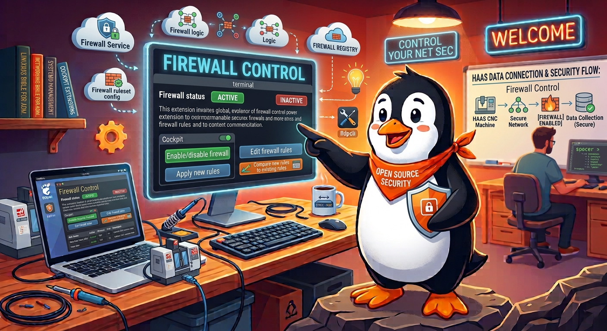
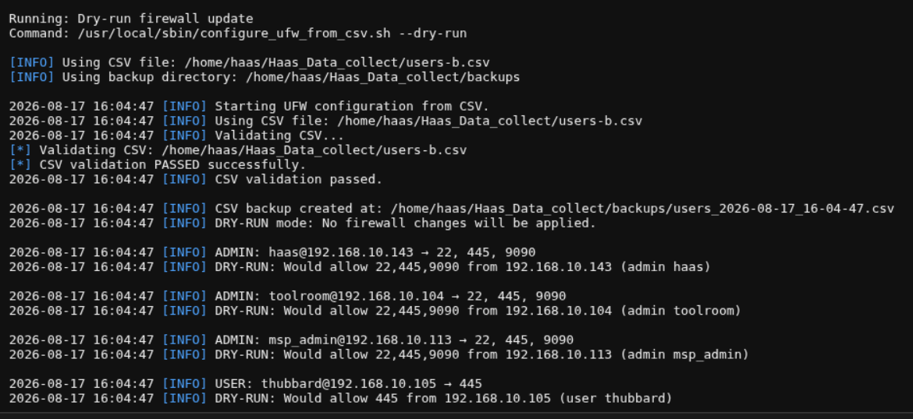
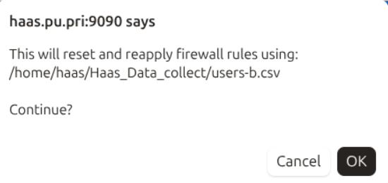
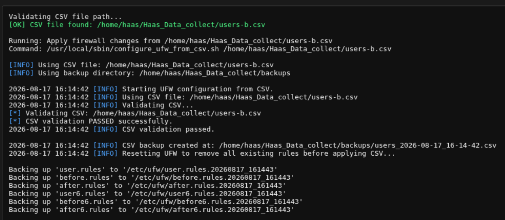
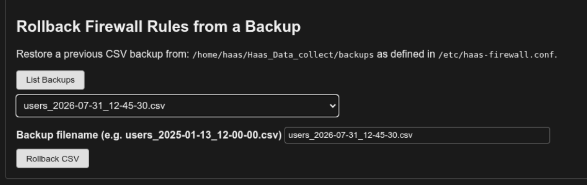
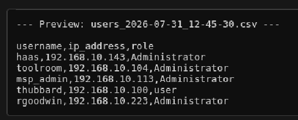

# Firewall Control

----------------------------------------------------------------

----------------------------------------------------------------

The `haas-install.sh` installer sets up a Cockpit extension for managing the
appliance's firewall day to day, so you don't need SSH access for routine
firewall work. Log into Cockpit at `https://<appliance-ip>:9090` and look
for **Firewall Control** under **System** in the sidebar.

----------------------------------------------------------------

!!! Note "Unlock the page first"
    Cockpit opens most pages in **🔒 Limited access** mode. Click that badge
    at the top of the page (the gear icon on mobile) before any of the
    buttons below will work.

The line under the page title shows this appliance's current IPv4/MAC
per active network interface — see
[Network info on every extension page](./manage_intro.md#network-info-on-every-extension-page)
for what it means and why more than one active interface is flagged.

## Firewall Status Dashboard

----------------------------------------------------------------

{ width="500"}

----------------------------------------------------------------

At the top of the page:

- A colored status indicator (green = enabled, red = disabled) plus your
  logged-in username, user ID, groups, and shell. Great for troubleshooting.
- An **Enable Firewall** / **Disable Firewall (for testing)** toggle button
  that reflects the current state. Both directions ask for confirmation
  first — disabling warns that all rules are removed and the appliance
  becomes vulnerable; enabling warns that you'll be disconnected if your
  current IP isn't already covered by a rule in `users-a.csv`.

    !!! warning "Disabling is not permanent"
        `haas-firewall.timer` runs `haas-firewall.service` every 4 hours
        as a self-heal, and that service runs `ufw --force enable` as
        part of reapplying the CSV — so a firewall disabled here comes back
        on by itself, usually within 4 hours (sooner if someone clicks
        **Apply Firewall Changes** in the meantime, which also resets that
        countdown). The confirmation dialog says so. If you need it off
        for longer than that (an extended troubleshooting session, for
        example), also run
        `sudo systemctl disable --now haas-firewall.timer` — and remember
        to re-enable that timer afterward, or the appliance stops
        self-healing entirely, not just for this one disable.
- **Active Firewall Rules** — the live output of `ufw status numbered`,
  refreshed automatically. Rules are sorted by the **From** IP address
  numerically (`192.168.10.9` before `192.168.10.10`, not the reverse a
  plain text sort would produce), not by the order they happened to be
  added in — the `[N]` rule numbers themselves are untouched, so they're
  still what you'd pass to `ufw delete N` if you ever needed to, they just
  won't run 1, 2, 3... top to bottom on screen anymore. Subnet/CIDR rules
  sort by their network address; non-IPv4 entries (`Anywhere`, IPv6) sort
  last. A dashed divider separates each IP's group of rules from the
  next, since one CSV row (one person/machine) usually produces 2-3
  consecutive rules (ssh/smb/cockpit) that belong together — **Show
  Current UFW Rules** below renders the same grouped/sorted table.
- **Show Network Neighbor** — runs `lldpcli show neighbors` and prints the
  result in the output pane below: which switch and port this appliance
  is physically plugged into, straight from the page — no SSH needed.
  Since this button sits up here but its result appears in the output
  pane further down the page, clicking it automatically scrolls that
  pane into view — no need to know to scroll down and look for it.
  See [Network Visibility (LLDP)](./lldp.md) for what the output means
  and why it matters.

## Firewall Log

----------------------------------------------------------------

{ width="500"}

----------------------------------------------------------------

Click **Firewall Log** to stream the live UFW log (`journalctl -f`) into the
rules pane, with radio filters for **All**, **BLOCK**, **ALLOW**, or
**Audit** entries. Click **Stop** to end the stream and go back to showing
the static rule list.

## Simulate / Compare

These buttons never make persistent changes — safe to use any time to
check what *would* happen:

| Button | What it does |
|---|---|
| Simulate Firewall Update (Dry-Run) | Runs `configure_ufw_from_csv.sh --dry-run` against the currently active CSV (whatever `CSV_PATH` in `/etc/haas-firewall.conf` currently points to) |
| Show Current UFW Rules | Runs `configure_ufw_from_csv.sh --show-rules`, sorted and grouped by IP the same way as Active Firewall Rules above |
| Edit conf file | Opens `/etc/haas-firewall.conf` in an inline editor |
| Edit Users-A | Opens `~/Haas_Data_collect/users-a.csv` in an inline editor (see below) |
| Edit Users-B | Opens `~/Haas_Data_collect/users-b.csv` in an inline editor (see below) |
| Compare Users-A to Users-B | Runs `configure_ufw_from_csv.sh --compare users-b.csv` against the currently active rules — answers "what would change if I applied Users-B instead" |

----------------------------------------------------------------

{ width="500"}

----------------------------------------------------------------

!!! note "Users-A and Users-B — two interchangeable slots, not a hierarchy"
    Neither slot is inherently "the real one" — think of it like an A/B
    firmware update: `users-a.csv` is simply whichever slot is active right
    now (normally the one applied at install time), and `users-b.csv` is
    the other slot, used for planned or alternate rule sets. A common
    pattern: edit **Users-B** to add or remove a contractor's temporary
    access, use **Compare Users-A to Users-B** to review exactly what
    would change, then **Apply Firewall Changes** against Users-B when
    you're satisfied. There's nothing special about switching back to
    Users-A later — it's just applying the other slot again.

The **Edit Users-A** / **Edit Users-B** / **Edit conf file** buttons load
the file into a text box in place of the output pane, with **Save
Changes** and **Cancel** buttons. Saving writes the file directly — it does
not apply firewall changes by itself; use **Apply Firewall Changes** below
for that.

!!! note "Saving restores haas:HaasGroup ownership"
    Every save through **Edit Users-A**, **Edit Users-B**, or **Edit
    Custom CSV** runs as root (Cockpit's `superuser: "require"`
    escalation), which would otherwise leave the file `root`-owned and
    quietly break direct terminal edits (`nano users-a.csv`) for the
    `haas` user afterward. Each save explicitly restores
    `haas:HaasGroup` ownership and `664` permissions once the write
    succeeds, so the file stays editable both ways no matter which
    Administrator-role account (`haas`, `mspadmin`, or any other) saved
    it last.

Saving from **Edit Users-A** or **Edit Users-B** doesn't touch the
live firewall by itself — you still need **Apply Firewall Changes**
below, and each save button sets up the Apply section for exactly the
file you just saved, so there's nothing to retype and no stale state left
over from an earlier edit:

- **Edit Users-A** — saving unchecks **Apply Users-B (or a custom CSV)
  instead of Users-A** (in case it was left checked from an earlier
  Users-B/custom edit), then pops up a reminder to click **Apply Firewall
  Changes**.
- **Edit Users-B** — saving checks that same box and fills its path field
  with `users-b.csv`, then pops up a reminder, so **Apply Firewall
  Changes** is one click away with no manual checkbox/path matching
  required.
- **Apply Firewall Changes** itself clears that checkbox again once it
  succeeds, so the state doesn't carry over to the next apply — the next
  Edit Users-A/Edit Users-B save is what sets it correctly for whichever
  file you edit next.

**Edit conf file** doesn't do any of this, since
`/etc/haas-firewall.conf` isn't a rules file `configure_ufw_from_csv.sh`
reads.

!!! note "Advanced: custom CSV path"
    Below the primary buttons, an **Advanced** section (collapsed by
    default) still has the free-text **Edit Custom CSV** and **Compare
    Current vs Planned Rules** tools from before — useful for editing or
    comparing against an arbitrary file by full path: a Rollback backup
    you want to preview, or a one-off file outside the normal Users-A/B
    slots. **Edit Custom CSV** reads the path field fresh each time you
    click it, so it always edits whatever file is currently typed there.
    Saving from it behaves the same as **Edit Users-B** — it checks
    **Apply Users-B (or a custom CSV) instead of Users-A** and fills in
    the path just saved.

!!! note "Save Changes validates the CSV first"
    **Edit Users-A**, **Edit Users-B**, and **Edit Custom CSV** all check every row before
    writing anything, mirroring exactly what `configure_ufw_from_csv.sh`
    itself parses — the header line is always skipped, and each remaining
    non-blank row must be `name,ip_address,role`:

    - **name** — letters, numbers, underscore, and hyphen only
    - **ip_address** — a valid IPv4 dotted-quad (each octet 0–255)
    - **role** — `Administrator` or `user` (case-insensitive, matching how
      the script itself compares it — any other value becomes an
      `UNKNOWN ROLE` line that's silently skipped when rules are applied)

    If any row fails, nothing is written — a popup names exactly which line
    and why, and the editor box stays open with your edits intact so you
    can fix it and click **Save Changes** again. **Edit conf file** has no
    such check, since `/etc/haas-firewall.conf` isn't row-structured data.

    Whitespace around a field (e.g. `mike, 192.168.10.20,user`) is stripped
    from what's actually saved, not just ignored during the check —
    `configure_ufw_from_csv.sh` itself does no trimming of its own, so a
    stray space that merely *passed* validation would otherwise still
    reach it verbatim and fail there instead.

## Output pane

Every command's output streams into the box below **Simulate / Compare**.
Click **Clear Output** at any time to reset it. It sits directly under
the read-only Simulate/Compare buttons on purpose, so results are visible
without scrolling past the less-frequently-used **Rollback** section —
Rollback lives at the very bottom of the page for that reason.

## Apply Firewall Changes

!!! warning "Makes persistent changes"
    Everything above this section is read-only. This section actually
    rewrites the firewall.

- **Reset Firewall Only** — runs `ufw reset`, deleting all custom rules.
  Asks for confirmation first.
- **Apply Firewall Changes** — runs `configure_ufw_from_csv.sh` against
  `users-a.csv` (or Users-B / a custom CSV path, if you check **Apply
  Users-B (or a custom CSV) instead of Users-A** and provide one).
  Checking that box pre-fills the path field with
  `/home/haas/Haas_Data_collect/users-b.csv` as a starting point, as long
  as the field is still empty; it won't overwrite a path you've already
  typed. Asks for confirmation, **naming exactly which CSV file it's
  about to use** (`users-a.csv`, `users-b.csv`, or your custom path) so
  you're not confirming blind — then checks that file actually exists
  before touching anything; if it doesn't, the firewall is left untouched
  and you get an error instead.

----------------------------------------------------------------

{ width="500"}

----------------------------------------------------------------

Both buttons refresh **Active Firewall Rules** immediately once the
command actually finishes, rather than waiting on the dashboard's normal
2-second polling — since these are exactly the two actions that change
what rules exist, they shouldn't leave the dashboard above showing stale
state even briefly.

!!! tip "Apply Firewall Changes checks Samba/Linux accounts too"
    Whichever CSV is applied (Users-A, Users-B, or a custom file) controls
    *network* access; it has no connection to the
    actual Samba/Linux login accounts (created via Manage Samba's
    **Create User** / **Delete User** — see
    [Create User](./samba.md#create-user)). A successful **Apply Firewall
    Changes** diffs the CSV's usernames against both real Samba accounts
    (`pdbedit -L`) and real Linux accounts (`HaasGroup` membership),
    excluding `haas` itself from both — and checks them separately,
    since `manage_users.sh` creates/deletes the Linux and Samba sides as
    two distinct steps, so a partial failure in one can leave them out of
    sync with each other, not just with the CSV. Only if there's actually
    a mismatch, it pops up a summary and lists the specific names in the
    output pane, one per line under a colored heading for each of the
    four possible categories: new-in-CSV-no-Samba-account,
    Samba-account-not-in-CSV, new-in-CSV-no-Linux-account, and
    Linux-account-not-in-CSV. Nothing is created or deleted
    automatically; this is a reminder, not an action, so a contractor's
    firewall access being revoked doesn't quietly leave their login
    account still active because deleting it never happened.

----------------------------------------------------------------

Confirm the changes before applying:

{ width="500"}

----------------------------------------------------------------

{ width="500"}

----------------------------------------------------------------

## Rollback Firewall Rules from a Backup

Every time the firewall config is applied, a timestamped copy of the CSV is
saved to the `BACKUP_DIR` configured in `/etc/haas-firewall.conf`. This
section is deliberately last on the page — it's a recovery tool you'll
reach for far less often than Simulate/Compare or Apply Firewall Changes.

1. Click **List Backups** to populate the dropdown from that directory.
2. Selecting a backup previews its contents in the output pane and fills
   in the filename field.
3. Click **Rollback CSV** to run `rollback_csv.sh` against that backup.

**Rollback CSV** only restores the file — like the CSV editors above, it
doesn't touch the live firewall by itself. Since `rollback_csv.sh` always
restores into whatever `CSV_PATH` currently points to (normally
`users-a.csv`, never a custom one), a successful rollback unchecks
**Apply Users-B (or a custom CSV) instead of Users-A** and pops up a
reminder to click **Apply Firewall Changes**, exactly like saving from
**Edit Users-A**.

----------------------------------------------------------------

When you click "List Backups" you will see the backups in the dropdown.

{ width="500"}

----------------------------------------------------------------

When you select a backup, it will be displayed in the panel so that you can review it.

{ width="500"}

----------------------------------------------------------------
