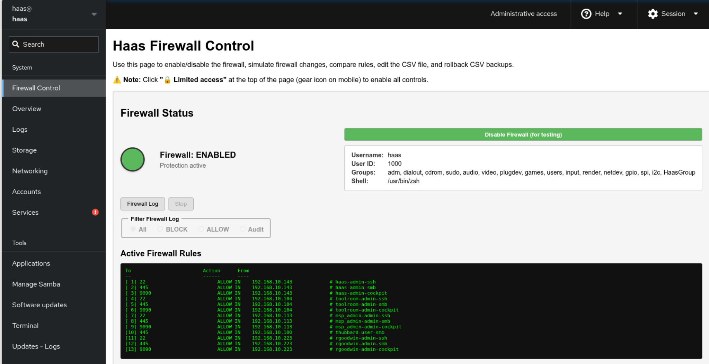
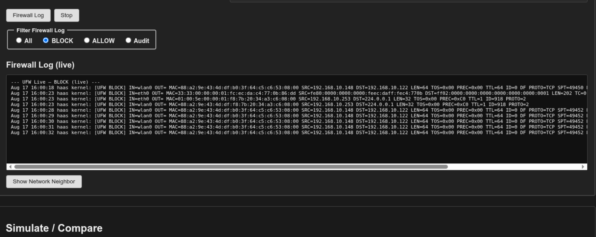

# Firewall Control

----------------------------------------------------------------

The `haas-install.sh` installer sets up a Cockpit extension for managing the
appliance's firewall day to day, so you don't need SSH access for routine
firewall work. Log into Cockpit at `https://<appliance-ip>:9090` and look
for **Firewall Control** under **System** in the sidebar.

----------------------------------------------------------------

!!! Note "Unlock the page first"
    Cockpit opens most pages in **🔒 Limited access** mode. Click that badge
    at the top of the page (the gear icon on mobile) before any of the
    buttons below will work.

## Firewall Status Dashboard

----------------------------------------------------------------

----------------------------------------------------------------

At the top of the page:

- A colored status indicator (green = enabled, red = disabled) plus your
  logged-in username, user ID, groups, and shell.
- An **Enable Firewall** / **Disable Firewall (for testing)** toggle button
  that reflects the current state. Both directions ask for confirmation
  first — disabling warns that all rules are removed and the appliance
  becomes vulnerable; enabling warns that you'll be disconnected if your
  current IP isn't already covered by a rule in `users.csv`.
- **Active Firewall Rules** — the live output of `ufw status numbered`,
  refreshed automatically.

## Firewall Log

----------------------------------------------------------------

----------------------------------------------------------------

Click **Firewall Log** to stream the live UFW log (`journalctl -f`) into the
rules pane, with radio filters for **All**, **BLOCK**, **ALLOW**, or
**Audit** entries. Click **Stop** to end the stream and go back to showing
the static rule list.

## Simulate / Compare

These buttons never make persistent changes — safe to use any time to
check what *would* happen:

| Button | What it does |
|---|---|
| Simulate Firewall Update (Dry-Run) | Runs `configure_ufw_from_csv.sh --dry-run` against the current `users.csv` |
| Show Current UFW Rules | Runs `configure_ufw_from_csv.sh --show-rules` |
| Edit users.csv | Opens `~/Haas_Data_collect/users.csv` in an inline editor (see below) |
| Edit Custom CSV | Opens whatever path is currently typed in the **Compare Current vs Planned Rules** box (below) in the same inline editor |
| Edit conf file | Opens `/etc/haas-firewall.conf` in an inline editor |
| Compare Current vs Planned Rules | Runs `configure_ufw_from_csv.sh --compare <path>` against whatever CSV path you enter — defaults to `users1.csv`, the usual convention for a planned/alternate file, since comparing against `users.csv` (the file already active) wouldn't show anything interesting |

The **Edit users.csv** / **Edit Custom CSV** / **Edit conf file** buttons
load the file into a text box in place of the output pane, with **Save
Changes** and **Cancel** buttons. Saving writes the file directly — it does
not apply firewall changes by itself; use **Apply Firewall Changes** below
for that. **Edit Custom CSV** reads the path field fresh each time you
click it, so it always edits whatever file is currently typed in
**Compare Current vs Planned Rules** — change that field first if you want
to edit a different file.

!!! note "Save Changes validates the CSV first"
    **Edit users.csv** and **Edit Custom CSV** both check every row before
    writing anything, mirroring exactly what `configure_ufw_from_csv.sh`
    itself parses — the header line is always skipped, and each remaining
    non-blank row must be `name,ip_address,role`:

    - **name** — letters, numbers, underscore, and hyphen only
    - **ip_address** — a valid IPv4 dotted-quad (each octet 0–255)
    - **role** — `Administrator` or `user` (case-insensitive, matching how
      the script itself compares it — any other value becomes an
      `UNKNOWN ROLE` line that's silently skipped when rules are applied)

    If any row fails, nothing is written — a popup names exactly which line
    and why, and the editor box stays open with your edits intact so you
    can fix it and click **Save Changes** again. **Edit conf file** has no
    such check, since `/etc/haas-firewall.conf` isn't row-structured data.

## Output pane

Every command's output streams into the box below **Simulate / Compare**.
Click **Clear Output** at any time to reset it. It sits directly under
the read-only Simulate/Compare buttons on purpose, so results are visible
without scrolling past the less-frequently-used **Rollback** section —
Rollback lives at the very bottom of the page for that reason.

## Apply Firewall Changes

!!! warning "Makes persistent changes"
    Everything above this section is read-only. This section actually
    rewrites the firewall.

- **Reset Firewall Only** — runs `ufw reset`, deleting all custom rules.
  Asks for confirmation first.
- **Apply Firewall Changes** — runs `configure_ufw_from_csv.sh` against
  `users.csv` (or a custom CSV path, if you check **Use custom CSV file**
  and provide one). Checking that box pre-fills the path field with
  `/home/haas/Haas_Data_collect/users1.csv` as a starting point — the
  usual convention alongside the default `users.csv` — as long as the
  field is still empty; it won't overwrite a path you've already typed.
  Asks for confirmation, **naming exactly which CSV file it's about to
  use** (`users.csv`, or your custom path) so you're not confirming
  blind — then checks that file actually exists before touching
  anything; if it doesn't, the firewall is left untouched and you get an
  error instead.

## Rollback Firewall Rules from a Backup

Every time the firewall config is applied, a timestamped copy of the CSV is
saved to the `BACKUP_DIR` configured in `/etc/haas-firewall.conf`. This
section is deliberately last on the page — it's a recovery tool you'll
reach for far less often than Simulate/Compare or Apply Firewall Changes.

1. Click **List Backups** to populate the dropdown from that directory.
2. Selecting a backup previews its contents in the output pane and fills
   in the filename field.
3. Click **Rollback CSV** to run `rollback_csv.sh` against that backup.
