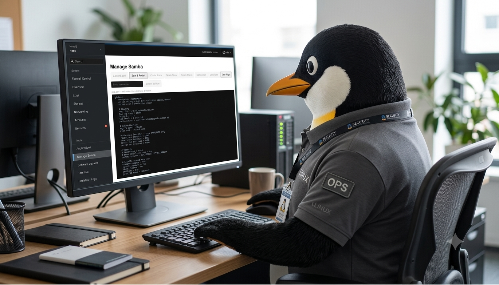

# Managing the Appliance

----------------------------------------------------------------

----------------------------------------------------------------

The appliance is built on Ubuntu Linux for reliability and stability.

**What is Ubuntu Linux?**

Think of Ubuntu as an enterprise-grade operating system designed for bulletproof reliability and background services.

If you're coming from Windows, here is what you need to know about running the appliance on Ubuntu:

- Zero License Fees & Instant Setups: No Windows Activation keys, no sudden "Windows Update" reboots in the middle of a shift, and no telemetry bloat.

- Built-in Web Management (GUI): You don't need to be a command-line wizard. The appliance uses Cockpit, a browser-based dashboard that lets you manage disk space, network shares, firewalls, and updates visually—just like logging into a smart router or NAS device.

- Seamless Windows Integration: It uses standard Samba (SMB/CIFS) file sharing. To your Windows PCs and Haas machine controls, the appliance looks and acts just like a standard Windows Network Drive (\\APPLIANCE-IP\SHARE).

- Low Resource Overhead: It runs efficiently on light hardware (like a Raspberry Pi 5 or an older spare PC) without needing heavy system specs just to keep the OS running.

## Cockpit login page branding

`haas-install.sh` replaces Cockpit's stock login screen — which otherwise
just shows the bare OS name (e.g. "Ubuntu 24.04 LTS") — with a Tux-on-the-
shop-floor illustration as the background and "Haas CNC Data Collection
Appliance" as the title, so it's obvious at a glance which appliance
you've logged into.

This works by dropping a `branding.css` (plus the background image) into
`/usr/share/cockpit/branding/<os-id>/` — Cockpit's own supported branding
mechanism, not a patch to Cockpit itself, so it survives Cockpit updates.
`<os-id>` comes from `/etc/os-release` (`ubuntu` on this appliance), which
takes precedence over Cockpit's built-in default branding.

To change the background image later, replace
`docs/manage_the_appliance/img/tux_terminal1.resized.jpg` in the repo and
re-run `haas-install.sh` — or edit
`/usr/share/cockpit/branding/ubuntu/branding.css` directly on the
appliance for a quick one-off change.

## Network info on every extension page

Every custom Cockpit extension — Firewall Control, Manage Samba, System
Updates, and Python Script Services — shows a line right under its title
naming the appliance's IPv4 address and MAC address for every active
**physical** network interface (real Ethernet/Wi-Fi hardware, not
bridges or virtual adapters), set off from the rest of the page by a
divider line so it doesn't visually run into the paragraph below it.
It's a quick sanity check for "am I on the network I think I'm on, and
is Cockpit reachable on the address I'm using" without opening a
terminal.

If both Ethernet and Wi-Fi come back active at the same time, both are
listed, with a highlighted amber warning box on its own line underneath
(the same yellow/amber convention used elsewhere on these pages for
"read this" notes) rather than blending into the address line:

!!! warning "Use one interface, not both"
    Running both Ethernet and Wi-Fi simultaneously means the appliance is
    reachable — and needs to be secured and firewalled — on two separate
    networks at once, which is harder to reason about and easier to get
    wrong. For the best security and manageability, connect the
    appliance over **one** interface at a time; leave the other
    physically unplugged or disabled.

This has no effect on the firewall itself — `users.csv` rules apply
per-IP regardless of which interface it's reachable on — it's purely
informational, read fresh (no caching) every time the page loads.
