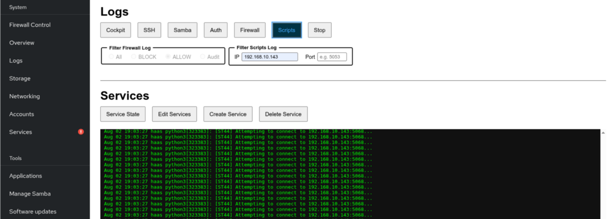

# Python Script Services

----------------------------------------------------------------

The `haas-install.sh` installer sets up a dedicated Cockpit extension for
managing the `haas-*.service` systemd units that run the per-machine CNC
data-collection scripts — separate from the general **Updates - Logs**
page, since creating, editing, and troubleshooting these services is a
day-to-day task that has nothing to do with OS updates. Log into Cockpit
at `https://<appliance-ip>:9090` and look for **Python Scripts** in the
sidebar.

----------------------------------------------------------------

## Logs

**Scripts** streams the CNC machine-logger output (`journalctl -t
python3`) into the output pane, with optional **Machine** / **IP** /
**Port** text filters. **Stop** ends the stream. Changing any filter
while the stream is running automatically restarts it with the new
filter applied — no need to stop and re-click.

**Machine** matches every line's `[MACHINE]` prefix (e.g. `ST44`), which
`haas_logger2.py` includes on *every* message for that machine — not just
the ones that happen to mention its IP/port. Because of that, **Machine
wins outright over IP/Port** rather than combining with them: only the
very first "Attempting to connect" lines actually repeat the port number,
so an AND-combination would hide everything else (cycle detection, file
writes, etc.) the moment both were filled in. Filling in Machine greys
out IP/Port to make clear they're not being applied — clear Machine to
use IP/Port filtering instead.

In this screenshot I am filtering the Python log from my laptop at
192.168.10.143:

----------------------------------------------------------------

----------------------------------------------------------------

## Services

Manages the `haas-*.service` systemd units that run the per-machine CNC
data-collection scripts.

----------------------------------------------------------------

### Service State

Click **Service State** for a one-shot `systemctl list-unit-files`
summary of every `haas-*` service and its current state, followed by:

- a reminder that the unit files live in `/etc/systemd/system`
- the same IP/port/name breakdown as the `haas-ports` terminal alias, with
  any **duplicate ports flagged** — two services both pointing
  `-t <ip> --port <port>` at the same address means one of them is very
  likely connecting to the wrong machine, which is exactly the kind of
  thing that shows up as "this CNC just isn't writing a CSV" with no
  obvious error to explain why.
- a one-shot TCP reachability check (`nc -z`, 2s timeout) against each
  service's `-t <ip> --port <port>` — skipped for any machine that
  already has an established connection from its `python3` process, so a
  machine that's already connected and streaming is never touched a
  second time

The whole button is disabled for the duration of the run (including the
connectivity sweep, which can take a couple seconds per machine) so a
second click can't stack an overlapping sweep against the same targets.

!!! note "\"Not reachable\" isn't always a problem"
    This check is deliberately only run here, on demand, and not
    automatically right after Create Service. During initial deployment
    it's common for services to be created before the machine shop has
    configured the actual CNC to connect on that port — in that window,
    every machine will correctly show "not reachable," and that's normal,
    not an error. Run **Service State** once you expect the machines to
    actually be talking; a machine that stays unreachable at that point is
    worth investigating (wrong IP/port, firewall, machine powered off,
    network issue) — one that was never expected to be connected yet
    isn't.

!!! warning "Why the connectivity check skips already-connected machines"
    Some CNC control network stacks are minimal enough to only accept one
    connection at a time. Probing a machine that already has an active,
    established connection from `haas_logger2.py` risks contending with —
    or on a sufficiently limited stack, even displacing — that real
    connection, purely because of the diagnostic check itself. Skipping
    already-connected machines avoids that risk entirely; only machines
    that aren't currently connected get probed.

----------------------------------------------------------------

### Edit Services

1. Click **Edit Services**, then pick a unit file from the dropdown that
   appears. Entries are listed by machine name only (`st30`, not
   `haas-st30.service`) — the `haas-` prefix and `.service` suffix are
   dropped from the label (not the underlying file, just what's shown),
   so with a lot of machines, typing e.g. `s` jumps straight to `st10y`/
   `st30`/`st40`/etc. using the browser's own type-ahead, instead of
   every option starting with the same "haas-" text.
2. The file loads into an editor. Every other button is locked while
   editing except **Save & Restart** and **Cancel**.
3. **Save & Restart** asks for confirmation, then writes the file, runs
   `systemctl daemon-reload`, restarts the service, and finishes with
   `systemctl status <service>` so you can confirm it came back up
   cleanly.
4. **Cancel** discards your changes and returns to the log/output view.

----------------------------------------------------------------

### Create Service

Click **Create Service** to open a form (Description, Machine Name, IP
Address, Port) instead of a raw editor — this generates a new
`haas-<machine>.service` unit from a template, so you don't need to hand
-write systemd files for each new CNC machine.

- Typing in **Machine Name**, **Description**, and **IP Address** filters
  out invalid characters as you type (IP Address only accepts digits and
  dots, for example).
- **Save & Reload** validates before writing anything:
    - all four fields are required
    - IP Address must be a valid IPv4 address
    - Port must be an integer between 5001 and 5099 (Haas's recommended TCP/IP port range)
- Once validated, it writes `/etc/systemd/system/haas-<machine>.service`,
  creates the machine's working directory under
  `/home/haas/Haas_Data_collect/machines/<machine>`, then runs
  `daemon-reload`, `enable`, and `start` for the new service — the output
  pane shows each step, ending with `systemctl status` for the new
  service, followed by the same IP/port/name breakdown (with duplicate
  ports flagged) shown by **Service State** — a quick way to catch a
  copy-pasted port before it causes a silent connection mix-up.

!!! note "Why the template uses `python3 -u`"
    The `-u` flag forces unbuffered stdout. Without it, Python fully
    block-buffers output whenever stdout isn't a real terminal — which is
    exactly the case under systemd, where stdout goes to journald through
    a pipe. That means `haas_logger2.py`'s own log lines (`End of cycle
    detected!`, `Data appended to: ...`, etc.) can sit invisible in the
    buffer well after the corresponding CSV write has actually completed
    on disk — a one-off message has nothing to push it over the flush
    threshold, so it may never show up in the **Scripts** log at all,
    even though the data was received and saved correctly (visible via
    **Data Freshness**). `-u` isn't a logging feature you have to add;
    the log lines already exist in the script — it just makes sure they
    reach journald promptly instead of sitting buffered.

----------------------------------------------------------------

### Delete Service

Pick a unit file from the dropdown after clicking **Delete Service**.
Confirms first (**"This cannot be undone"**, and calls out that the
machine's data directory under
`/home/haas/Haas_Data_collect/machines/` will **not** be deleted), then
stops, disables, and removes the unit file, followed by `systemctl
daemon-reload`.

----------------------------------------------------------------

### Data Freshness

Click **Data Freshness** for a one-shot list of when each machine under
`/home/haas/Haas_Data_collect/machines/` last wrote a CSV file — the
newest file in that machine's `cnc_logs/` directory, however logging was
set up (append mode or per-cycle files, it just checks modification
time).

The list is sorted **oldest first**, so a machine that's silently stopped
producing data floats straight to the top instead of only being noticed
whenever someone happens to go looking for it. A machine directory with
no `cnc_logs/` yet (e.g. a service that's never completed a cycle) or an
empty one is called out the same way, right alongside the rest.

This doesn't tell you *why* a machine stopped writing — pair it with
**Service State**'s IP/port/duplicate check and the **Scripts** log
above to see whether it's a connection problem, a wrong/duplicate port,
or something else.
