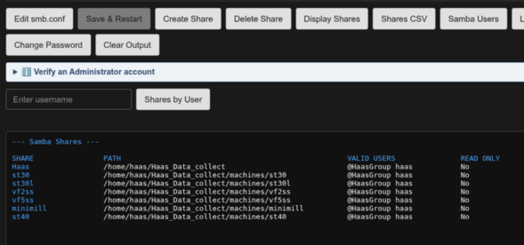

# Manage Samba

----------------------------------------------------------------

The `haas-install.sh` installer script sets up a Cockpit web extension for viewing and editing the Samba configuration without needing SSH access. Log into Cockpit at `https://<appliance-ip>:9090` and look for **Manage Samba** in
the sidebar.

----------------------------------------------------------------

The line under the page title shows this appliance's current IPv4/MAC
per active network interface — see
[Network info on every extension page](./manage_intro.md#network-info-on-every-extension-page)
for what it means and why more than one active interface is flagged.

----------------------------------------------------------------

The page has a single output/editor panel below a row of buttons. Only one
of five things is ever shown there:

- command output
- the `smb.conf` editor
- the `Create Share` form
- the `Create User` form
- the `Change Password` form — never more than one at once.

## View buttons

These are read-only and safe to click any time:

| Button | What it does |
|---|---|
| Display Shares | Runs `list_shares.sh` — lists the shares defined in `smb.conf` |
| Shares CSV | Runs `list_shares_csv.sh` — same share list in CSV format for use in Excel |
| Samba Users | Lists every account in the Samba password database (`pdbedit -L`) |
| Linux Users | Lists local Linux accounts with UID 1000–59999, showing UID, GID, and home directory |
| Shares by User | Enter a username in the field next to the button, then click it to run `smbstatus --user=<name>` and show that user's **active** Samba sessions |

----------------------------------------------------------------

### Display shares

To map a drive to a Mac/Windows/Linux computer or the Haas machine tools you need the share name. Clicking the `Display Shares` button provides a quick view of all the shares available on the appliance. To map a drive see

The header row and each row's **SHARE** column are colored blue — enough
to anchor each row at a glance without a full divider line between every
share, since each one is only a single line to begin with.

----------------------------------------------------------------



----------------------------------------------------------------

### Shares by User

Use this button to see if a specific user has a drive mapped to the appliance. The machines should always show up connected. In this example, I'm checking on user `thubbard`:

----------------------------------------------------------------


----------------------------------------------------------------


## Edit smb.conf

1. Click **Edit smb.conf** to load `/etc/samba/smb.conf` into the editor
   panel. While editing, every other view button is disabled except
   **Save & Restart** and **Clear Output**.
2. Make your changes directly in the text box.
3. Click **Save & Restart**. A confirmation dialog asks you to confirm
   before anything is written. Confirming first validates your edits with
   `testparm` — nothing is written or restarted yet. Only if that passes
   does it write the file and restart `smbd`, and the output panel shows
   the restart result followed by `systemctl status smbd`, so you can
   confirm the service came back up cleanly.
4. Click **Clear Output** instead of saving to discard your edits and
   return to the output panel — it doubles as a Cancel button while in
   edit mode.

!!! note "Invalid configs are rejected before anything is touched"
    `testparm` checks your edits before `smb.conf` is overwritten. If it
    finds a problem, the real config file is left untouched and `smbd` is
    not restarted — the error from `testparm` is shown above the editor so
    you can fix it and try again. Note that `testparm` only catches
    *syntax* errors; it can't tell you whether a share definition actually
    does what you intend.

## Create Share

Adds a new share stanza to `smb.conf` without hand-editing the file — the
same idea as **Create Service** on the Updates/Logs page: only the parts
that vary between shares are exposed as fields, and everything else is
filled in from a fixed template.

1. Click **Create Share**. Every other view button is disabled except
   **Save & Restart** and **Clear Output**, same as edit mode.

2. Fill in the two fields:

    | Field | Becomes | Notes |
    |---|---|---|
    | Machine Name | The `[section]` name | Letters, digits, `_`, `-` only; lower-cased on save |
    | Comment | `comment =` | Letters, digits, `_`, `-`, spaces only |

    There's no Path field — the share's directory is always
    `/home/haas/Haas_Data_collect/machines/<machine name>`, the same
    convention **Create Service** uses for a machine's working directory.
    Every other share setting (`browseable`, `writable`, `valid users`,
    `force user`/`force group`, the create/directory mask fields, etc.) is
    also fixed and identical for every share — none of it is user-editable
    through this form.

3. Click **Save & Restart**. A confirmation dialog names the directory and
   share it's about to create, and reminds you that this only creates the
   share — you still need to use **Create Service** on the Updates - Logs
   page to set up the logger service that actually collects data into it. The logic here is that you probably have machines that aren't Haas, but you still want to drop CNC programs onto the appliance and load them to the control.

    Before anything is written:

    * The machine directory is created with `mkdir -p` if it doesn't
      already exist yet — you don't need to create it (or a service for
      that machine) first.
    * The **machine name** is checked against the existing `smb.conf` for
      a section that already uses it — duplicates are rejected rather
      than silently shadowing the existing share.
    * The assembled config (existing `smb.conf` + the new stanza) is run
      through `testparm`, exactly like the Edit smb.conf flow.

    Only if the name is free and `testparm` passes is the new stanza
    appended to `smb.conf` and `smbd` restarted; the output panel then shows
    the restart result and `systemctl status smbd`.

4. Click **Clear Output** to discard the form and cancel — it doubles as
   Cancel here too.

## Delete Share

Removes a share's stanza from `smb.conf` — the same idea as **Delete
Service** on the Updates/Logs page: pick from a dropdown, confirm, done.

1. Click **Delete Share** to populate a dropdown with every share
   currently defined in `smb.conf` (via `testparm -s`). The `[Haas]` share
   — the appliance's main data share, set up by `haas-install.sh` — is
   deliberately left out of this list, since it isn't a per-machine share;
   if it ever genuinely needs to be removed, do that through Edit smb.conf
   instead.
2. Select a share. A confirmation dialog names it and warns this cannot
   be undone. It also makes clear that only the `smb.conf` entry is
   removed — the machine's data directory itself is never touched or
   deleted.
3. Confirming reads the current `smb.conf`, removes that share's stanza,
   runs the result through `testparm` (same gate as Edit smb.conf and
   Create Share), and only then writes the file and restarts `smbd`. If
   `testparm` rejects the result, nothing is saved or restarted.

## Create User

Creates a Linux + Samba account by running `manage_users.sh` (the same
script documented for terminal use — it isn't copied to
`/usr/local/sbin/`, it stays at `/home/haas/Haas_Data_collect/manage_users.sh`
and runs from there either way), instead of needing SSH access to run it
by hand.

1. Click **Create User**. Every other view button is disabled except
   **Create User** (the panel's main action button briefly relabels
   itself from **Save & Restart**) and **Clear Output**.
2. Fill in the four fields:

    | Field | Notes |
    |---|---|
    | Username | Letters, digits, `_`, `-` only; lower-cased on save |
    | Role | **Standard user** — Samba share access only, no shell, no sudo. **Administrator** — SSH + sudo + Samba, matching `manage_users.sh --admin-user` |
    | Password | Set for both the Linux account and the Samba account |
    | Confirm Password | Must match exactly |

3. Click **Create User**. A confirmation dialog names the username and
   role before anything runs. Confirming runs
   `manage_users.sh <username> --set-password --force` (plus
   `--admin-user` for the Administrator role), with the password you
   entered piped to the script's own interactive prompts — the output
   panel shows the script's full log as it runs.
4. Click **Clear Output** instead to discard the form and cancel.

For the **Administrator** role, once the account itself is created the
panel automatically runs `setup_zsh.sh <repo_dir> <username>` for the new
user — the same script `haas-install.sh` uses to set up the `haas`
account. It installs zsh and Oh My Zsh, copies the repo's `zshrc` to
`~/.zshrc` and `haas-aliases.zsh` to the Oh My Zsh custom directory, and
sets zsh as the login shell — so a new admin's SSH session shows the
`haas-*`/`t-*` alias menu instead of a bare bash prompt. This step needs
internet access (Oh My Zsh and its plugins install from GitHub); if it
fails, the account still works over SSH with the default shell, and the
output panel shows the exact command to re-run manually. **Standard
user** accounts get `/usr/sbin/nologin` and never have a shell, so this
step is skipped for them.

!!! tip "Verify an Administrator account"
    The Manage Samba page has a collapsed **&#8505;&#65039; Verify an Administrator
    account** note with the same checklist, right below the button row.
    If you want to confirm a new Administrator account end-to-end, open
    the Cockpit **Terminal** page and run each of these (replace
    `<username>`):

    ```bash
    getent passwd <username>                                    # shell should be /bin/zsh, home /home/<username>
    groups <username>                                           # should include sudo and HaasGroup
    sudo -l -U <username>                                       # confirms sudo actually works
    sudo pdbedit -L -v <username> | grep "Account Flags"        # should show [U] (enabled), not [D]
    ls -la /home/<username>/.zshrc /home/<username>/.oh-my-zsh/custom/haas-aliases.zsh   # both owned <username>:<username>
    ```

    Then, logged in as that user (e.g. `ssh <username>@<appliance_ip>`),
    type `haas` and press Tab — it should list the full `haas-*`/`t-*`
    alias menu.

!!! note "This is a separate system from firewall access"
    `users.csv`/**Apply Firewall Changes** control *network* access — which
    IPs can reach the appliance at all. This controls *account* access —
    who can actually log in and read/write files once they're on the
    network. They're related but independent; applying a firewall CSV
    doesn't create or remove Samba/Linux accounts, which is exactly why
    this button exists. See the note under **Apply Firewall Changes** in
    [Firewall Control](./firewall.md) for the reminder that ties the two
    together.

## Delete User

Removes a Linux + Samba account — pick from a dropdown, confirm, done,
the same pattern as **Delete Share**.

1. Click **Delete User** to populate a dropdown with every current member
   of `HaasGroup` except `haas` itself (the appliance's own account,
   deliberately excluded — deleting it would be catastrophic).
2. Select a user. A confirmation dialog names them and warns this cannot
   be undone. It also makes clear their home directory, if they have one,
   is not deleted — only the Linux and Samba accounts themselves.
3. Confirming runs `manage_users.sh <username> --delete-user --force` and
   shows the result in the output panel.

If the user still has an active login session (an open SSH connection,
for example), `userdel` refuses to remove the Linux account and the
output panel shows `[ERROR]` naming the account as still active, with
the command to terminate the session first (`sudo pkill -KILL -u
<username>`) before retrying. The account is not silently left in place
without a warning — deletion either fully succeeds or is reported as
failed.

## Change Password

Sets a new password for an existing account — for a departed contractor's
CSV row being pulled from `users.csv` (revoking network access) but their
Samba/Linux login left active, use **Delete User** above instead; this is
for rotating a *current* user's password (a suspected credential
compromise, or a routine 90-day rotation policy), which otherwise has no
way to be done without SSH access.

1. Click **Change Password** to populate a dropdown with every current
   member of `HaasGroup` except `haas` itself — the same list Delete User
   uses.
2. Select a user. A small form appears with **New Password** and
   **Confirm Password** fields (the username itself is shown read-only,
   just for confirmation).
3. Click **Set New Password**. A confirmation dialog names the user
   before anything runs, then
   `manage_users.sh <username> --set-password --force` runs with the
   password you entered.
4. On success, that entry is marked **✓ (done)** and disabled in the
   dropdown — not removed — so during a multi-user sweep (e.g. rotating
   everyone's password after an incident) the full roster stays visible
   and it's obvious at a glance who's left, rather than only being able
   to tell by counting. The dropdown is ready immediately for the next
   pick. Click **Cancel** at any point to back out of the current
   selection without changing anything and return to the dropdown; the
   list (and its done-markers) is rebuilt fresh each time you click
   **Change Password** itself.

## Clear Output

Resets the panel back to a plain **Ready.** message and, if you were
mid-edit, discards the unsaved editor contents.
