# Manage Samba

----------------------------------------------------------------

The `haas-install.sh` installer script sets up a Cockpit web extension for viewing and editing the Samba configuration without needing SSH access. Log into Cockpit at `https://<appliance-ip>:9090` and look for **Manage Samba** in
the sidebar.

----------------------------------------------------------------

The line under the page title shows this appliance's current IPv4/MAC
per active network interface — see
[Network info on every extension page](./manage_intro.md#network-info-on-every-extension-page)
for what it means and why more than one active interface is flagged.

----------------------------------------------------------------

The buttons are grouped into two panels — **Shares & Configuration** (Edit
smb.conf, Create Share, Delete Share, Display Shares, Shares CSV, Shares by
User) and **Users** (Users, Create User, Delete User, Change Password) —
above a single output/editor panel. Only one of five things is ever shown
in that panel:

- command output
- the `smb.conf` editor
- the `Create Share` form
- the `Create User` form
- the `Change Password` form — never more than one at once.

**Save & Restart** and **Clear Output** sit in their own row directly above
that panel, separate from both button panels. **Clear Output** is always
there; **Save & Restart** stays hidden the rest of the time and appears
only while you're editing `smb.conf`, creating a share, or creating a user
— instead of sitting permanently in the button row, disabled, when it
doesn't apply.

## View buttons

These are read-only and safe to click any time:

| Button | What it does |
|---|---|
| Display Shares | Runs `list_shares.sh` — lists the shares defined in `smb.conf` |
| Shares CSV | Runs `list_shares_csv.sh` — same share list in CSV format for use in Excel |
| Users | Three numbered sections: **Samba Users** — every account in the Samba password database (`pdbedit -L`); **Linux Users (login-capable, with a home directory)** — only the accounts that also have a real shell and home directory (i.e. admin accounts), showing UID, GID, and home directory; **Linux Users (no home directory, Samba share only)** — the machine-tool/share-only accounts, so the count difference between the first two sections is self-explanatory instead of looking like a discrepancy. A totals line after all three sections gives the count of each, for comparing against Cockpit's own **Accounts** page (which only lists accounts with a home directory) or an auditor's own tally |
| Shares by User | Enter a username in the field next to the button, then click it to run `smbstatus --user=<name>` and show that user's **active** Samba sessions |
| Drive Mapping | Enter a username in the field next to the button, then click it to generate a Windows `net use` command for every share, ready to hand off to that user |

----------------------------------------------------------------

### Display shares

To map a drive to a Mac/Windows/Linux computer or the Haas machine tools you need the share name. Clicking the `Display Shares` button provides a quick view of all the shares available on the appliance. To map a drive see

The header row and each row's **SHARE** column are colored blue — enough
to anchor each row at a glance without a full divider line between every
share, since each one is only a single line to begin with.

----------------------------------------------------------------

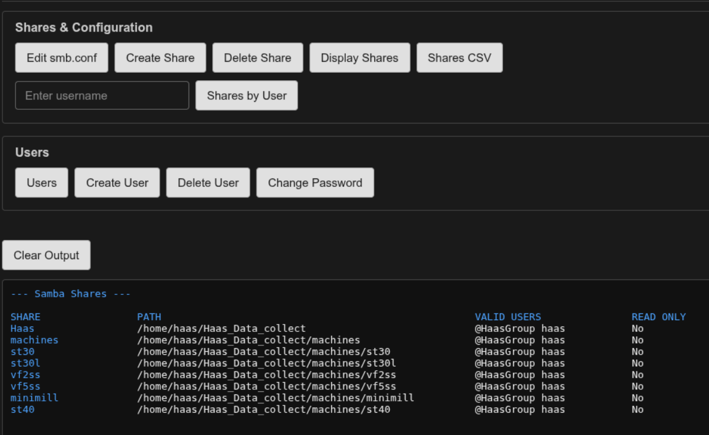{ width="500"}

----------------------------------------------------------------

### Shares CSV

`Display Shares` is easy to read on screen, but it isn't something you
can hand off to someone else to work with in a spreadsheet — the columns
are lined up with spaces, not something a spreadsheet program
understands as columns. `Shares CSV` runs the same share list through
`list_shares_csv.sh` instead, which outputs
[CSV](https://en.wikipedia.org/wiki/Comma-separated_values){: target="_blank" rel="noopener" }
(**C**omma-**S**eparated **V**alues) — a plain text format where each
line is one row and a comma marks where one column ends and the next
begins. It isn't an Excel-only format; it's a universal one that
LibreOffice Calc, Microsoft Excel, Google Sheets, and just about
anything else that opens spreadsheets can read.

Click `Shares CSV`, select all the text in the output panel below "--- Samba Shares (CSV) ---", and paste
it into a new, empty text file (Notepad, Notepad++), save it with a `.csv` extension. Opening that
file in a spreadsheet program should trigger an import dialog rather
than just dropping the raw text into cell A1. You can also paste it into a new spreadsheet. That will bring up the same "Text Import" dialog.

Each of the four columns — **share**, **path**, **valid_users**,
**read_only** — is colored differently on screen, in every row including
the header, so it's easy to scan down a single column. The coloring is
just for readability; copying the text still gives you plain,
comma-separated values.

----------------------------------------------------------------

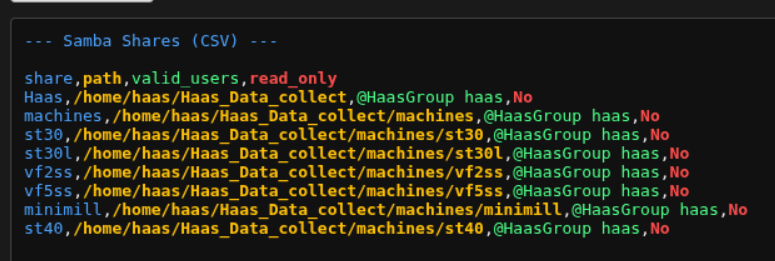{ width="500"}

----------------------------------------------------------------

!!! warning "Leave \"Space\" unchecked"
    Some values in this CSV contain spaces of their own — `valid_users`
    values like `@HaasGroup haas` are one field, not two. It's tempting
    to check a **Space** delimiter option in the import dialog because
    you can see spaces in the data, but doing that splits `@HaasGroup
    haas` into two separate columns and throws off everything after it.
    This file only uses commas to separate columns — leave every other
    delimiter option (Space included) unchecked, and leave only
    **Comma** checked, as shown below in LibreOffice Calc's **Text
    Import** dialog. Microsoft Excel's import has the same "which
    character separates columns" question under a different name (its
    exact wording depends on your Excel version), but the same rule
    applies: comma only.

----------------------------------------------------------------

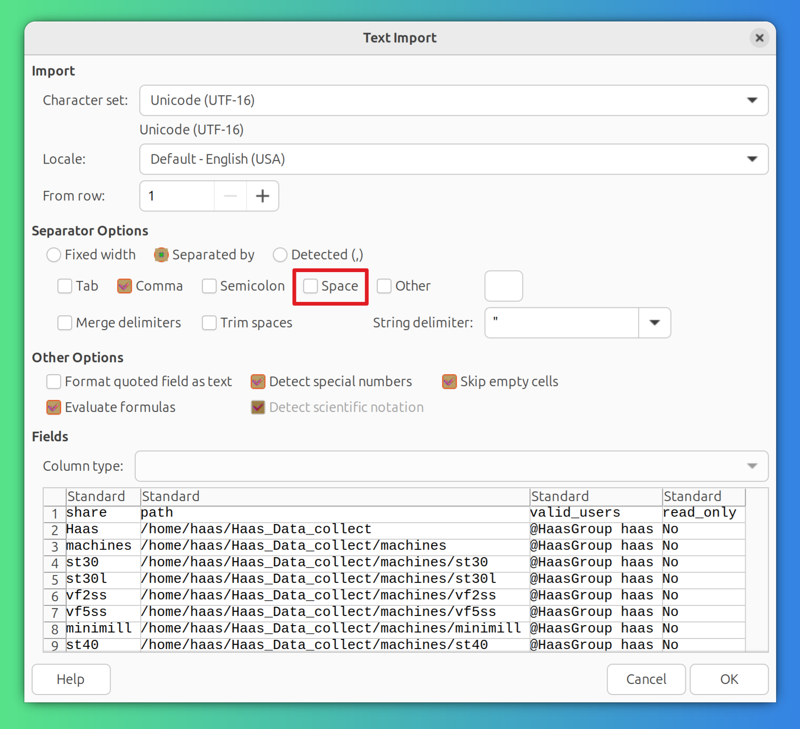{ width="500"}

----------------------------------------------------------------

The data in the spreadsheet program. This is Libre Calc, but it's the in Excel, Google Sheets. You can share this to anyone that needs to map a drive.

----------------------------------------------------------------

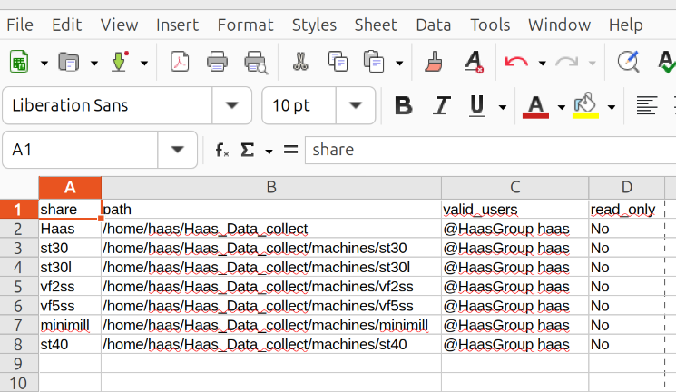

----------------------------------------------------------------

### Shares by User

Use this button to see if a specific user has a drive mapped to the appliance. The machines should always show up connected. If no drives are actively mapped, nothing will appear.

In this example, I'm checking on user `thubbard`:

----------------------------------------------------------------

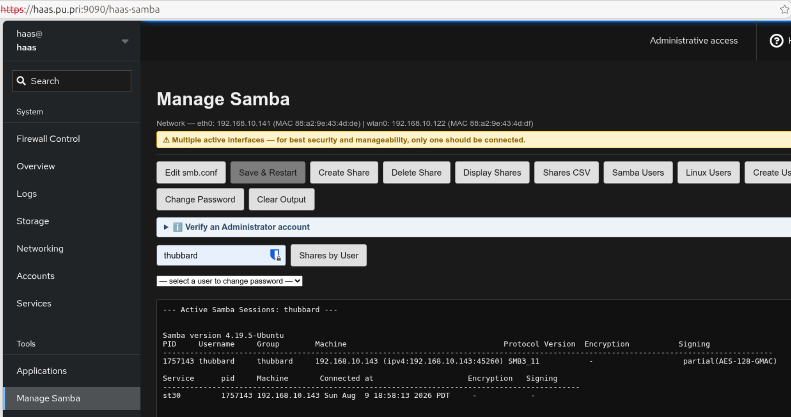

----------------------------------------------------------------

### Drive Mapping

Enter a username in the field and click `Drive Mapping` to get a
ready-to-send Windows drive mapping command for every share currently
defined — pick out the line(s) that user actually needs and send them
that line.

```text
net use * \\192.168.10.141\st30 /user:jdoe * /persistent:yes
```

----------------------------------------------------------------

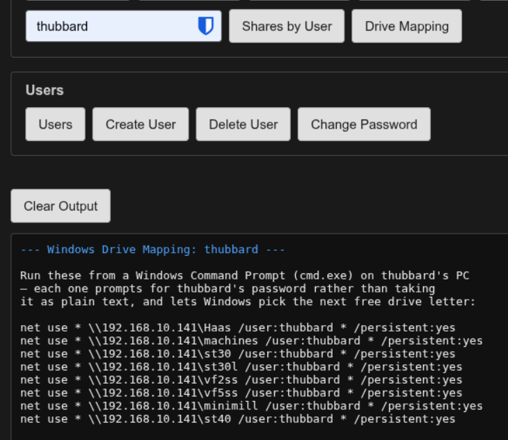{ width="500"}

----------------------------------------------------------------

Two details are deliberate:

- The `*` in place of the password makes `net use` prompt for it
  interactively (Windows doesn't echo it back) instead of the password
  sitting in plain text in the command itself — which matters, since
  this is a command you're handing off in an email or chat message.
- The `*` in place of a drive letter (instead of e.g. `Z:`) lets Windows
  pick the next free drive letter on its own, so running more than one
  of these back to back on the same PC won't collide over which letter
  to use.

----------------------------------------------------------------

## Edit smb.conf

1. Click **Edit smb.conf** to load `/etc/samba/smb.conf` into the editor
   panel. While editing, every button in both panels is disabled, and
   **Save & Restart** appears in its own row above the editor (otherwise
   hidden) alongside **Clear Output**.
2. Make your changes directly in the text box.
3. Click **Save & Restart**. A confirmation dialog asks you to confirm
   before anything is written. Confirming first validates your edits with
   `testparm` — nothing is written or restarted yet. Only if that passes
   does it write the file and restart `smbd`, and the output panel shows
   the restart result followed by `systemctl status smbd`, so you can
   confirm the service came back up cleanly.
4. Click **Clear Output** instead of saving to discard your edits and
   return to the output panel — it doubles as a Cancel button while in
   edit mode.

!!! note "Invalid configs are rejected before anything is touched"
    `testparm` checks your edits before `smb.conf` is overwritten. If it
    finds a problem, the real config file is left untouched and `smbd` is
    not restarted — the error from `testparm` is shown above the editor so
    you can fix it and try again. Note that `testparm` only catches
    *syntax* errors; it can't tell you whether a share definition actually
    does what you intend.

!!! note "\"Referenced but unset environment variable...SMBDOPTIONS\" in the log"
    If `systemctl status smbd`'s output (or the system journal) shows a line
    like `smbd.service: Referenced but unset environment variable evaluates
    to an empty string: SMBDOPTIONS`, that's harmless — it's a known
    Debian/Ubuntu Samba packaging quirk
    ([Debian #1073969](https://bugs-devel.debian.org/1073969)), not a real
    error, and it doesn't affect Samba working correctly.
    `haas-install.sh` writes `/etc/default/samba` with `SMBDOPTIONS=""` on
    install specifically to prevent it from appearing at all; you'd only
    see it on an appliance that predates that fix, or if `/etc/default/samba`
    was manually removed. Add `SMBDOPTIONS=""` (and `NMBDOPTIONS=""`) to
    that file and restart `smbd` to make it stop for good.

## Create Share

Adds a new share stanza to `smb.conf` without hand-editing the file — the
same idea as **Create Service** on the Updates/Logs page: only the parts
that vary between shares are exposed as fields, and everything else is
filled in from a fixed template.

1. Click **Create Share**. Same as edit mode: every button in both panels
   is disabled, and **Save & Restart** appears above the form alongside
   **Clear Output**.

2. Fill in the two fields:

    | Field | Becomes | Notes |
    |---|---|---|
    | Machine Name | The `[section]` name | Letters, digits, `_`, `-` only; lower-cased on save |
    | Comment | `comment =` | Letters, digits, `_`, `-`, spaces only |

    There's no Path field — the share's directory is always
    `/home/haas/Haas_Data_collect/machines/<machine name>`, the same
    convention **Create Service** uses for a machine's working directory.
    Every other share setting (`browseable`, `writable`, `valid users`,
    `force user`/`force group`, the create/directory mask fields, etc.) is
    also fixed and identical for every share — none of it is user-editable
    through this form.

   ----------------------------------------------------------------

   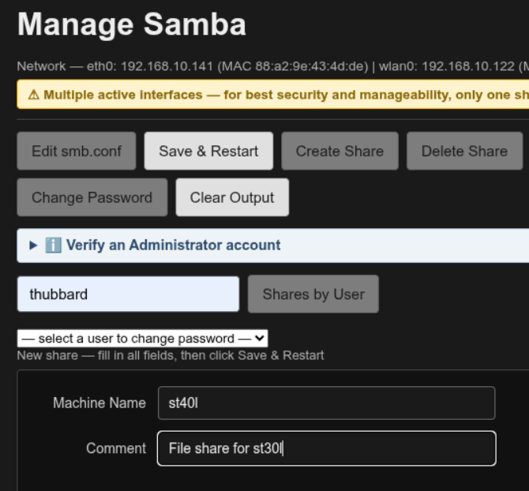

   ----------------------------------------------------------------

3\. Click **Save & Restart**. A confirmation dialog names the directory and
   share it's about to create, and reminds you that this only creates the
   share — you still need to use **Create Service** on the Updates - Logs
   page to set up the logger service that actually collects data into it. The logic here is that you probably have machines that aren't Haas, but you still want to drop CNC programs onto the appliance and load them to the control.

    Before anything is written:

    - The machine directory is created with `mkdir -p` if it doesn't
      already exist yet — you don't need to create it (or a service for
      that machine) first.
    - The **machine name** is checked against the existing `smb.conf` for
      a section that already uses it — duplicates are rejected rather
      than silently shadowing the existing share.
    - The assembled config (existing `smb.conf` + the new stanza) is run
      through `testparm`, exactly like the Edit smb.conf flow.

    Only if the name is free and `testparm` passes is the new stanza
    appended to `smb.conf` and `smbd` restarted; the output panel then shows
    the restart result and `systemctl status smbd`.

  ----------------------------------------------------------------

Output if the share was created successfully:

   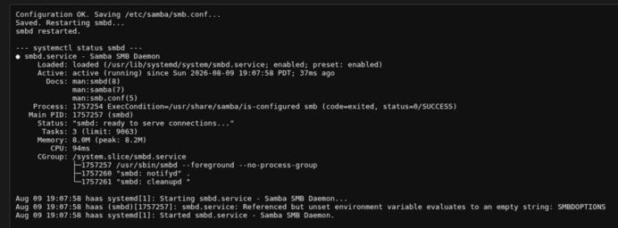

  ----------------------------------------------------------------

  Here is the stanza added to smb.conf:

  ----------------------------------------------------------------

   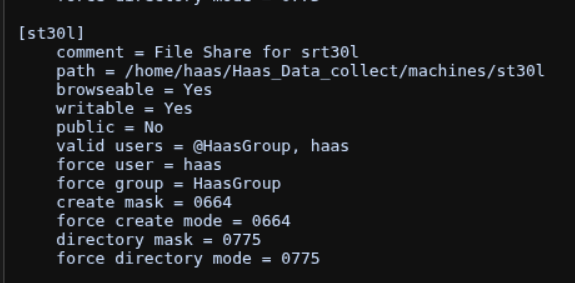

  ----------------------------------------------------------------

4\. Click `Clear Output` to discard the form and cancel — it doubles as `Cancel` here too.

## Delete Share

Removes a share's stanza from `smb.conf` — the same idea as **Delete
Service** on the Updates/Logs page: pick from a dropdown, confirm, done.

1. Click **Delete Share** to populate a dropdown with every share
   currently defined in `smb.conf` (via `testparm -s`). The `[Haas]` share
   — the appliance's main data share, set up by `haas-install.sh` — is
   deliberately left out of this list, since it isn't a per-machine share;
   if it ever genuinely needs to be removed, do that through Edit smb.conf
   instead.
2. Select a share. A confirmation dialog names it and warns this cannot
   be undone. It also makes clear that only the `smb.conf` entry is
   removed — the machine's data directory itself is never touched or
   deleted.
3. Confirming reads the current `smb.conf`, removes that share's stanza,
   runs the result through `testparm` (same gate as Edit smb.conf and
   Create Share), and only then writes the file and restarts `smbd`. If
   `testparm` rejects the result, nothing is saved or restarted.

----------------------------------------------------------------

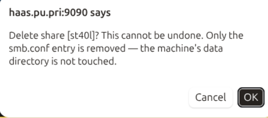

----------------------------------------------------------------

## Users

This button presents all users in the display panel. There are three sections:

- Samba users
- Linux Users with home directories (Administrator role)
- Linux users without home directories (user role)

Each section is sorted alphabetically and each user is numbered. After all users are displayed a summary is generated so that any orphaned users will obvious. A user could be orphaned is an Administrator deleted an account manually in the terminal.

----------------------------------------------------------------

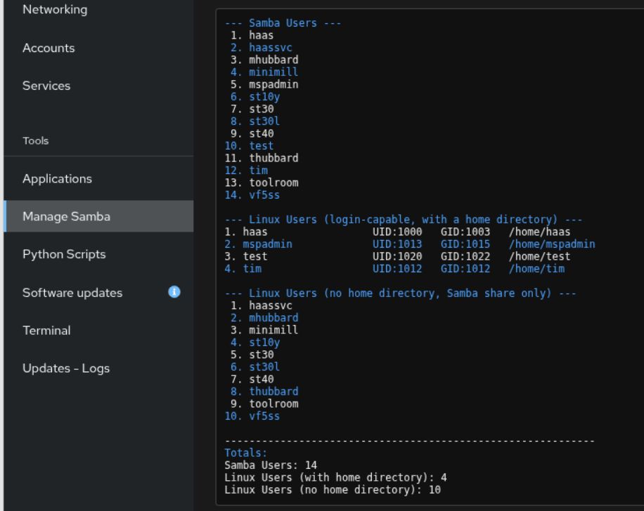

----------------------------------------------------------------

## Create User

Creates a Linux + Samba account by running `manage_users.sh` (the same
script documented for terminal use — it isn't copied to
`/usr/local/sbin/`, it stays at `/home/haas/Haas_Data_collect/manage_users.sh`
and runs from there either way), instead of needing SSH access to run it
by hand.

1. Click **Create User**. Every button in both panels is disabled, and the
   same button that appears above the panel as **Save & Restart** in the
   other flows shows up here too — relabeled **Create User** — alongside
   **Clear Output**.
2. Fill in the four fields:

    | Field | Notes |
    |---|---|
    | Username | Letters, digits, `_`, `-` only; lower-cased on save |
    | Role | **Standard user** — Samba share access only, no shell, no sudo. **Administrator** — SSH + sudo + Samba, matching `manage_users.sh --admin-user` |
    | Password | Set for both the Linux account and the Samba account |
    | Confirm Password | Must match exactly |

----------------------------------------------------------------

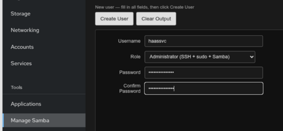

----------------------------------------------------------------

3\. Click **Create User**. A confirmation dialog names the username and
   role before anything runs. Confirming runs
   `manage_users.sh <username> --set-password --force` (plus
   `--admin-user` for the Administrator role), with the password you
   entered piped to the script's own interactive prompts — the output
   panel shows the script's full log as it runs.

----------------------------------------------------------------

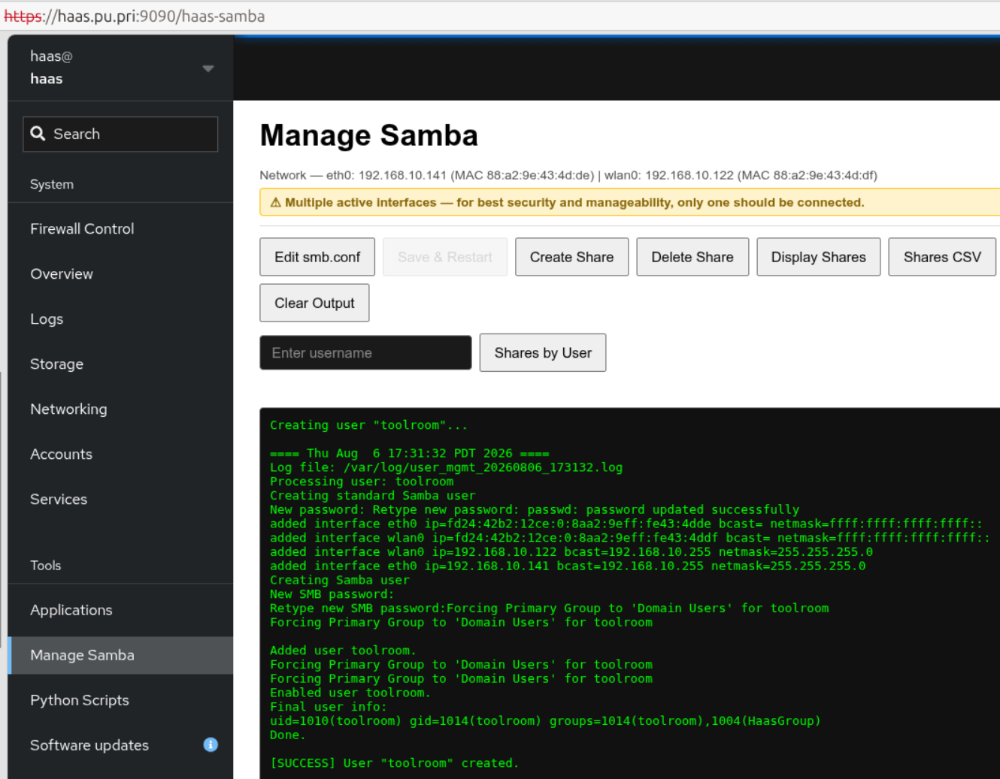{ width="500"}

----------------------------------------------------------------

4\. Click **Clear Output** instead to discard the form and cancel.

----------------------------------------------------------------

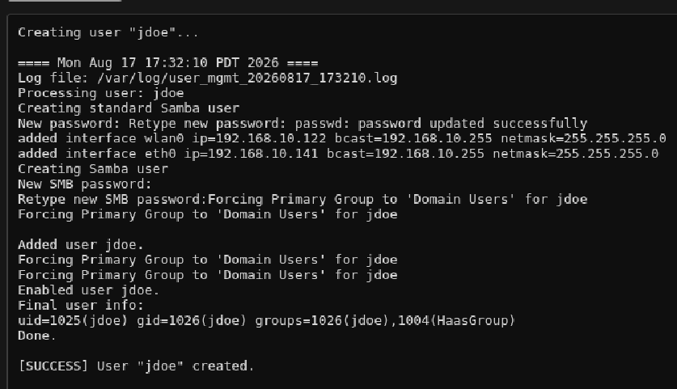{ width="500"}

----------------------------------------------------------------

For the **Administrator** role, once the account itself is created the
panel automatically runs `setup_zsh.sh <repo_dir> <username>` for the new
user — the same script `haas-install.sh` uses to set up the `haas`
account. It installs zsh and Oh My Zsh, copies the repo's `zshrc` to
`~/.zshrc` and `haas-aliases.zsh` to the Oh My Zsh custom directory, and
sets zsh as the login shell — so a new admin's SSH session shows the
`haas-*`/`t-*` alias menu instead of a bare bash prompt. This step needs
internet access (Oh My Zsh and its plugins install from GitHub); if it
fails, the account still works over SSH with the default shell, and the
output panel shows the exact command to re-run manually. **Standard
user** accounts get `/usr/sbin/nologin` and never have a shell, so this
step is skipped for them.

!!! tip "Administrator accounts are verified automatically"
    Right after that zsh setup finishes (success or failure doesn't
    matter — a nologin/no-shell **Standard user** never runs any of this),
    the panel automatically re-checks the new account end-to-end and
    prints a PASS/FAIL line for each of five checks directly in the output
    panel:

----------------------------------------------------------------

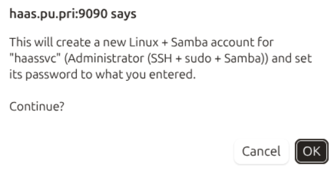{ width="500"}

----------------------------------------------------------------

    - Shell is `zsh` and home directory is `/home/<username>`
    - Member of both `sudo` and `HaasGroup`
    - `sudo -l -U <username>` doesn't report "not allowed to run sudo"
    - The Samba account's flags show `[U]` (enabled), not `[D]`
    - `.zshrc` and `.oh-my-zsh/custom/haas-aliases.zsh` both exist and are
      owned by `<username>:<username>`

    Each check runs independently, so one failure doesn't stop the rest
    from reporting — there's no need to open a Terminal and run these by
    hand anymore.

----------------------------------------------------------------

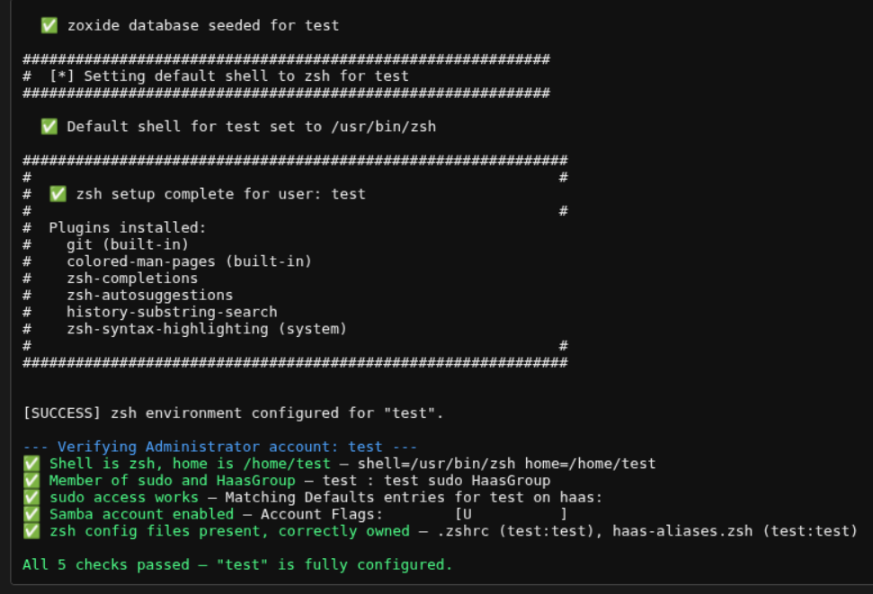

----------------------------------------------------------------

!!! note "This is a separate system from firewall access"
    `users-a.csv`/`users-b.csv`/**Apply Firewall Changes** control *network* access — which
    IPs can reach the appliance at all. This controls *account* access —
    who can actually log in and read/write files once they're on the
    network. They're related but independent; applying a firewall CSV
    doesn't create or remove Samba/Linux accounts, which is exactly why
    this button exists. See the note under **Apply Firewall Changes** in
    [Firewall Control](./firewall.md) for the reminder that ties the two
    together.

## Delete User

Removes a Linux + Samba account — pick from a dropdown, confirm, done,
the same pattern as **Delete Share**.

1. Click **Delete User** to populate a dropdown with every current member
   of `HaasGroup` except `haas` itself (the appliance's own account,
   deliberately excluded — deleting it would be catastrophic).
2. Select a user. A confirmation dialog names them and warns this cannot
   be undone — it removes the Linux account, its home directory (if it
   has one), and the Samba account together.
3. Confirming runs `manage_users.sh <username> --delete-user --force` and
   shows the result in the output panel.

----------------------------------------------------------------

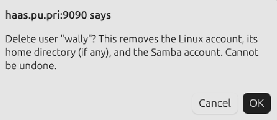

----------------------------------------------------------------

If the user still has an active login session (an open SSH connection,
for example), `userdel` refuses to remove the Linux account and the
output panel shows `[ERROR]` naming the account as still active, with
the command to terminate the session first (`sudo pkill -KILL -u
<username>`) before retrying. The account is not silently left in place
without a warning — deletion either fully succeeds or is reported as
failed. Have the user logout of the SSH or Cockpit session.

## Change Password

Sets a new password for an existing account — for a departed contractor's
CSV row being pulled from `users-a.csv`/`users-b.csv` (revoking network access) but their
Samba/Linux login left active, use **Delete User** above instead; this is
for rotating a *current* user's password (a suspected credential
compromise, or a routine 90-day rotation policy), which otherwise has no
way to be done without SSH access.

1. Click **Change Password** to populate a dropdown with every current
   member of `HaasGroup` except `haas` itself — the same list Delete User
   uses.
2. Select a user. A small form appears with **New Password** and
   **Confirm Password** fields (the username itself is shown read-only,
   just for confirmation).
3. Click **Set New Password**. A confirmation dialog names the user
   before anything runs, then
   `manage_users.sh <username> --set-password --force` runs with the
   password you entered.
4. On success, that entry is marked **✓ (done)** and disabled in the
   dropdown — not removed — so during a multi-user sweep (e.g. rotating
   everyone's password after an incident) the full roster stays visible
   and it's obvious at a glance who's left, rather than only being able
   to tell by counting. The dropdown is ready immediately for the next
   pick. Click **Cancel** at any point to back out of the current
   selection without changing anything and return to the dropdown; the
   list (and its done-markers) is rebuilt fresh each time you click
   **Change Password** itself.

## Clear Output

Resets the panel back to a plain **Ready.** message and, if you were
mid-edit, discards the unsaved editor contents.
