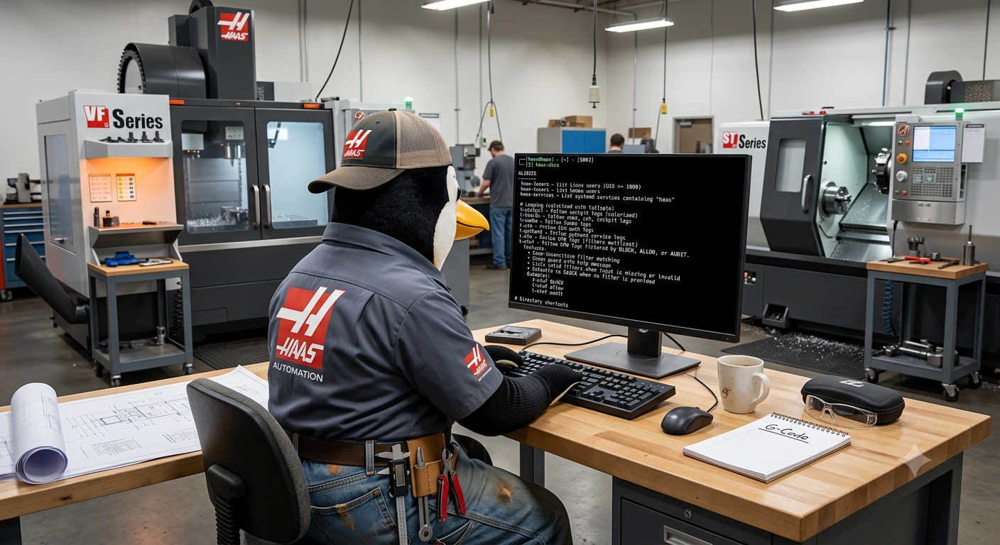
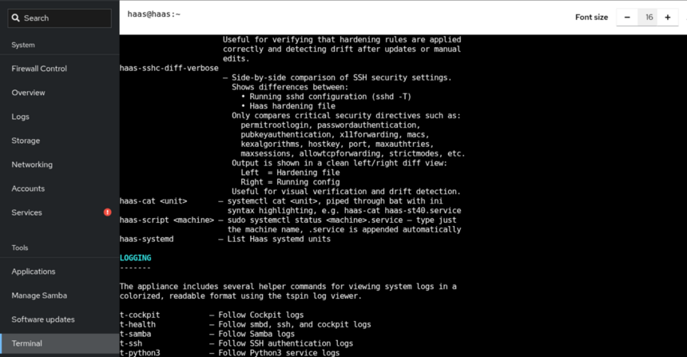

# Terminal Aliases & Functions

----------------------------------------------------------------



----------------------------------------------------------------

## The shell wars

There are a lot of shells available on Linux including `Warp` a shell with AI built in. If you want to read more about some of them you can look at my [Ubuntu for Network Engineers page](https://rikosintie.github.io/Ubuntu4NetworkEngineers/terminal){: target="_blank" rel="noopener" }

I chose the ZSH shell for the appliance. It's well maintained and has a very active plugins project. The `haas-install.sh` script calls `setup_zsh.sh` to installs zsh + Oh My Zsh for the `haas` user and drops `haas-aliases.zsh` into `~/.oh-my-zsh/custom/`, so every alias and function below is available automatically in any SSH session as `haas`.

## Opening the terminal

To log into the appliance using SSH:

- Open a terminal
- enter `ssh haas@<appliance_ip>`
- Type the `haas` user password
- Press enter

----------------------------------------------------------------

You don't have to use SSH to get into the terminal on the appliance. The Cockpit webpage has a menu for the terminal. Click the `Terminal` menu on the navigation bar and the terminal opens.

----------------------------------------------------------------



----------------------------------------------------------------

**Quick reference, without leaving the terminal:**

All of the aliases are available but they aren't shown onscreen like they are when you login over SSH. To run them enter:

- `haas-help` — lists every `haas-*`/`t-*` alias and function
- `haas-docs` — the same list, with a description for each

!!! note "haas-help is generated, haas-docs is hand-written"
    `haas-help` introspects the shell at runtime (`alias` and zsh's
    `${(k)functions}`), so it's always accurate — every `haas-*`/`t-*`
    alias or function shows up automatically the moment it's defined, with
    no maintenance required. `haas-docs` is a static, hand-written list
    with a description for each one; it does not auto-discover anything,
    so a newly added alias or function only appears there if someone
    remembers to add a line for it. If `haas-docs` ever looks incomplete
    compared to `haas-help`, that's why — not a bug, just a doc that
    hasn't been updated yet.

----------------------------------------------------------------

## Inspection aliases

| Alias | What it does |
|---|---|
| `haas-lusers` | List Linux users with UID ≥ 1000 |
| `haas-susers` | List Samba users (`pdbedit -L`) |
| `haas-services` | List systemd unit files containing "haas" |
| `haas-cat <unit>` | `systemctl cat <unit>` piped through `bat -l ini` for a syntax-highlighted view of a unit file, e.g. `haas-cat haas-st40.service` |
| `haas-script <machine>` | `sudo systemctl status <machine>.service` — status for a machine's logger service. Type just the machine name; `.service` is appended automatically, e.g. `haas-script st40` |

## Live log streaming (colorized with Tailspin)

| Alias | What it does |
|---|---|
| `t-cockpit` | Follow the Cockpit log |
| `t-health` | Follow smbd, ssh, and Cockpit logs together |
| `t-samba` | Follow the Samba (`smbd`) log |
| `t-ssh` | Follow SSH auth log (`/var/log/auth.log`) |
| `t-python3` | Follow the CNC data-collection script logs |
| `t-ufw` | Follow UFW logs, with multicast traffic (`DST=224.*`) filtered out |

### `t-ufwf <BLOCK\|ALLOW\|AUDIT>`

A friendlier version of `t-ufw` that filters to one UFW action at a
time. Case-insensitive, defaults to `BLOCK` if you run it with no
argument, and prints usage + the valid filter list if you pass something
invalid:

```
t-ufwf BLOCK
t-ufwf allow
t-ufwf audit
```

## Directory shortcuts

| Alias | Goes to |
|---|---|
| `haas-bin` | `/usr/local/sbin` — the appliance management scripts |
| `haas-firewall` | `/usr/share/cockpit/haas-firewall/` |
| `haas-python` | `/usr/share/cockpit/haas-python/` |
| `haas-samba` | `/usr/share/cockpit/haas-samba/` |
| `haas-updates` | `/usr/share/cockpit/haas-update-appliance/` |
| `haas-log` | `/var/log/` |
| `haas-repo` | `/home/haas/Haas_Data_collect/` |
| `haas-ssh` | `/etc/ssh/sshd_config.d/` |
| `haas-system` | `/etc/systemd/system` |

## Config editing

| Alias | What it does |
|---|---|
| `haas-fw-conf` | Edit `/etc/haas-firewall.conf` with sudo |
| `haas-sshd` | Edit `/etc/ssh/sshd_config.d/99-haas-hardening.conf` with sudo |

## SSH hardening verification

These compare the *live* sshd configuration against the hardening file
the installer wrote, so you can catch drift from manual edits or
updates:

| Command | What it does |
|---|---|
| `haas-sshc` | Prints just the security-relevant directives from `sshd -T` (the full config chain, as currently on disk) |
| `haas-sshc-diff` | Diffs the full config chain against the hardening file alone, filtered to the same directives — catches directives overridden elsewhere in the chain. Prints "No differences in monitored SSH directives." when clean |
| `haas-sshc-diff-verbose` | Same comparison, but always shows both sides side-by-side (`diff -y`), even when identical — actual differences are colored (yellow for a changed value, red for a directive only present on one side) |
| `haas-sshc-stale` | Checks whether the hardening file has been edited more recently than sshd's last start/reload |

!!! Note "Two different questions, two different commands"
    `sshd -T` only ever reads config *files* — it has no way to see what
    the live `sshd` process actually has loaded in memory. Both sides of
    `haas-sshc-diff`/`-verbose` read from files on disk, so they will
    always agree the moment you save the hardening file, whether or not
    sshd has actually reloaded — that comparison answers "does anything
    else in the config chain override this file's directives?", not
    "has sshd picked up my edit?" `haas-sshc-stale` is what answers the
    second question, by comparing the file's modification time against
    sshd's last start time and its last SIGHUP reload (from the
    journal). `haas-sshc-diff` and `haas-sshc-diff-verbose` both run it
    automatically before comparing, and it tells you to
    `sudo systemctl reload ssh` if the file is newer than either.

Directives checked by all three diff commands: `permitrootlogin`,
`passwordauthentication`, `pubkeyauthentication`,
`challengeresponseauthentication`, `permitemptypasswords`, `banner`,
`x11forwarding`, `macs`, `kexalgorithms`, `hostkey`,
`pubkeyacceptedalgorithms`, `port`, `maxauthtries`, `maxsessions`,
`logingracetime`, `allowtcpforwarding`, `allowagentforwarding`,
`printlastlog`, `strictmodes`.

## LLDP (network neighbor discovery)

| Function | What it does |
|---|---|
| `haas-lldp-neighbors` | `lldpcli show neighbors` |
| `haas-lldp-interface` | `lldpcli show interfaces` |
| `haas-lldp-chassis` | `lldpcli show chassis` |
| `haas-lldp-stats` | `lldpcli show statistics` |
| `haas-lldp-running` | `lldpcli show running-configuration` |

## Other functions

| Function | What it does |
|---|---|
| `haas-systemd` | `cd` to the systemd unit directory and list every `haas-*` file |
| `haas-smb-shares` | Print each Samba share name next to its `path =` line from `smb.conf` |

## Tree helpers

| Alias | What it does |
|---|---|
| `treeh` | `tree -h --dirsfirst` — human-readable sizes, directories first |
| `treed` | `tree -dh --dirsfirst` — directories only |

## General shell helpers

These aren't Haas-specific, but ship in the same file:

| Alias/Function | What it does |
|---|---|
| `ec` | Open `~/.zshrc` in `$EDITOR` |
| `ec1` | Open `haas-aliases.zsh` itself in `$EDITOR` |
| `sc` | Reload the shell (`exec zsh`) after editing either of the above |
| `_` | Shorthand prefix for `sudo ` |
| `cat` | Aliased to `batcat` (syntax-highlighted `cat`), theme `zenburn` |
| `path [filter]` | Print `$PATH`, one entry per line; optionally grep it |
| `mkd <dir>` | `mkdir -p` and `cd` into it in one step |
| `nano <file>` | Wrapped so every file you edit gets a timestamped backup in `backups/` first, with backups older than 30 days auto-pruned |
