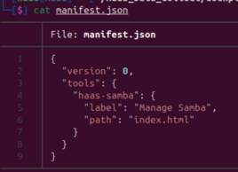
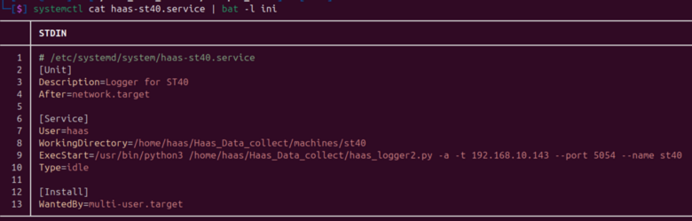
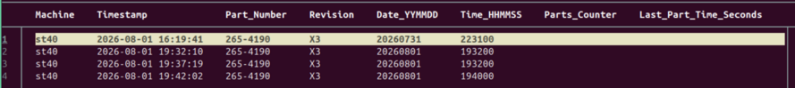
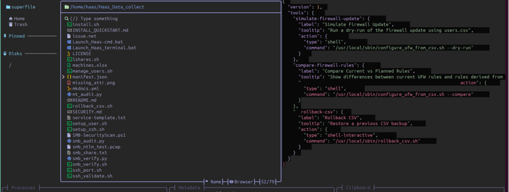

# Third-Party Terminal Tools

----------------------------------------------------------------

`tools.yaml` lists a handful of small, single-purpose terminal tools that
`install-tools.sh` downloads and installs for the `haas` user — the same
script the **Sync Tools** button on the Updates - Logs page runs, so
`Sync Tools` is how you install these for the first time or pick up new
releases later.

None of these are required to run the appliance. They just make working
in an SSH session noticeably more pleasant than stock `cat`, `less`, and
`cd`.

----------------------------------------------------------------

## zoxide — jump to a directory by a fragment of its name

`zoxide` remembers every directory you `cd` into and lets you jump back
with `z <fragment>` instead of typing the full path. It ranks matches by
how often and how recently you've visited them, so a short fragment
usually lands you exactly where you meant.

`haas-install.sh` seeds the database with the same directories the
`haas-*` aliases point to in the `terminal_aliases.md`'s Directory Shortcuts
table [located here](terminal_aliases.md#directory-shortcuts){_target=blank} — `/usr/local/sbin`, `/home/haas/Haas_Data_collect`, the Samba and
firewall Cockpit extension directories, `/etc/ssh/sshd_config.d`,
`/etc/systemd/system`, and more — so `z` already knows about them on a
fresh install, before you've ever visited them yourself.

Jumping around the repo, and then somewhere else entirely, with just a
fragment of the directory name:

```
┌─[haas@haas] - [~/Haas_Data_collect/cockpit_samba] - [4878]
└─[$] z mach
┌─[haas@haas] - [~/Haas_Data_collect/machines] - [4879]

┌─[haas@haas] - [~/Haas_Data_collect/machines] - [4890]
└─[$] z cock
┌─[haas@haas] - [~/Haas_Data_collect/cockpit_samba] - [4891]
```

Once a machine's directory has been visited at least once (e.g. after its
service or share has been created), a fragment of its name works too —
`z minimill` behaves the same way as `z mach` or `z cock` above.

See everything currently in the database with `zoxide query -l`:

```
$ zoxide query -l
/home/haas/Haas_Data_collect
/home/haas/Haas_Data_collect/machines
/home/haas/Haas_Data_collect/cockpit_samba
/etc/ssh/sshd_config.d
/etc/systemd/system
/home/haas/Haas_Data_collect/machines/st10y
/home/haas/Haas_Data_collect/machines/minimill
/etc/ssh
/home/haas/Haas_Data_collect/machines/minimill/cnc_logs
```

## bat — `cat` with syntax highlighting

`bat` is a drop-in replacement for `cat` that adds syntax highlighting,
line numbers, and a git-modified-lines gutter. `haas-aliases.zsh` already
aliases plain `cat` to it (theme `zenburn`), so you get this automatically
just by using `cat` — see `terminal_aliases.md`.

Three things worth knowing beyond the alias:

Show non-printable characters (useful when a config file looks fine but
behaves oddly — trailing whitespace, stray carriage returns, etc.):

```bash
bat -A /etc/ssh/sshd_config.d/99-haas-hardening.conf
```

Show plain output

```bash
cat -p manifest.json
```

```bash title='Command Output'
{
  "version": 0,
  "tools": {
    "haas-samba": {
      "label": "Manage Samba",
      "path": "index.html"
    }
  }
}
```

----------------------------------------------------------------



----------------------------------------------------------------

Force a language for content that isn't a real file (e.g. piped output
that doesn't have an extension to guess from. In this case use the language for an "ini" file):

```bash
systemctl cat haas-st40.service | bat -l ini
```

----------------------------------------------------------------



----------------------------------------------------------------

More information is available on the [TailSpin GitHub page](https://github.com/bensadeh/tailspin) or on my [Ubuntu for Network Engineers Git book](https://rikosintie.github.io/Ubuntu4NetworkEngineers/terminal/#bat-a-better-cat).

----------------------------------------------------------------

## tspin (Tailspin) — colorize any log stream

`tspin` recognizes and colorizes common log patterns — timestamps, IPs,
UUIDs, HTTP methods, log levels — with no configuration, and opens the
result in `less` by default. The `t-*` aliases in `terminal_aliases.md`
(`t-cockpit`, `t-samba`, `t-ssh`, `t-python3`, `t-ufw`, `t-health`) are all
just `journalctl`/`tail` piped through it.

For anything those aliases don't already cover, pipe it through directly:

```bash
journalctl -u haas-st40 -f | tspin
```

Or let `tspin` run the command itself, which is equivalent but keeps the
whole pipeline as one line:

```bash
tspin --exec='journalctl -u haas-st40 -f'
```

More information is available on the [TailSpin GitHub page](https://github.com/bensadeh/tailspin).

----------------------------------------------------------------

## csvlens — browse CSV data like `less`, but tabular

`haas_logger2.py` writes each machine's collected data as a csv file under that
machine's `cnc_logs/` directory (e.g.
`machines/st40/cnc_logs/st40_1234.csv`). `csvlens` opens a file like that
as a scrollable, searchable table instead of a wall of comma-separated
text — vim-style navigation, regex search, column freezing/filtering, and
sorting.

Open a machine's data file directly:

```bash
z st40                     # zoxide jump into machines/st40
csvlens cnc_logs/st40_265-4190.csv
```

----------------------------------------------------------------



----------------------------------------------------------------

Or inspect the output of another command without writing it to disk
first:

```bash
cat cnc_logs/*.csv | csvlens
```

More information is available on the [csvlens GitHub page](https://github.com/ys-l/csvlens).

----------------------------------------------------------------

## fresh — a real terminal editor for config files

`fresh` is a full-featured terminal text editor with VS Code/Sublime-style
keybindings, mouse support, and syntax highlighting — a step up from
`nano` for anything more involved than a one-line edit. `haas-aliases.zsh`
already uses it for the two config files you're most likely to hand-edit:

```bash
haas-fw-conf   # sudo fresh /etc/haas-firewall.conf
haas-sshd      # sudo fresh /etc/ssh/sshd_config.d/99-haas-hardening.conf
```

It works the same way on anything else:

```bash
sudo fresh /etc/samba/smb.conf
```

More information is available on the [fresh GitHub page](https://github.com/sinelaw/fresh)

----------------------------------------------------------------

## spf (superfile) — a terminal file manager

`superfile` is a full-screen terminal file manager — browse, move, copy,
rename, and delete files with the keyboard (or mouse) instead of chaining
`ls`/`mv`/`cp` commands by hand. Useful for poking around
`Haas_Data_collect/machines/` when you want to see everything at a glance
rather than one `ls` at a time.

Launch it in the current directory:

```bash
spf
```

----------------------------------------------------------------



----------------------------------------------------------------

More information is available on the [Superfile GitHub page](https://github.com/yorukot/superfile)
