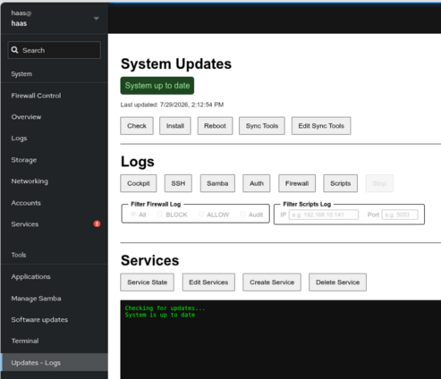
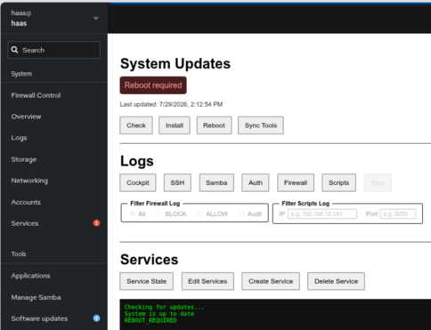
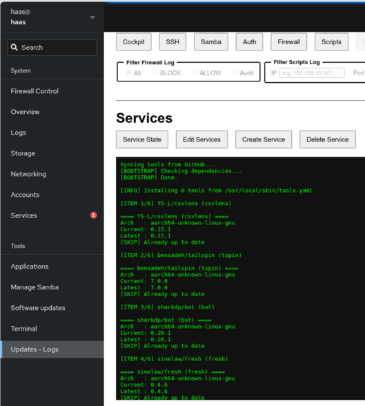
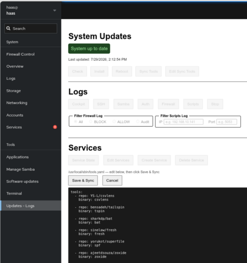

# Updates - Logs

----------------------------------------------------------------

The `haas-install.sh` installer sets up a Cockpit extension for OS
updates, syncing the appliance's CLI tools, tailing system logs, and
managing the CNC machine-logger services — all without needing SSH
access. Log into Cockpit at `https://<appliance-ip>:9090` and look for
**Updates - Logs** in the sidebar.

----------------------------------------------------------------

----------------------------------------------------------------

## System Updates

A status banner at the top shows the current state (up to date, updates
available, or reboot required) and the last time updates were installed
from this page (persisted across page reloads).

| Button | What it does |
|---|---|
| Check | Runs `/usr/local/sbin/update-check.sh` and refreshes the status banner and package table |
| Install | Runs `/usr/local/sbin/update-system.sh` to install available Ubuntu updates, then automatically re-checks status afterward |
| Reboot | Reboots the appliance immediately — asks for confirmation first |
| Sync Tools | Runs `/usr/local/sbin/install-tools.sh` to install/update the CLI tools listed in `/usr/local/sbin/tools.yaml` (csvlens, tspin, bat, fresh, superfile, zoxide, ...) |
| Edit Sync Tools | Edits `/usr/local/sbin/tools.yaml` itself, to add/remove/change which tools Sync Tools installs — see below |

----------------------------------------------------------------

### If a reboot is required

A message will be displayed in the panel. If you are ready to reboot the appliance, click the `Reboot` button.

----------------------------------------------------------------

----------------------------------------------------------------

### Sync Tools

Click `Sync Tools` after you run the `Check` to keep the installed third party tools up to date.

----------------------------------------------------------------

----------------------------------------------------------------

### Edit Sync Tools

Click **Edit Sync Tools** to load `/usr/local/sbin/tools.yaml` — the
inventory **Sync Tools** installs from — into an editor. Every other
button is locked while editing except **Save & Sync** and **Cancel**.

Each entry needs a `repo:` (the GitHub `owner/name`) and a `binary:` (the
name Sync Tools installs it as). To add a tool, find its GitHub page,
confirm it publishes **Releases** (usually a link on the right side of
the repo's home page), then add an entry in that form.

**Save & Sync** validates the whole file before touching anything real —
nothing is written and Sync Tools does not run unless every check passes:

1. **YAML syntax** — the file must parse. If `yq` itself isn't installed
   yet (a brand-new appliance that has never run Sync Tools), you're told
   to run **Sync Tools** once first, since that's what installs `yq`.
2. **Structure** — the top-level `tools:` key must be a list, and every
   entry must have both `repo` and `binary`.
3. **Each repo actually exists** — every `repo:` is checked against
   `https://api.github.com/repos/<repo>/releases/latest`, the same
   endpoint Sync Tools itself uses to find the latest release. A typo'd
   or renamed repository, or one with no published releases, is caught
   here instead of failing partway through an actual sync.

Progress streams live above the editor as each repo is checked, so a slow
GitHub response doesn't look like the page has hung. If anything fails,
the file is left untouched, the specific problem(s) are listed, and your
edits stay in the editor to fix and retry — nothing is lost. If every
check passes, the file is saved and **Sync Tools** runs automatically.

----------------------------------------------------------------

----------------------------------------------------------------

## Logs

Six buttons stream a live log into the output pane; **Stop** ends
whichever one is running. Only one log streams at a time — starting a
new one automatically stops the previous stream.

| Button | Source |
|---|---|
| Cockpit | `journalctl -u cockpit` |
| SSH | `journalctl -u ssh` |
| Samba | `journalctl -u smbd` |
| Auth | `/var/log/auth.log` |
| Firewall | Live UFW log via `journalctl`, with **All / BLOCK / ALLOW / Audit** radio filters |
| Scripts | CNC machine-logger output (`journalctl -t python3`), with optional **IP** / **Port** text filters |

For the **Firewall** and **Scripts** logs, changing the filter while the
stream is running automatically restarts it with the new filter applied
— no need to stop and re-click.

----------------------------------------------------------------

In this screenshot I am filtering the Python log from my laptop at 192.168.10.143:

----------------------------------------------------------------

## Services

Manages the `haas-*.service` systemd units that run the per-machine CNC
data-collection scripts.

----------------------------------------------------------------

### Service State

Click **Service State** for a one-shot `systemctl list-unit-files`
summary of every `haas-*` service and its current state, followed by:

- a reminder that the unit files live in `/etc/systemd/system`
- the same IP/port/name breakdown as the `haas-ports` terminal alias, with
  any **duplicate ports flagged** — two services both pointing
  `-t <ip> --port <port>` at the same address means one of them is very
  likely connecting to the wrong machine, which is exactly the kind of
  thing that shows up as "this CNC just isn't writing a CSV" with no
  obvious error to explain why.
- a one-shot TCP reachability check (`nc -z`, 2s timeout) against each
  service's `-t <ip> --port <port>` — skipped for any machine that
  already has an established connection from its `python3` process, so a
  machine that's already connected and streaming is never touched a
  second time

The whole button is disabled for the duration of the run (including the
connectivity sweep, which can take a couple seconds per machine) so a
second click can't stack an overlapping sweep against the same targets.

!!! note "\"Not reachable\" isn't always a problem"
    This check is deliberately only run here, on demand, and not
    automatically right after Create Service. During initial deployment
    it's common for services to be created before the machine shop has
    configured the actual CNC to connect on that port — in that window,
    every machine will correctly show "not reachable," and that's normal,
    not an error. Run **Service State** once you expect the machines to
    actually be talking; a machine that stays unreachable at that point is
    worth investigating (wrong IP/port, firewall, machine powered off,
    network issue) — one that was never expected to be connected yet
    isn't.

!!! warning "Why the connectivity check skips already-connected machines"
    Some CNC control network stacks are minimal enough to only accept one
    connection at a time. Probing a machine that already has an active,
    established connection from `haas_logger2.py` risks contending with —
    or on a sufficiently limited stack, even displacing — that real
    connection, purely because of the diagnostic check itself. Skipping
    already-connected machines avoids that risk entirely; only machines
    that aren't currently connected get probed.

----------------------------------------------------------------

### Edit Services

1. Click **Edit Services**, then pick a unit file from the dropdown that
   appears.
2. The file loads into an editor. Every other button is locked while
   editing except **Save & Restart** and **Cancel**.
3. **Save & Restart** asks for confirmation, then writes the file, runs
   `systemctl daemon-reload`, restarts the service, and finishes with
   `systemctl status <service>` so you can confirm it came back up
   cleanly.
4. **Cancel** discards your changes and returns to the log/output view.

----------------------------------------------------------------

### Create Service

Click **Create Service** to open a form (Description, Machine Name, IP
Address, Port) instead of a raw editor — this generates a new
`haas-<machine>.service` unit from a template, so you don't need to hand
-write systemd files for each new CNC machine.

- Typing in **Machine Name**, **Description**, and **IP Address** filters
  out invalid characters as you type (IP Address only accepts digits and
  dots, for example).
- **Save & Reload** validates before writing anything:
    - all four fields are required
    - IP Address must be a valid IPv4 address
    - Port must be an integer between 5001 and 5099 (Haas's recommended TCP/IP port range)
- Once validated, it writes `/etc/systemd/system/haas-<machine>.service`,
  creates the machine's working directory under
  `/home/haas/Haas_Data_collect/machines/<machine>`, then runs
  `daemon-reload`, `enable`, and `start` for the new service — the output
  pane shows each step, ending with `systemctl status` for the new
  service, followed by the same IP/port/name breakdown (with duplicate
  ports flagged) shown by **Service State** — a quick way to catch a
  copy-pasted port before it causes a silent connection mix-up.

----------------------------------------------------------------

### Delete Service

Pick a unit file from the dropdown after clicking **Delete Service**.
Confirms first (**"This cannot be undone"**), then stops, disables, and
removes the unit file, followed by `systemctl daemon-reload`.

----------------------------------------------------------------

### Data Freshness

Click **Data Freshness** for a one-shot list of when each machine under
`/home/haas/Haas_Data_collect/machines/` last wrote a CSV file — the
newest file in that machine's `cnc_logs/` directory, however logging was
set up (append mode or per-cycle files, it just checks modification
time).

The list is sorted **oldest first**, so a machine that's silently stopped
producing data floats straight to the top instead of only being noticed
whenever someone happens to go looking for it. A machine directory with
no `cnc_logs/` yet (e.g. a service that's never completed a cycle) or an
empty one is called out the same way, right alongside the rest.

This doesn't tell you *why* a machine stopped writing — pair it with
**Service State**'s IP/port/duplicate check and the **Scripts** log
(Logs section, filtered to that machine's IP/port) to see whether it's a
connection problem, a wrong/duplicate port, or something else.
