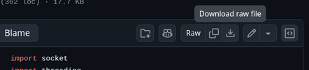

# How to use the Python logger script

The first step is downloading the script from my [GitHub Repository](https://github.com/rikosintie/Haas_Data_collect){target="_blank}. There are several ways to accomplish that task depending on your Operating System and how deep you want to go down the rabbit hole!

- From the homepage of the repository, click on `haas_logger2.py`
- Click on the `Raw` download icon
- Save the file to a location on your drive.

----------------------------------------------------------------



----------------------------------------------------------------

You can also download a `zip` file with the entire repository. That is useful if you are going to build an appliance and need all of the scripts and files. To download the repository as a `zip` file:

- Open the Edge browser and navigate to the [GitHub Repository](https://github.com/rikosintie/Haas_Data_collect){target="_blank}.
- Click on the green `Code` button
- Click on `Download ZIP`
- Unzip the files to your hard drive.

----------------------------------------------------------------


----------------------------------------------------------------

!!! Note
    The unzip process with create two `Haas_Data_collect_main` folders. Navigate to the second one, highlight all the files, cut and paste them into the first folder.

----------------------------------------------------------------

## Clone the Repository

Cloning the repository pulls down all the files into a directory named `Haas_Data_collect` on your local drive. The installation steps are done in the Mac/Linux terminal or cmd.exe/PowerShell on Windows. In my recent testing on Windows 11 24H2, I learned a lot about using PowerShell on Windows 11. I created a page on what my setup looks like. I highly recommend installing the Windows Terminal and setting up PowerShell if you are a Windows user. Here is a link to the page - [Using PowerShell with the Network Discovery scripts](https://rikosintie.github.io/Discovery/Using_PowerShell/). PowerShell is also available on Mac/Linux. The configurations on the "Using PowerShell" page work on all three OSes.

Open the Mac/Linux terminal or cmd/PowerShell terminal and cd to a location you want to install the scripts into. I have a directory named `Tools` that I use to organize tools I download from the Internet.

Then paste the following:

```bash
git clone https://github.com/rikosintie/Haas_Data_collect.git
cd Haas_Data_collect
```

The cloning operation creates a subfolder named `Haas_Data_collect`

Inside the folder will be the :

- haas_logger2.py - The script to listen for the Haas machines' output
- cnc_logs - a folder to hold the data files
- dprnt_example.txt - A sample CNC program with the dprnt statements
- All of the scripts and files needed to build a data collection appliance.

----------------------------------------------------------------

!!! Note
    You should run `git pull` on a regular basis. If there are any updates to the project, this will copy them down and overwrite the existing files.

----------------------------------------------------------------

## Configure the CNC for output

Your CNC control must be connected to an Ethernet network either by Wi-Fi or cable. This [Haas Video](https://youtube.com/watch?v=g7hl2Lw4KdM&si=txrjMdDefbxXeBxp) does a great jobs explaining how to setup `TCP/IP` on your control.

### Configure the control to output `DPRNT` statements

On the `settings` page, search for dprnt

- Option 261 - set to `TCP Port`
- Option 262 - set to `User Data`
- Option 263 - set to `5052`

----------------------------------------------------------------

The port number doesn't have to be unique per machine. The IP address of the  CNC control is unique so the ports can all be the same. I like to use unique port numbers. For example, my shop has six machines and I use:

- Machine1 - set to 5051
- Machine2 - set to 5052
- Machine3 - set to 5053
- Machine4 - set to 5054
- Machine5 - set to 5055
- Machine6 - set to 5056

**Here is a screenshot for machine2:**


----------------------------------------------------------------

When you execute the script, `Haas_logger2.py`, it runs continuously until you press `ctrl+c`. When `DPRNT[End of Cycle]` is executed in the CNC program, the script writes the data to disk and then resumes listening. Multiple copies of the script can be started on the same server to collect from multiple CNC machines concurrently.

**The script accepts four parameters:**

- -a or (--append) Save all data from a part number to the same file.
- -n or (--name) is the name of the machine. Used in the name of file that is saved.
- -p or (--port) is the port that is configured with parameter 263.
- -t is the IP address of the `Haas` machine tool.

The script will connect to the machine using the IP address like putty does in the Haas Video.

### The script help text

If you run the script with just `-h` as a parameter, the following help will be printed to the screen.

```text hl_lines="1"
python haas_logger2.py -h
usage: haas_logger2.py [-h] [-H HOST] [-p PORT] [-n MACHINE_NAME] [-a] [-t TARGET_IP]

Haas CNC Data Logger - Connects to a CNC machine and saves output to files

options:
  -h, --help            show this help message and exit
  -H, --host HOST       Host IP to bind to in server mode (default: 0.0.0.0)
  -p, --port PORT       Port to listen on or connect to (default: 5062)
  -n, --name MACHINE_NAME
                        Machine name for filename (default: Machine_Port####)
  -a, --append          Append mode: Save all cycles for same part number to one file
  -t, --target TARGET_IP
                        Target IP address to connect to (client mode). If not specified, runs in server mode.

Examples:
    CLIENT MODE (Connect to the Haas CNC machine):
    python haas_logger.py -t 172.16.1.100                 # Connect to machine at this IP
    python haas_logger.py -t 172.16.1.100 -p 5063         # Connect to machine on custom port
    python haas_logger.py -t 172.16.1.100 -a -n "Mill_1"  # Connect with append mode and custom name

    ---------------------

    SERVER MODE (Listens for connections. Only used for script development, not production):
    python haas_logger.py                          # Listen on default port 5062
    python haas_logger.py -p 5063 -a               # Listen on port 5063 with append mode
    python haas_logger.py -H 0.0.0.0 -p 5062       # Listen on all interfaces

Notes:
    - Use -t to connect to a Haas machine (client mode)
    - Without -t, the script waits for the machine to connect (server mode)
    - In append mode (-a), close CSV files on PCs before production runs to avoid file locks
    - If a file is locked, the script will retry 3 times then create a backup file
    - In client mode, the script will auto-reconnect if the connection is lost
```

----------------------------------------------------------------

## Usage examples

```python hl_lines="2 5 8 11 14 17"
# Machine 1
python haas_logger2.py -t 172.16.1.11  --port 5052 --name "Lathe1"

# Machine 2
python haas_logger2.py -t 172.16.1.12  --port 5053 --name "Lathe2"

# Machine 3
python haas_logger2.py -t 172.16.1.13  -p 5054 -n "Lathe3"

# Machine 4
python haas_logger2.py -t 172.16.1.14  -p 5055 -n "Mill1"

# Machine 5
python haas_logger2.py -t 172.16.1.15  -p 5056 -n "Mill2"

# Machine 6
python haas_logger2.py -t 172.16.1.16 -p 5057 -n "Mill3"
```

A new file is created each time using the naming format: `machine-name_"part-number"_yymmdd_hh:mm:ss.csv`.

For example - `Machine1_“265-4183”_20251202_151020.csv`

----------------------------------------------------------------

### Append mode

If you want all data from one part number collected in one file instead of one file per cycle use the `-a` append flag. One file is created using the naming format: `machine-name_part-number.csv`.

For example - `Machine1_strut.csv`

----------------------------------------------------------------

!!! Warning
    Server mode isn't for use with Haas Data Collection. It's a mode for testing the script.
    The haas_simulator.py script is used to send data to the script running in server mode.

----------------------------------------------------------------

## CNC Program Format

The sample code for DPRNT can be found [here on the Haas.com site](https://www.haascnc.com/content/dam/haascnc/videos/bonus-content/ep63-dprnt/dprntexample_1.nc):

### Here is a simple example

```unixconfig hl_lines="6 8 10 12 13 15 17 19 21-23 25"
%
O03020 (DPRNT PART DATA)
G04 P1. (1 SECOND DWELL, SO WE HAVE A CYCLE TIME)
G103 P1 (LIMIT LOOKAHEAD)
(DPRNT BLANK LINE)
DPRNT[]
(DPRNTS ALL TEXT, A PART NUMBER)
DPRNT[ PART NUMBER: 265-4183, REV. X2]
(DPRNT BLANK LINE)
DPRNT[]
(SIMPLE DATE AND TIME)
DPRNT[ DATE YYMMDD: #3011[60]]
DPRNT[ TIME HHMMSS: #3012[60]]
(DPRNT BLANK LINE)
DPRNT[]
(DPRNT BLANK LINE)
DPRNT[]
(#3901 PARTS COUNTER)
DPRNT[*PARTS*MADE:*#3901[90]]
(DPRNT BLANK LINE)
DPRNT[]
(#3024 LAST PART TIMER)
DPRNT[*TIME,*LAST PART:*#3024[40]*SECONDS]
G103 (RETURN TO NORMAL LOOKAHEAD)
DPRNT[End of Cycle]
M30
%
```

----------------------------------------------------------------

#### Screen output from haas_logger2.py when using the Append flag

```unixconfig hl_lines="1 4 6-11"
python haas_logger2.py --port 5052 -a --name "Machine1"
[Machine1] Haas CNC Data Logger started on 0.0.0.0:5052 (APPEND mode)
[Machine1] Waiting for connections...
[Machine1] TIP: Close CSV files in Excel to avoid file lock issues
[Machine1] Press Ctrl+C to stop
[Machine1] Connection established from ('172.16.0.143', 59994)
[Machine1] Part number detected: “265-4183”
[Machine1] End of cycle detected!
[Machine1] Data appended to: cnc_logs/Machine1_“265-4183”.csv
[Machine1] Connection closed from ('172.16.0.143', 59994)
[Machine1] Connection established from ('172.16.0.143', 46606)
[Machine1] Part number detected: “265-4183”
[Machine1] End of cycle detected!
[Machine1] Data appended to: cnc_logs/Machine1_“265-4183”.csv
[Machine1] Connection closed from ('172.16.0.143', 46606)
```

#### Screen output from haas_logger2.py without the Append flag

```unixconfig hl_lines="1 5-14"
python haas_logger2.py --port 5052 --name "Machine1"
[Machine1] Haas CNC Data Logger started on 0.0.0.0:5052
[Machine1] Waiting for connections...
[Machine1] Press Ctrl+C to stop
[Machine1] Connection established from ('127.0.0.1', 43052)
[Machine1] Part number detected: TEST-001
[Machine1] End of cycle detected!
[Machine1] Data saved to: cnc_logs/Machine1_TEST-001_20251202_141427.csv
[Machine1] Connection closed from ('127.0.0.1', 43052)
[Machine1] Connection established from ('127.0.0.1', 56304)
[Machine1] Part number detected: TEST-002
[Machine1] End of cycle detected!
[Machine1] Data saved to: cnc_logs/Machine1_TEST-002_20251202_141537.csv
[Machine1] Connection closed from ('127.0.0.1', 56304)
[Machine1] Connection established from ('127.0.0.1', 49556)
[Machine1] Part number detected: TEST-002
[Machine1] End of cycle detected!
[Machine1] Data saved to: cnc_logs/Machine1_TEST-002_20251202_150918.csv
[Machine1] Connection closed from ('127.0.0.1', 49556)
[Machine1] Connection established from ('127.0.0.1', 39222)
[Machine1] Part number detected: “265-4183”
[Machine1] End of cycle detected!
[Machine1] Data saved to: cnc_logs/Machine1_“265-4183”_20251202_151020.csv
```

----------------------------------------------------------------

## Start up files

If you have several Haas machines and want to collect data from all of them it gets tiresome to type the script command for each machine. I have created two Windows batch files that you can modify or your own use.

**This batch file uses the Windows cmd.exe to open a new cmd process for each machine:**

```bash
set PY=C:\Python314\python.exe
set SCRIPT=C:\Users\micha\Downloads\Haas_Data_collect\haas_logger2.py

rem Start each CNC logger in its own window

start "ST40"      cmd /k "%PY% %SCRIPT% -t 172.16.0.21 -a -p 5052 -n ST40"
start "VF2SS"     cmd /k "%PY% %SCRIPT% -t 172.16.0.22 -a -p 5053 -n VF2SS"
start "VF5SS"     cmd /k "%PY% %SCRIPT% -t 172.16.0.23 -a -p 5054 -n VF5SS"
start "MINIMILL"  cmd /k "%PY% %SCRIPT% -t 172.16.0.24 -a -p 5055 -n MINIMILL"
start "ST30"      cmd /k "%PY% %SCRIPT% -t 172.16.0.25 -a -p 5056 -n ST30"
start "ST30L"     cmd /k "%PY% %SCRIPT% -t 172.16.0.26 -a -p 5057 -n ST30L"

exit /b
```

You will need to change the PY variable to match where you installed Python, and the `SCRIPT` variable to the path where you unzipped the files.

Then update the IP Addresses and names to match your machines.

----------------------------------------------------------------

**This batch file uses the Windows terminal to open a new tab for each machine:**

```unixconfig linenums="1"
@echo off
REM Launch Haas loggers in separate tabs

wt ^
  new-tab -p "Haas Loggers ST40" ^
  ; new-tab -p "Haas Loggers VF2SS" ^
  ; new-tab -p "Haas Loggers VF5SS" ^
  ; new-tab -p "Haas Loggers MINIMILL" ^
  ; new-tab -p "Haas Loggers ST30" ^
  ; new-tab -p "Haas Loggers ST30L"
```

You will need to change the PY variable to match where you installed Python, the `SCRIPT` variable to the path where you unzipped the files.

Then update the IP Addresses and names to match your machines.

I prefer the terminal script if you have the Windows terminal installed.

----------------------------------------------------------------

## If you don't have access to a Haas control

If you want to work on the Python scripts when you are at home, you can use the Linux `netcat` application to simulate a Haas control on a Mac/Linux laptop or Windows Subsystem for Linux (WSL).

In this example, nc is running on a PC with IP address 172.16.0.223.

- Open a terminal
- paste in `sudo nc -lvkp 5052` and press Enter

You will see `Listening on 0.0.0.0 5052` in the terminal.

Type the dprnt commands, pressing Enter after each one.
Type `End of Cycle` to write the data.

```unixconfig hl_lines="1"
sudo nc -lvkp 5052

Listening on 0.0.0.0 5052
Connection received on 1S1K-G5-5587.pu.pri 41104
PART NUMBER: 265-4183, REV. X2
End of Cycle
```

On the machine with the script running:

```unixconfig
[Machine2] Attempting to connect to 172.16.0.223:5052...
[Machine2] Successfully connected!
[Machine2] Connected to ('172.16.0.223', 5052)
[Machine2] Part number detected: 265-4183
[Machine2] End of cycle detected!
[Machine2] Data saved to: cnc_logs/Machine2_265-4183_20251208_121016.csv
```

----------------------------------------------------------------

## DPRNT Allowed/Disallowed Characters

### Allowed Characters

- +,-.*()?:#{}_/
- a-z A-Z 0-9

### Disallowed characters, results in alarm 535

- "&\;`~|'<>!@$%^=
- other languages like αβγ汉字
- ascii chars like ®±€

----------------------------------------------------------------

**Core Scripts:**

- haas_logger2.py → Connects to a Haas machine over TCP/IP, receives DPRNT output, and writes it into CSV files.

- haas_simulator.py → Simulates Haas machine output for testing without needing a live machine.
